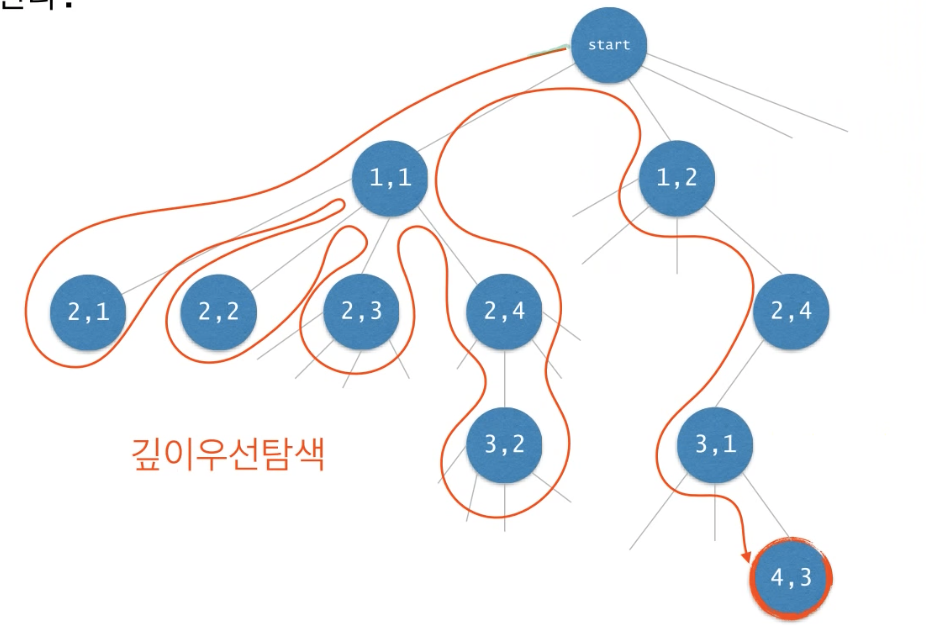
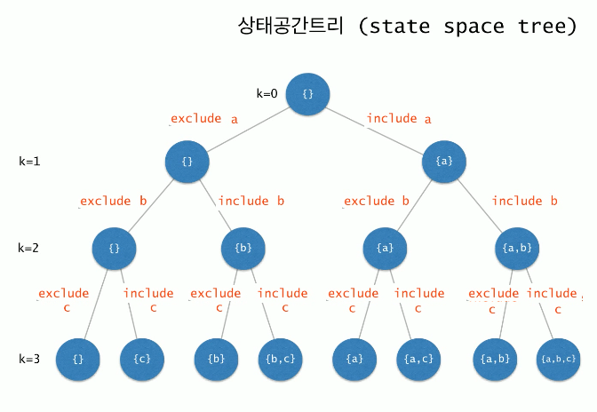
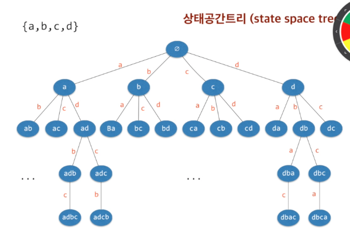
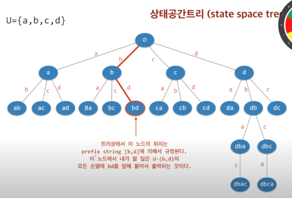

# 영리한 프로그래밍을 위한 알고리즘

- 링크: [영리한 프로그래밍을 위한 알고리즘 강좌](https://www.inflearn.com/course/%EC%95%8C%EA%B3%A0%EB%A6%AC%EC%A6%98-%EA%B0%95%EC%A2%8C)
- 기간: 2021. 10. 30 ~ 2021. 11. 30


[TOC]


## 순환 Recursion

**무한루프**

- base case & recursion case

```java
public class Code02 {
  public static void main(String[] args) {
    int n = 4;
    func(n); // Hello 4번 출력
  }
  
  public static void func(int k) {
    if (k <= 0) { // base case: 적어도 하나의 recursion case에 빠지지 않는 경우가 존재해야 한다
      return;
    } else {
      System.out.println("Hello");
      func(k-1); // recursion case: 순환을 반복하다보면 결국 base case에 수렴해야 한다
    }
  }
}
```

- 수학적 귀납법 이용

```java
public class Code03 {
  public static void main(String[] args) {
    int result = func(4); //10
  }
  
  public static void func(int n) { // 0~n까지 더하는 함수
    if (n == 0) { // n이 0이면, 답은 0이다
      return 0;
    } else {
      return n + func(n-1); // n이 0보다 크다면, 0과 n-1 사이의 정수의 합에 n을 더해라. -> 수학적 귀납법 이용
    }
  }
}
```


**Factorial 팩토리얼: n!**

```java
public static int factorial(int n) {
  if (n == 0) {
    return 1;
  } else {
    return n * factorial(n-1); // 수학적 귀납법 이용
  }
}
```

- 비슷한 예제: x^n 구하기


```text 
x^0  = 1
x^n = x*x^n-1 if (n > 0)
```

```java
public static double power(double x, int n) {
  if (n == 0) {
    return 1;
  } else {
    return x * power(x, n-1);
  }
}
```


**Fibonacci Number 피보나치**

```text
f0 = 0
f1 = 1
fn = fn-1 + fn-2 (n>1)
```

```java
public int fibonacci(int n){
  if (n > 2) {
    return n;
  } else {
    return fibonacci(n-1) + fibonacci(n-2);
  }
}
```


**최대공약수: Euclid Method**

```text
m >= n인 두 양의 정수 m, n에 대해서 m이 n의 배수이면 gcd(m, n) = n이고, 그렇지 않으면 gcd(m, n) = gcd(n, m%n)이다
```

```java
public static int gcd(int m, int n) {
  if(m < n) {
    int tmp = m; m = n; n = tmp; // swap m and n
  }
  
  if (m % n == 0) {
    return n;
  } else {
    return gcd(n, m%n);
  }
}
```

- Euclid Method: 좀더 단순한 버전

```java
public static int gcd(int p, int q) {
  if (q == 0) {
    return p;
  } else {
    return gcd(q, p%q);
  }
}
```


**문자열 길이 계산**

```java
public static int length(String str) {
  if(str.equlas("")) {
    return 0;
  } else {
    return 1 + length(str.substring(1));
  }
}
```


**문자열의 프린트**

```java
public static void printChars(String str) {
  if(str.length() == 0) {
    return;
  } else {
    System.out.println(str.charAt(0));
    printChars(str.substring(1));
  }
}
```


**문자열을 뒤집어 프린트**

```java
public static void printCharReverse(String str) {
  if(str.length() == 0) {
    return;
  } else {
		printCharReverse(str.substring(1));
    System.out.print(str.charAt(0));
  }
}
```


**2진수로 변환하여 출력**

```java
public void printInBinary(int n) {
  if(n < 2) {
    System.out.println(n);
  } else {
    printInBinary(n/2);
  }
}
```


**배열의 합 구하기**

```java
public static int sum(int n, int[] data) {
  if(n <= 0) {
    return 0;
  } else {
    return sum(n-1, data) + data[n-1]; // data[0]에서 data[n-1]까지의 합을 구하여 반환
  }
}
```


**데이터파일로부터 n개의 정수 읽어오기**

```java
public void readFrom(int n, int[] data, Scanner in) {
  if(n == 0) {
    return ;
  } else { 
    //Scanner in이 참조하는 파일로부터 n개의 정수를 입력받아 배열 data의 data[0], ..., data[n-1]에 저장한다
    readFrom(n-1, data, in);
    data[n-1] = in.nextInt();
  }
}
```


**Recursion vs. Iteration**

- 모든 순환함수는 반복문(Iteration)으로 변경 가능
- 그 역도 성립함. 즉 ==모든 반복문은 recursion으로 표현 가능함==
- 순환함수는 복잡한 알고리즘을 단순하고 알기쉽게 표현하는 것을 가능하게 함
- 하지만 함수 호출에 따른 오버헤드가 있음(매개변수 전달, 액티베이션 프레임 생성 등)


**순환적 알고리즘 설계**

- 적어도 하나의 base case, 즉 순환되지 않고 종료되는 case가 있어야 함
- 모든 case는 결국 base case로 수렴해야 함
- ==암시적 implicit 매개변수를 명시적 explicit 매개변수로 바꾸어라==


**순차탐색 Sequential Search**

  - Iteration 버전: 매개변수 암시화
      - 이 함수의 미션은 data[0]에서 data[n-1] 사이에서 target을 검색하는 것이다.
      - 하지만 검색 구간의 시작 인덱스 0은 보통 생략한다. 즉, 암시적 매개변수이다.

```java
int search(int[] data, int n, int target) { // 0 생략(암시), n으로 n-1 명시
  for(int i = 0; i < n; i++) {
    if(data[i] == target) {
      return i;
    }
    return -1; // 찾고 있는 값이 존재하지 않음.
  }
}
```


- Recursion 버전1: 매개 변수 명시화
  - 이 함수의 미션은 data[begin]에서 data[end] 사이에서 target을 검색하는 것이다.
  - 즉, 검색구간의 시작점을 명시적으로 정한다.
  - 이 함수를 search(data, 0, n-1, target)으로 호출한다면 Iteration 버전의 함수와 동일한 일을 한다.
```java
int search(int[] data, int begin, int end, int target) { // begin, end 명시, end를 data.length-1라고 표현할 수 도 있음
  if(begin > end) { // 찾고 있는 값이 존재하지 않음.
    return -1;
  } else if(target == data[begin]) {
    return begin;
  } else {
    return search(data, begin+1, end, target);
  }
}
```


- Recursion 버전2: 매개 변수 명시화
  - end를 앞으로 옮기면서 순환

```java
int search(int[] data, int begin, int end, int target) {
  if(begin > end) {
    return -1;
  } else if(target == data[end]) {
    return end;
  } else {
    return search(data, begin, end-1, target);
  }
}
```


- Recursion 버전3: 매개 변수 명시화
  - begin과 end 사이에  middle 이라는 인덱스의 값을 탐색하고 begin과 middle-1, middle+1과 end 사이를 탐색
  - 이진탐색과 다름

```java
int search(int[] data, int begin, int end, int target) {
  if(begin > end) {
    return -1;
  } else {
    int middle = (begin+end)/2;
    if(data[middle] == target) {
      return middle;
    } 
    int index = search(data, begin, middle-1, target);
    if(index != -1) {
      return index;
    } else {
      return search(data, middle+1, end, target);
    }
  } 
}
```


- 최대값 찾기 버전1
  - 이 함수의 미션은 data[begin]에서 data[end] 사이에서 최대값을 찾아 반환한다. begin <= end 라고 가정한다.

```java
int findMax(int[] data, int begin, int end) {
  if(begin == end) {
    return data[begin];
  } else {
    return Math.max(data[begin], findMax(data, begin+1, end))
  }
}
```


- 최댓값 찾기 버전2

```java
int findMax(int[] data, int begin, int end) {
  if(begin == end) {
    return data[begin];
  } else {
    int middle = (begin+end)/2;
    int max1 = findMax(data, begin, middle);
    int max2 = findMax(data, middle+1, end);
    return Math.max(max1, max2);
  }
}
```


**이진검색**

- 배열이 정열되어 있을 때 적용가능한 방법 (ex. 사전에서 단어찾기)

```java
public static int binarySearch(String[] items, String target, int begin, int end) { //Iteration이라면 begin과 end를 0, n-1로 표현
  if(begin > end) {
    return -1;
  } else {
    int middle = (begin+end)/2;
    int compResult = target.compareTo(items[middle]); // 같으면 0, 작으면 음수, 크면 양수 반환
    if(compResult == 0) {
      return middle;
    } else if(compResult < 0) {
      return binarySearch(items, target, begin, middle-1);
    } else {
      return binarySearch(items, target, middle+1, end);
    }
  }
}
```


**미로찾기 Maze**

- 현재 위치에서 출구까지 가는 경로가 있으려면
  1) 현재 위치가 출구이거나 혹은
  2) 이웃한 셀들 중 하나에서 현재 위치를 지나지 않고 출구까지 가는 경로가 있거나


- Decision Problem(답이 yes or no 인 문제) 버전
  - pseudo code 1

  ```java
  boolean findPath(x, y) { // (x, y)로 부터 출구가 있는지 판단하는 함수
    if(x, y) is the exit { // 1. 현재 위치가 출구인 경우
      return true;
    } else { // 2. 이웃한 셀들 중 하나에서 현재 위치를 지나지 않고 출구까지 가는 경로가 있거나
      for each neighbouring cell(x', y') of (x, y) do // (x, y) 상하좌우에 위치하는 셀 들
        if (x', y') is on the pathway // (x', y')가 경로인 경우 (벽이 아님)
          if findPath(x', y')
            return true;
          return false;
    }
  }
  ```
  
  - pseudo code 2: 방문 위치 저장

  ```java
  boolean findPath(x, y) {
    if(x, y) is the exit {
      return true;
    } else {
      mark (x, y) as a visited cell; // 방문 사실 저장
      for each neighbouring cell (x', y') of (x, y) do
        if (x', y') is on the pathway and not visited // (x', y')가 경로이고 방문하지 않은 경우
          if findPath(x', y')
            return true;
      return falase;
    }
  }
  ```
  
  - pseudo code 3: 2보다 호출이 많지만 가독성이 높아짐

  ```java
  boolean findPath(x, y) {
    if (x, y) is either on the wall or a visited cell {
      return false;
    } else if (x, y) is the exit {
      return true;
    } else {
      mark (x, y) as a visited cell;
      for each neighbouring cell (x', y') of (x, y) do // 경로인지 확인하지 않는다
        if findPath(x', y')
          return true;
      return false;
    }
  }
  ```


- class Maze

```java
public class Maze {
  private static int N = 8;
  private static int[][] maze = {
    {0, 0, 0, 0, 0, 0, 0, 1},
    {0, 1, 1, 0, 1, 1, 0, 1},
    {0, 0, 0, 1, 0, 0, 0, 1},
    {0, 1, 0, 0, 1, 1, 0, 0},
    {0, 1, 1, 1, 0, 0, 1, 1},
    {0, 1, 0, 0, 0, 1, 0, 1},
    {0, 0, 0, 1, 0, 0, 0, 1},
    {0, 1, 1, 1, 0, 1, 0, 1}
  }
  
  private static final int PATHWAY_COLOUR = 0; // white. 경로임.
  private static final int WALL_COLOUR = 1; // blue. 경로가 아님(벽임).
  private static final int BLOCKED_COLOUR = 2; // red. visited이며 출구까지의 경로상에 있지 않음이 밝혀진 cell
  private static final int PATH_COLOUR = 3; // green. visited이며 아직 출구로 가는 경로가 될 가능성이 있는 cell
  
  public static boolean findMazePath(int x, int y) {
    if(x < 0 || y < 0 || x >= N || y >= N) { // 좌표의 유효성 검사 (0 ~ n-1)
      return false;
    } else if(maze[x][y] != PATHWAY_COLOUR) { // 이미 visited(green or red)거나 wall(blue) 인 경우
      return false;
    } else if(x == N-1 && y == N-1) { // 출구인 경우
      maze[x][y] = PATH_COLOUR;
      return true;
    } else {
      maze[x][y] = PATH_COLOUR; // 방문했음.
      if(findMazePath(x-1, y) || findMazePath(x, y+1) 
         || findMazePath(x+1, y) || findMazePath(x, y-1)) {
        return true;
      }
      maze[x][y] = BLOCKED_COLOUR; // dead end. (x, y)를 지나지 않고 출구로 가는 경로가 없음
      return false;
    }
  }
  public static void main(String[] args) {
   	printMaze();
    findMazePath(0, 0);
    printMaze();
  }
}
```


**Counting Cells in a Blob**

- Binary 이미지
- 각 픽셀은 background pixel이거나 혹은 image pixel
- 서로 연결된 image pixel들의 집합을 blob이라고 부름
- 상하좌우 및 대각방향으로도 연결된 것으로 간주
- 입력:
  - N*N 크기의 2차원 그리드
  - 하나의 좌표 (x, y)
- 출력:
  - 픽셀 (x, y)가 포함된 blob의 크기,
  - (x, y)가 어떤 blob에도 속하지 않는 경우에는 0


- Recursive Thinking

  ```text
  현재 픽셀이 속한 blob의 크기를 카운트하려면
    현재 픽셀이 image color가 아니면
  		0을 반환한다
    현재 픽셀이 image color라면
      먼저 현재 픽셀은 카운트한다 (count = 1).
      현재 픽셀이 중복 카운트되는 것을 방지하기 위해 다른 색으로 칠한다.
      현재 픽셀에 이웃한 모든 픽셀들에 대해서 // 북, 북동, 동, 동남, 남, 남서, 서, 북서	
      	그 픽셀이 속한 blob의 크기를 카운트하여 카운터에 더해준다.
      카운터를 반환한다
  ```


- psuedo code

  ```java
  Algorithm for countCells(x, y)
    if the pixel (x, y) is outside the grid // (x, y) 유효성 검사
      the result is 0;
  	else if pixel (x, y) is not an image pixel or already counted
      the result is 0;
  	else
      set the colour of the pixel (x, y) to a read colour; // 이미 카운트되었음을 표시
  		the result is 1 plus the number of cells in each piece of the blob that includes a nearest neighbour
  ```


- class CountCells

```java
class CountCells {
  private static int N = 8;
  private static int[][] blob = {
    {0, 0, 0, 0, 0, 0, 0, 1},
    {0, 1, 1, 0, 1, 1, 0, 1},
    {0, 0, 0, 1, 0, 0, 0, 1},
    {0, 1, 0, 0, 1, 1, 0, 0},
    {0, 1, 1, 1, 0, 0, 1, 1},
    {0, 1, 0, 0, 0, 1, 0, 1},
    {0, 0, 0, 1, 0, 0, 0, 1},
    {0, 1, 1, 1, 0, 1, 0, 1}
  }
  
  private static int BACKGROUND_COLOR = 0;
  private static int IMAGE_COLOR = 1;
  private static int ALREADY_COUNTED = 2;

  public int countCells(int x, int y) {
    if(x < 0 || y < 0 || x >= N || y >= N) {
      return 0;
    } else if(grid[x][y] != IMAGE_COLOR) { // 0 or 2
      return 0;
    } else {
      grid[x][y] = ALREADY_COUNTED;
      return 1 + countCells(x-1, y+1) + countCells(x, y+1) + countCells(x+1, y+1) 
        + countCells(x-1, y) + countCells(x+1, y) 
        + countCells(x-1, y-1) + countCells(x, y-1) + countCells(x+1, y-1);
    }
  }
  
  public static void main(String[] args) {
		// 미완
  }
}
```


**N Queens Problem**

- 백트래킹 Backtracking: 상태공간트리를 깊이우선방식으로 탐색하여 해를 찾는 알고리즘. (막다르는 경우 최근의 결정을 번복하는 것)

  

- 상태공간트리: ==찾는 해를 포함하는 트리==
  - 즉, 해가 존재한다면 그것은 반드시 이 트리의 어떤 한 노드에 해당함. 따라서 이 트리를 체계적으로 탐색하면 해를 구할 수 있음. 
  - ==상태공간트리의 모든 노드를 탐색해야 하거나 그리거나 데이터구조를 생성해야 한다는 것은 아님.== 트리는 개념, 논리적인 것임.
  - infeasible한 노드를 만나면 상위 노드로 돌아간다.
    - infeasible: 이 노드는 해가 되기 위한 기본적인 조건을 위반했다. (이 노드 밑을 확인할 필요가 없다.)


- Recursion 이용 버전: Stack을 이용하는 것보다 쉽고 간명함

  - psuedo code

    ```java
    return-type queens(arguments) { // 매개변수는 내가 현재 트리의 어떤 노드에 있는지를 지정해야 한다.
      if non-promising { // infeasible한 경우
        report failure and return; 
      } else if success { // 현재 노드가 내가 찾던 최종적인 노드인 경우
        report answer and return;
      } else { // 자식노드로 이동
        visit children recursively;
      }
    }
    ```

  - psuedo code 1

    - 매개변수 level은 현재 노드의 레벨을 표현하고, 1번에서 level번째 말이 어디에 놓였는지는 전역변수인 cols로 표현하자. cols[i] = j는 i번 말이 (i행, j열)에 놓였음을 의미한다.
    - return-type은 일단 boolean으로 하자. 즉, 성공이냐 실패냐를 반환한다.

    ```java
    int[] cols = new int[N+1];
    return-type queens(int level) { // 현재 노트가 위치한 트리의 높이
      if non-promising { 
        report failure and return; 
      } else if success {
        report answer and return;
      } else { 
        visit children recursively;
      }
    }
    ```

  - psuedo code 2

    - 노드가 어떤 경우에 non-promising할까? 일단 이문제는 나중에 생각하자.
    - promising 테스트를 통과했다는 가정하에 level==N이면 모든 말이 놓였다는 의미이고 따라서 성공이다.
    - level+1번째 말을 각각의 열에 놓은 후 recursion을 호출한다.

    ```java
    int[] cols = new int[N+1];
    boolean queens(int level) {
      if(!promising(level)) { // non-promising
        return false;
      } else if(level == N) { // promising && level==N -> 모든 말이 놓였다.
        return true;
      } 
      for(int i = 1; i <= N; i++) {
        cols[level+1] = i;
        if(queens(level+1)) { // recursion 
          return true;
        }
      }
      return false; // 어떤 방법도 있지 않음
    }
    ```

    - 앞에 놓여진 말들 간에는 충돌이 없음이 보장되어 있으므로, 마지막에 놓인 말이 이전에 놓인 다른 말들과 충돌하는지 검사하는 것으로 충분하다.
      - 충돌하는 경우 1: 같은 열에 놓임
        - cols[i] == cols[level]
      - 충돌하는 경우 2: 같은 대각선에 놓임
        - level - i = | cols[level] - cols[i] |

    ```java
    boolean promising(int level) {
      for(int i = 1; i < level; i++) {
        if(cols[i] == cols[level]) { // 같은 열에 놓였는지 검사
          return false;
        } else if(level - i == Math.abs(cols[level] - cols[i])) { // 같은 대각선에 놓였는지 검사
          return false;
        }
      }
      return true;
    }
    ```

    

  - class Queens

  ```java
  class NQueenProblem {
    private static int N = 8;
    private static int[][] chess = {
      {0, 0, 0, 0, 0, 0, 0, 1},
      {0, 1, 1, 0, 1, 1, 0, 1},
      {0, 0, 0, 1, 0, 0, 0, 1},
      {0, 1, 0, 0, 1, 1, 0, 0},
      {0, 1, 1, 1, 0, 0, 1, 1},
      {0, 1, 0, 0, 0, 1, 0, 1},
      {0, 0, 0, 1, 0, 0, 0, 1},
      {0, 1, 1, 1, 0, 1, 0, 1}
    }
    
    int[] cols = new int[N+1];
    
    boolean queens(int level) {
      if(!promising(level)) {
        return false;
      } else if(level == N) {
        for(int i = 1; i <= N; i++) {
          System.out.println("(" + i + ", " + cols[i] + ")");
        }
        return true;
      }
      for(int i = 1; i <= N; i++) {
        cols[level+1] = i;
        if(queens(level+1)) {
          return true;
        }
      }
      return false;
    }
  
    boolean promising(int level) {
      for(int i = 1; i < level; i++) {
        if(cols[i] == cols[level]) { // 같은 열에 놓였는지 검사
          return false;
        } else if(level - i == Math.abs(cols[level] - cols[i])) { // 같은 대각선에 놓였는지 검사
          return false;
        }
      }
      return true;
    }
    
    public static void main(String[] args) {
    	// 미완
    }
  }
  ```

  

- Stack 이용 버전

  // 미완


**멱집합 Powerset**

- 멱집합이란
  - 어떤 집합의 모든 부분집합
- 멱집합의 개수
  - 어떤 집합의 원소가 n개이면, 그 집합의 부분집합의 개수는  2^n개이다.

- 멱집합 구하는 과정을 Recursion으로 표현한다면

  ```text
  - {a, b, c, d, e, f}의 모든 부분집합을 나열하려면 
    - a를 제외한  {b, c, d, e, f}의 모든 부분집합들을 나열하고
    - {b, c, d, e, f}의 모든 부분집합에 {a}를 추가한 집합들을 나열한다.
  - {b, c, d, e, f}의 모든 부분집합에 {a}를 추가한 집합들을 나열하려면
    - {c, d, e, f}의 모든 부분집합들에 {a}를 추가한 집합들을 나열하고
    - {c, d, e, f}의 모든 부분집합에 {a, b}를 추가한 집합들을 나열한다.
  - {c, d, e, f}의 모든 부분집합에 {a}를 추가한 집합들을 나열한다.
    - {d, e, f}의 모든 부분집합들에 {a}를 추가한 집합들을 나열하고
    - {d, e, f}의 모든 부분집합에 {a, c}를 추가한 집합들을 나열한다.
  ```

- psuedo code 1 // 미션: S의 멱집합 출력

  ```java
  powerSet(S) { 
    if S is an empty set {
      print nothing;
    } else {
      let t be the first element of S;
      find all subsets of S-{t} by calliing powerSet(S-{t}); // powerSet 함수는 여러 개의 집합들을 return 해야 한다.. 어떻게?
      print the subsets;
      print the subset with adding t;
    }
  }
  ```

- psuedo code 2 // 미션: S의 멱집합을 구한 후 각각에 집합 P를 합집합하여 출력하라

  ```java
  powerSet(P, S) { // recursion 함수가 두 개의 집합을 매개변수로 받도록 설계해야 한다는 의미이다. 두 번째 집합의 모든 부분집합들에 첫번째 집합을 합집합하여 출력한다.
    // 집합  S는 data[k], …, data[n-1]이고, 집합  P는 include[i] = true, i = 0, …, k-1인 원소들이다.
    // {c, d, e, f} -> 집합 S: k번째부터 마지막 원소까지 연속된 원소들이다.
    // {a, b} -> 집합 P: 처음부터 k-1번째 원소들 중 일부이다.
    if S is an empty set {
      print P;
    } else {
      let t be the first element of S;
      powerSet(P, S-{t});
      powerSet(P∪{t}, S-{t});
    }
  }
  ```

- class Powerset

```java
class PowerSet {
  private static char data[] = {'a', 'b', 'c', 'd', 'e', 'f'};
  private static int n = data.length;
  private static boolean[] include = new boolean[n]; // 트리 상에서 현재 나의 위치를 표현한다.
  
  public static void powerSet(int k) { // k는 트리 상에서 현재 나의 위치를 표현한다. 
    if(k == n) { // 만약 내 위치가 리프노드라면
      for(int i = 0; i < n; i++) {
        if(include[i]) {
          System.out.println(data[i] + " ");
        }
        System.out.println();
        return;
      }
    }
    // k번째 원소(data[k])를 포함하지 않는 경우
    include[k] = false;
    powerSet(k+1); // 먼저 왼쪽으로 내려갔다가
   	// k번째 원소(data[k])를 포함하지 않는 경우
    include[k] = true;
    powerSet(k+1); // 이번엔 오른쪽으로 내려간다.
  }
  
  public static void main(String[] args) {
    // 미완
    powetSet(0); // P는 공집합, S는 전체집합
  }
}
```


- 상태공간트리 (state space tree)

  

  - 해를 찾기 위해 탐색할 필요가 있는 모든 후보들을 포함하는 트리
  - 트리의 모든 노드들을 방문하면 해를 찾을 수 있다.
  - 루트에서 출발하여 체계적으로 모든 노드를 방문하는 절차를 기술한다.


**순열 Permutation**

- 원소 n개를 가진 임의의 집합에 대해서 원소들의 모든 가능한 순열의 경우의수는 n!이다.

- {a, b, c, d}의 모든 순열

  - 첫 원소가 a이면서 {b, c, d}의 모든 순열
  - 첫 원소가 b이면서 {a, c, d}의 모든 순열
  - 첫 원소가 c이면서 {a, b, d}의 모든 순열
  - 첫 원소가 d이면서 {a, b, c}의 모든 순열

- psuedo code 1

  ```java
  void printPerm(a prefix string, a set S) { // 임의의 집합 중에 고정시킨 한 원소, 임의의 집합
    if |S| is 0 { // S가 공집합인 경우. |S| is 1 로 하는 것과 큰 차이가 없다.
      print the prefix string;
    } else {
      for each element x in S {
        printPerm(the prefix string + x, S-{x}) // 고정된 원소들과 함께 x를 고정하여 전달하고, S에서 x를 제외한 집합을 전달한다.
      }
    }
  }
  ```

- psuedo code 2

  ```java
  char data[] = {'a', 'b', 'c', 'd'};
  int n = 4;
  
  void perm(int k) {
    if(k == n) { // S가 공집합인 경우
      print data[0...n-1];
      return;
    }
    for(int i = k; i < n; i++) { // S의 원소를 하나씩
      swap(data, k, i); // swap data[k] and data[i]. 
      perm(k+1); // 이 호출 이후에 데이터의 순서를 유지된다는 보장이 없음
    }
  }
  ```

- recursion이 데이터를 변경할 때는 매우 조심해야 한다.

  - 호출 전후에 데이터가 변경되지 않고 유지되도록 하는게 좋다.

- psuedo code 3

  ```java
  char data[] = {'a', 'b', 'c', 'd'};
  int n = 4;
  
  void perm(int k) {
    if(k == n) { // S가 공집합인 경우
      print data[0...n-1];
      return;
    }
    for(int i = k; i < n; i++) { // S의 원소를 하나씩
      swap(data, k, i); // i가 첫번째가 되게 하고
      perm(data, k+1, n); 
      swap(data, k, i); // i가 제자리에 오게 한다.
    }
  }
  ```

- 상태공간트리 (state space tree) == 해공간트리, 서치트리

  

  


**멱집합과 순열 나열의 응용**

- 멱집합: 순서무관 / 순열: 순서상관

- 배낭문제 Knapsack
  - 무게와 가격이 정해진 N개의 아이템과 용량이 W인 배낭이 있다. 배낭의 용량을 초과하지 않으면서 가격의 합이 최대가 되도록 아이템을 배낭에 넣으려면?
  - 최악의 시간복잡도: O(2^N)
  - 멱집합의 부분집합의 무게의 총합이 W를 넘지 않는 것을 찾으면 됨
- TSP(Traveling Salesperson’s Problem)
  - tour 경로들 중에 가장 짧은 길이의 경로
  - 최선의 시간복잡도: O(N!)
  - 경로라는 것은 결국 순열의 형태


## 정렬


### 검색트리

#### 이진검색트리

#### 레드블랙트리


## 해슁


## 그래프 알고리즘


## Case Study - Huffman Coding


## 동적계획법


## 보충강의


