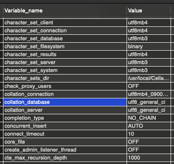

# [구름 에듀 - 스프링부트 나만의 블로그 만들기](https://edu.goorm.io/learn/lecture/24605/%EC%8A%A4%ED%94%84%EB%A7%81%EB%B6%80%ED%8A%B8-%EB%82%98%EB%A7%8C%EC%9D%98-%EB%B8%94%EB%A1%9C%EA%B7%B8-%EB%A7%8C%EB%93%A4%EA%B8%B0)

몰랐거나 기억해두고 싶은 것 정리

## 1. 환경 세팅

**환경변수**

어떤 경로에 있던 운영체제가 쉽게 프로그램에 접근할 수 있도록, 특정 파일의 경로를 저장한 것이다.


**Spring boot devtools**

캐시를 사용하여 성능 향상 -> 파일 변경 시 자동 재시작 (개발 편리)


**Lombok**

getter, setter, 생성자 자동 생성


**Spring Data JPA** + **MySQL Driver**

ORM을 사용할 수 있는 라이브러리


**Spring Security**

스프링 관련 보안 기능 제공 라이브러리


**Spring Web**

어노테이션 사용을 위한 라이브러리

내장형 컨테이너로 톰캣을 기본탑재하고 있다


**제어의 역전 Inverse Of Control**

스프링이 객체를 생성해서 메모리에 할당하는 것.

싱글톤 패턴 + 레퍼런스 변수를 스프링이 관리 =>  스프링 컨테이너에 변수를 관리

패키지 스캔으로 필요한 변수를 모두 메모리에 로드 -> IoC파일을 패키지 스캔 설정한 패키지 아래에 파일을 생성해야한다

특정 어노테이션이 붙어있는 클래스 파일들을 new해서(IoC) 스프링 컨테이너에서 관리함

패키지 스캔할 클래스에 @Controller 선언


**MySQL UTF-8 설정 (Mac)**

1. MySQL 설정 변경

   ```shell
   vi /usr/local/etc/my.cnf
   ```

   기존에 아래 내용이 저장되어 있었다.

   ```text
   // /usr/local/etc/my.cnf 에 저장되어 있던 내용
   
   # Default Homebrew MySQL server config
   [mysqld]
   # Only allow connections from localhost
   bind-address = 127.0.0.1
   mysqlx-bind-address = 127.0.0.1
   ```

   내용 추가한다.

   ```text
   // /usr/local/etc/my.cnf 에 내용 추가
   
   # Default Homebrew MySQL server config
   [mysqld]
   # Only allow connections from localhost
   bind-address = 127.0.0.1
   mysqlx-bind-address = 127.0.0.1
   
   [mysqld]
   init_connect="SET collation_connection=utf8_general_ci"
   init_connect="SET NAMES utf8"
   character-set-server=utf8
   collation-server=utf8_general_ci
   skip-character-set-client-handshake
   
   [client]
   default-character-set=utf8
   
   [mysql]
   default-character-set=utf8
   ```

   ESC 누른 후 :wq 로 저장하고 나온다.

2. MySQL  재시작

   ```shell
   brew services stop mysql
   brew services start mysql
   ```

   재시작 한 뒤, 데이터베이스에 접속한다.

3. MySQL 설정 확인

   ```sql
   show variables like 'c%';
   ```

   utf-8로 변경된 것을 확인한다.

   


**properties 확장자가 아니라 yaml 확장자를 사용하는 이유**

yaml은 들여쓰기로 구분하여 똑같은 문구를 여러번 적지 않아도 된다.

```properties
#properties 예시
spring.datasource.driver-class-name: com.mysql.cj.jdbc.Driver
spring.datasource.url: jdbc:mysql://localhost:3306/blog?serverTimezone=Asia/Seoul
spring.datasource.username: cos
spring.datasource.password: cos1234
```

```yaml
# yaml 예시
spring:
  datasource:
    driver-class-name: com.mysql.cj.jdbc.Driver
    url: jdbc:mysql://localhost:3306/blog?serverTimezone=Asia/Seoul
    username: cos
    password: cos1234
```


**Git의 세가지 공간에 대한 비유**

- 작업 영역(폴더) -> 흐르는 뷰
- add
- 인덱스(Index) -> 사진
- commit
- 헤드(HEAD) ->  사진첩


## 2. 시작해봅시다

**HTTP 1.1의 4가지 요청방법**

- GET: 데이터 조회 -> Select
  - 쿼리스트링
    - 요청**?**데이터1=값&데이터2=값&...
- POST: 데이터 추가 -> Insert
  - 바디에 데이터를 넣어서 추가할 데이터 전송

  - 바디에 넣는 방법들
    - form-data
    - x-www-form-urlencoded
    - raw
    - binary
    - GraphQL

- PUT: 데이터 수정 -> Update
- DELETE: 데이터 삭제 -> Delete


**stateless**

클라이언트가 요청 시 마다 스트림을 연결해서 data를 주고 받는 방식

- HTTP 방식
- 세션 유지 어려움
  - session: 데이터를 응답해줄 준비가 됨 == 인증이 되어 있음


**stateful**

클라이언트와 서버의 연결이 지속되는 상태에서 data를 주고 받는 방식

- ex. 채팅
- 세션 유지 쉬움


**패킷 스위칭**

데이터를 패킷 단위로 잘라서 바디에 넣고 데이터의 정보는 헤더에 넣어서 전송

- 데이터 조립 과정 필요 -> 헤더에 저장된 데이터의 정보를 바탕으로 조립
- 헤더에 데이터의 형태를 알려주는 **MIME 타입**이 있다.


**서킷 스위칭**

데이터를 통째로 전송


**[MIME 타입](https://developer.mozilla.org/ko/docs/Web/HTTP/Basics_of_HTTP/MIME_types)**

- 형식: type/subtype


**HTTP 데이터 요청 반응**

- 200

  ```text
  // General
  
  Request URL: http://localhost:8080/http/get
  Request Method: GET
  Status Code: 200 
  Remote Address: [::1]:8080
  Referrer Policy: strict-origin-when-cross-origin
  
  // Response Headers
  
  Connection: keep-alive
  Content-Length: 10
  Content-Type: text/html;charset=UTF-8
  Date: Wed, 10 Nov 2021 05:29:08 GMT
  Keep-Alive: timeout=60
  
  // Request Headers
  
  Accept: text/html,application/xhtml+xml,application/xml;q=0.9,image/avif,image/webp,image/apng,*/*;q=0.8,application/signed-exchange;v=b3;q=0.9
  Accept-Encoding: gzip, deflate, br
  Accept-Language: ko-KR,ko;q=0.9,en-US;q=0.8,en;q=0.7
  Cache-Control: max-age=0
  Connection: keep-alive
  Host: localhost:8080
  sec-ch-ua: "Google Chrome";v="95", "Chromium";v="95", ";Not A Brand";v="99"
  sec-ch-ua-mobile: ?0
  sec-ch-ua-platform: "macOS"
  Sec-Fetch-Dest: document
  Sec-Fetch-Mode: navigate
  Sec-Fetch-Site: none
  Sec-Fetch-User: ?1
  Upgrade-Insecure-Requests: 1
  User-Agent: Mozilla/5.0 (Macintosh; Intel Mac OS X 10_15_7) AppleWebKit/537.36 (KHTML, like Gecko) Chrome/95.0.4638.69 Safari/537.36
  ```

- [405 해당 메서드 허용되지 않음](https://developer.mozilla.org/ko/docs/Web/HTTP/Status/405)

  ```text
  // General
  
  Request URL: http://localhost:8080/http/post
  Request Method: GET
  Status Code: 405 
  Remote Address: [::1]:8080
  Referrer Policy: strict-origin-when-cross-origin
  
  // Response Headers
  
  Allow: POST
  Connection: keep-alive
  Content-Language: ko-KR
  Content-Length: 4952
  Content-Type: text/html;charset=UTF-8
  Date: Wed, 10 Nov 2021 05:32:13 GMT
  Keep-Alive: timeout=60
  
  // Request Headers
  
  Accept: text/html,application/xhtml+xml,application/xml;q=0.9,image/avif,image/webp,image/apng,*/*;q=0.8,application/signed-exchange;v=b3;q=0.9
  Accept-Encoding: gzip, deflate, br
  Accept-Language: ko-KR,ko;q=0.9,en-US;q=0.8,en;q=0.7
  Connection: keep-alive
  Host: localhost:8080
  sec-ch-ua: "Google Chrome";v="95", "Chromium";v="95", ";Not A Brand";v="99"
  sec-ch-ua-mobile: ?0
  sec-ch-ua-platform: "macOS"
  Sec-Fetch-Dest: document
  Sec-Fetch-Mode: navigate
  Sec-Fetch-Site: none
  Sec-Fetch-User: ?1
  Upgrade-Insecure-Requests: 1
  User-Agent: Mozilla/5.0 (Macintosh; Intel Mac OS X 10_15_7) AppleWebKit/537.36 (KHTML, like Gecko) Chrome/95.0.4638.69 Safari/537.36
  ```
  
- **인터넷 브라우저 요청은 무조건 get요청 밖에 할 수 없다.**


**Maven**

프로젝트에 필요한 라이브러리를 관리하는 도구

pom.xml에 작성해두고 서버를 실행하면 필요한 라이브러리를 자동으로 다운받는다.


**@Builder 의 장점**

- 입력 값 순서를 신경쓰지 않아도 된다.


**[yaml 이란](https://www.inflearn.com/questions/16184)**

- XML, JSON보다도 경량의 파일

  - " " 가 없다
  - : 뒤에 공백있다
  - { } 중괄호 대신에 들여쓰기


**application.yml**

아래 모든 설정 합쳐 놓음

- web.xml
- root-context.xml: 싱글톤을 유지하기 위해서 한번만 생성할 객체 지정
- servlet-context.xml: 지속적으로 생성할 객체 지정

```yaml
#application.yml

server:
  port: 8000
  servlet:
    context-path: /blog
    encoding:
      charset: UTF-8
      enabled: true
      force: true
    
spring:
  mvc:
    view:
      prefix: /WEB-INF/views/
      suffix: .jsp
      
  datasource:
    driver-class-name: com.mysql.cj.jdbc.Driver
    url: jdbc:mysql://localhost:3306/blog?serverTimezone=Asia/Seoul
    username: cos
    password: cos1234
    
  jpa:
    open-in-view: true
    hibernate:
      ddl-auto: create
      naming:
        physical-strategy: org.hibernate.boot.model.naming.PhysicalNamingStrategyStandardImpl
      use-new-id-generator-mappings: false
    show-sql: true
    properties:
      hibernate.format_sql: true

  jackson:
    serialization:
      fail-on-empty-beans: false
```


- 서버 경로 설정
  1. port
     - 기존 포트: 8080
  2. context-path
     - 기존 context-path: /


- view 경로 설정
```yaml
spring:
  mvc:
    view:
      prefix: /WEB-INF/views/
      suffix: .jsp
```

1. prefix
2. suffix


view 파일에 따라 설정 방법이 다르다

1. 정적인 파일
   - 파일리턴(@Controller) 기본경로: src/main/resources/static
   - 리턴명에 '/'가 들어가야 함

 2. 동적인 파일 (ex. jsp)
    - jsp는 html, png 등과 달리 동적인 파일이라서 src/main/resources/static 아래가 아닌 src/main/webapp/WEB_INF/views 아래에 넣어함


