# 부스트코스 웹 백엔드

- 링크: [부스트코스 웹 백엔드](https://www.boostcourse.org/web326/joinLectures/28762)
- 기간: 2021. 10. 30 ~ 2021. . 


[TOC]


## 1. SQL & JDBC 프로그래밍

### 1) MySQL

**데이터베이스와 데이터베이스 관리 시스템**

- Q> 데이터베이스와 데이터베이스 관리 시스템을 어린이도 알 수 있을 정도로 설명해주세요.
- A> 도서관에 있는 책들이 데이터베이스라고 한다면, 도서관 사서분들이나 도서 정보를 찾아주는 컴퓨터를 DBMS라고 볼 수 있습니다.


**데이터베이스의 기본개념 (정의)**

- 데이터의 집합 (a Set of Data)
- 여러 응용 시스템(프로그램)들의 통합된 정보들을 저장하여 운영할 수 있는 공용(share) 데이터의 집합
- 효율적으로 저장, 검색, 갱신할 수 있도록 데이터 집합들끼리 연관시키고 조직화되어야 한다.


**데이터베이스의 특성**

- 실시간 접근성(Real-time Accessability)
  - 사용자의 요구를 즉시 처리할 수 있다.
- 계속적인 변화(Continuous Evolution)
  - 정확한 값을 유지하려고 삽입·삭제·수정 작업 등을 이용해 데이터를 지속적으로 갱신할 수 있다.
- 동시 공유성(Concurrent Sharing)
  - 사용자마다 서로 다른 목적으로 사용하므로 동시에 여러 사람이 동일한 데이터에 접근하고 이용할 수 있다.
- 내용 참조(Content Reference)
  - 저장한 데이터 레코드의 위치나 주소가 아닌 사용자가 요구하는 데이터의 내용, 즉 데이터 값에 따라 참조할 수 있어야 한다.


**데이터베이스 관리 시스템 (Database Management System = DBMS)**

- 데이터베이스를 관리하는 소프트웨어

- 여러 응용 소프트웨어(프로그램) 또는 시스템이 동시에 데이터베이스에 접근하여 사용할 수 있게 한다

- 필수 3기능
  
  - 정의기능 :  데이터 베이스의 논리적, 물리적 구조를 정의
  - 조작기능 : 데이터를 검색, 삭제, 갱신, 삽입, 삭제하는 기능
  - 제어기능 :  데이터베이스의 내용 정확성과 안전성을 유지하도록 제어하는 기능
  
- Oracle, SQL Server, MySQL, DB2 등의 상용 또는 공개 DBMS가 있다.

  

**데이터베이스 관리 시스템의 장/단점**

- 장점

  - 데이터 중복이 최소화

  - 데이터의 일관성 및 무결성 유지

  - 데이터 보안 보장

- 단점
  - 운영비가 비싸다
  - 백업 및 복구에 대한 관리가 복잡
  - 부분적 데이터베이스 손실이 전체 시스템을 정지

[install and uninstall MySQL in Mac](https://whitepaek.tistory.com/16)

**MySQL 실행 (Mac)**

- 서버 실행

  ```shell
  mysql.server start
  ```

  - 실행 성공 메세지

    ```shell
    Starting MySQL
    . SUCCESS!
    ```

    

- [데몬](../OS/데몬)으로 실행

  ```shell
  brew services start mysql // 서비스 실행
  brew services restart mysql // 서비스 재시작
  ```

  - 데몬으로 실행되고 있는 프로그램 조회

    ```shell
    brew services list
    ```

    

**MySQL 종료**

- 서버 종료

  ```shell
  mysql.server stop
  ```

	- 실행 성공 메세지

    ```shell
    Shutting down MySQL
    
    .. SUCCESS!
    ```

- [데몬](../OS/데몬)으로 종료

  ```shell
  brew services stop mysql
  ```


### 2) SQL(Structured Query Language)

- SQL은 데이터를 보다 쉽게 검색하고 추가, 삭제, 수정 같은 조작을 할 수 있도록 고안된 컴퓨터 언어입니다.
- 관계형 데이터베이스에서 데이터를 조작하고 쿼리하는 표준 수단입니다.
- DML (Data Manipulation Language): 데이터를 조작하기 위해 사용합니다.
  - INSERT, UPDATE, DELETE, SELECT 등이 여기에 해당합니다.
- DDL (Data Definition Language): 데이터베이스의 스키마를 정의하거나 조작하기 위해 사용합니다.
  - CREATE, DROP, ALTER 등이 여기에 해당합니다.
- DCL (Data Control Language) : 데이터를 제어하는 언어입니다. 권한을 관리하고, 테이터의 보안, 무결성 등을 정의합니다.
  - GRANT, REVOKE 등이 여기에 해당합니다.


**Database 생성하기**

- MySQL 관리자 계정인 root로 데이터베이스 관리 시스템에 접속하겠다는 것입니다.

```markup
mysql –uroot  -p
```

window 사용자는 설치 시에 입력했던 암호를 입력합니다.

맥 사용자는 암호가 없으니 그냥 엔터를 입력하면 됩니다.

MySQL DBMS에 접속하면 “mysql>” 프롬프트가 보입니다.

- 관리자 계정으로 MySQL에 접속했다면, 다음과 같은 명령으로 데이터베이스를 생성합니다.

```markup
 mysql> create database DB이름;
```

우리는 다음과 같은 명령을 실행하여 DB이름을 “connectdb＂로 생성하도록 하겠습니다.

```markup
mysql> create database connectdb;
```


**Database 사용자 생성과 권한 주기**

- Database를 생성했다면, 해당 데이터베이스를 사용하는 계정을 생성해야 합니다.
- 또한, 해당 계정이 데이터베이스를 이용할 수 있는 권한을 줘야 합니다.
- 아래와 같은 명령을 이용해서 사용자 생성과 권한을 줄 수 있습니다.
- db이름 뒤의 * 는 모든 권한을 의미한다.
- @’%’는 어떤 클라이언트에서든 접근 가능하다는 의미이고, @’localhost’는 해당 컴퓨터에서만 접근 가능하다는 의미입니다.
- flush privileges는 DBMS에게 적용을 하라는 의미입니다.
- 해당 명령을 반드시 실행해줘야 합니다.

```markup
grant all privileges on db이름.* to 계정이름@'%' identified by ＇암호’;
grant all privileges on db이름.* to 계정이름@'localhost' identified by ＇암호’;
flush privileges;
```

- 사용자 계정이름은 'connectuser', 암호는 'connect123!@#', 해당 사용자가 사용하는 데이터베이스는 'connectdb'로 계정을 생성하려면 다음과 같이 명령을 수행합니다.

```markup
grant all privileges on connectdb.* to connectuser@'%' identified by 'connect123!@#';

grant all privileges on connectdb.* to connectuser@'localhost' identified by 'connect123!@#';

flush privileges;

// mysql 8버전: 사용자 생성(+비밀번호 설정) 후 권한 부여
CREATE USER connectuser@'%' identified by 'connect123!@#';
GRANT ALL PRIVILEGES ON connectdb.* TO connectuser@'%'WITH GRANT OPTION;
```

[MySQL 8버전 grant 관련 문서](https://dev.mysql.com/doc/refman/8.0/en/grant.html)


[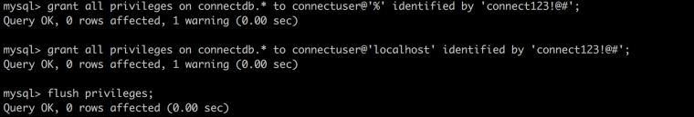](https://www.boostcourse.org/web326/lecture/258481?isDesc=false#)

**생성한 Database에 접속하기**

- mysql -h호스트명 -uDB계정명 -p 데이터베이스 이름
  -  mysql -h127.0.0.1 -uconnectuser -p connect123!@# [enter]

- **실행한 모습**

[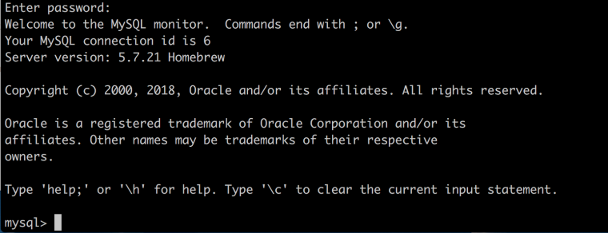](https://www.boostcourse.org/web326/lecture/258481?isDesc=false#)

- **다음과 같이 프롬프트가 보이면 성공**

**MySQL 연결끊기**

프롬프트에서 quit혹은 exit라고 입력합니다.

```markup
mysql> QUIT
mysql> exit
```

[](https://www.boostcourse.org/web326/lecture/258481?isDesc=false#)

- **다음과 같이 Bye라고 나오면 연결 끊기 성공**


**MySQL 버전과 현재 날짜 구하기**

```markup
mysql> SELECT VERSION(), CURRENT_DATE;
+-----------+--------------+
| VERSION() | CURRENT_DATE |
+-----------+--------------+
| 5.1.67    | 2013-01-05   |
+-----------+--------------+
1 row in set (0.00 sec)
```

프롬프트에서는 SQL을 입력합니다.

SQL은 semicolon (;)으로 끝납니다.

SQL은 쿼리(Query)라고 읽습니다.

쿼리는 DBMS에게 명령을 내릴 때 사용하는 문장이라고 생각하면 쉽습니다.

SELECT는 어떤 내용을 조회할 때 사용하는 키워드입니다.

MySQL은 쿼리에 해당하는 결과의 전체 row를 출력하고 마지막에 전체 row 수와 쿼리실행에 걸린 시간을 표시합니다.

 

**키워드는 대소문자를 구별하지 않는다.**

다음 쿼리들은 모두 같습니다.

```markup
mysql> SELECT VERSION(), CURRENT_DATE;
mysql> select version(), current_date;
mysql> SeLeCt vErSiOn(), current_DATE;
```

 

**쿼리를 이용해서 계산식의 결과도 구할 수 있다.**

 함수 및 수식 사용 예제

```markup
mysql> SELECT SIN(PI()/4), (4+1)*5;
+-------------+---------+
| SIN(PI()/4) | (4+1)*5 |
+-------------+---------+
|    0.707107 |      25 |
+-------------+---------+
```

 

**여러 문장을 한 줄에 연속으로 붙여서 실행가능하다.**

각 문장에 semicolon(;)만 붙혀 주면 됩니다.

```markup
mysql> SELECT VERSION(); SELECT NOW();
+--------------+
| VERSION()    |
+--------------+
| 3.22.20a-log |
+--------------+
+---------------------+
| NOW()               |
+---------------------+
| 2004 00:15:33 |
+---------------------+
```


**하나의 SQL은 여러 줄로 입력가능하다.**

MySQL은 문장의 끝을 라인으로 구분하는 것이 아니라 semicolon(;)으로 구분하기 때문에 여러 줄에 거쳐 문장을 쓰는 것도 가능합니다.

```markup
mysql> SELECT
    -> USER()
    -> ,
    -> CURRENT_DATE;
+--------------------+--------------+
| USER()             | CURRENT_DATE |
+--------------------+--------------+
| joesmith@localhost | 1999-03-18   |
+--------------------+--------------+
```

 

**SQL을 입력하는 도중에 취소할 수 있다.**

긴 쿼리를 작성하다가 중간에 취소해야 하는 경우에는 즉시 \c를 붙혀주면 됩니다.

```markup
mysql> SELECT

    -> USER()

    -> \c

mysql>
```

 

**DBMS에 존재하는 데이터베이스 확인하기**

작업하기 위한 데이터베이스를 선택하기 위해서는 어떤 데이터베이스가 존재하는지 알아보아야 합니다.

현재 서버에 존재하는 데이터베이스를 찾아보기 위해서 SHOW statement을 사용합니다.

```markup
mysql> show databases;
+-----------------------+
| Database               |
+-----------------------+
| information_schema |
| connectdb              |
+-----------------------+
2 rows in set (0.00 sec)
```

 

 

**사용중인 데이터베이스 전환하기**

Database을 선택하기 위해, “use” command 사용합니다.

```markup
mysql> use mydb;
```

데이터베이스를 전환하려면, 이미 데이터베이스가 존재해야 하며 현재 접속 중인 계정이 해당 데이터베이스를 사용할 수 있는 권한이 있어야 합니다.


**데이터를 저장하는 공간 테이블(Table)**

- 마이크로소프트의 엑셀(Excel)을 실행하면 표가 나옵니다. 이러한 표에 각종 값을 저장할 수 있습니다.
- 데이터베이스도 엑셀의 표와 유사한 테이블을 가질 수 있습니다.
- 엑셀과 다른 점은 데이터베이스를 생성해도 테이블은 존재하지 않는다는 것입니다.
- 테이블을 사용하려면 테이블을 생성하는 SQL을 사용해야 합니다.
- 그리고, 테이블에 값을 저장하려면 저장하기 위한 SQL을 사용해야 합니다.


**테이블(table)의 구성요소**

[_.PNG)](https://www.boostcourse.org/web326/lecture/258482/?isDesc=false#)

- **테이블(table)의 구성요소**

- 테이블 : RDBMS의 기본적 저장구조 한 개 이상의 column과 0개 이상의 row로 구성합니다.
- 열(Column) : 테이블 상에서의 단일 종류의 데이터를 나타냄. 특정 데이터 타입 및 크기를 가지고 있습니다.
- 행(Row) : Column들의 값의 조합. 레코드라고 불림. 기본키(PK)에 의해 구분. 기본키는 중복을 허용하지 않으며 없어서는 안 됩니다.
- Field : Row와 Column의 교차점으로 Field는 데이터를 포함할 수 있고 없을 때는 NULL 값을 가지고 있습니다.

​           

**현재 데이터베이스에 존재하는 테이블 목록 확인하기**

Database를 선택 후, Database의 전체 테이블 목록을 출력합니다.

```markup
mysql> show tables;

Empty set (0.02 sec)
```

“empty set” 은  데이터베이스에 어떤 테이블도 아직 생성되지 않았다는 것을 알려줍니다.


**SQL 연습을 위한 테이블 생성과 값의 저장**

examples.sql을 다운로드 합니다. [링크 바로가기](https://github.com/connect-boostcamp/boostcourse_fullstack_web/tree/master/part2)

터미널에서 examples.sql이 있는 폴더로 이동한 후, 다음과 같이 명령을 수행합니다.

명령을 수행한 후 암호를 입력합니다.

```markup
mysql   -uconnectuser  -p  connectdb   <  examples.sql
```

examples.sql에는 연습을 위한 테이블 생성문과 해당 테이블에 값을 저장하는 입력문이 존재합니다.

```markup
mysql –uconnectuser -p  connectdb
```

위의 명령으로 connectdb에 접속한 후 다음과 같이 명령을 수행합니다.

```markup
mysql> show tables
```

위의 명령은 접속한 db의 테이블 목록을 보는 명령입니다.

[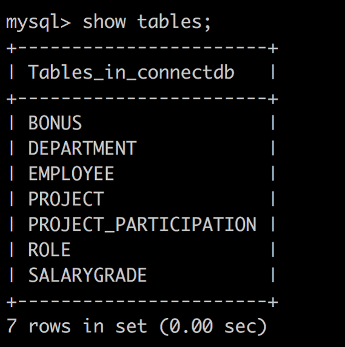](https://www.boostcourse.org/web326/lecture/258482/?isDesc=false#)

- **SQL연습을 위한 테이블 생성과 값의 저장**

**테이블 구조를 확인하기 위한 DESCRIBE 명령**

table 구조를 확인하기 위해, DESCRIBE 명령을 사용할 수 있습니다.

짧게 DESC라고 사용해도 됩니다.

EMPLOYEE테이블의 구조를 확인해 봅시다.

```markup
mysql> desc EMPLOYEE;
```


 **데이터 조작어(Data Manipulation Language, DML)의 종류**

데이터 조작어는 모두 동사로 시작합니다.

시작하는 동사에 따라서 다음과 같은 4가지 조작어가 있습니다.

- SELECT – 검색
- INSERT - 등록
- UPDATE - 수정
- DELETE - 삭제


**SELECT 구문의 기본문형**

[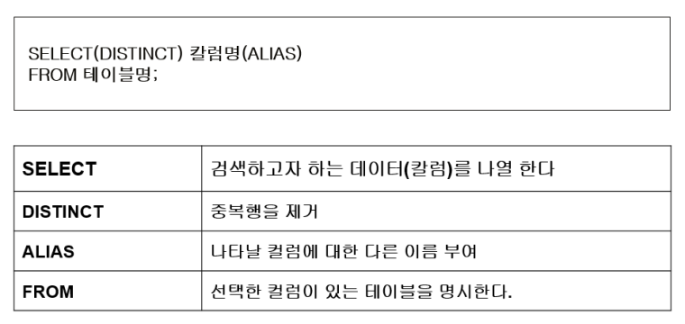](https://www.boostcourse.org/web326/lecture/258484/?isDesc=false#)

- **select 구문의 기본문형**

**SELECT 구문 예제(전체 데이터 검색)**

- 전체 데이터 검색
- SELECT 뒤에 * 를 기술함으로써 나타낼 수 있다.

예제 : departments 테이블의 모든 데이터를 출력하시오.

```markup
  SELECT * FROM  DEPARTMENT;
```

[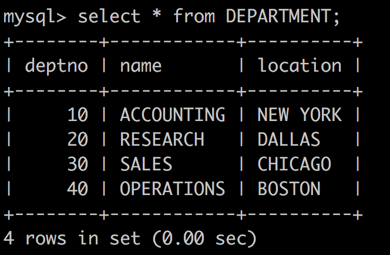](https://www.boostcourse.org/web326/lecture/258484/?isDesc=false#)

- **select 구문 예제**

**SELECT 구문 예제(특정 컬럼 검색)**

- SELECT 뒤에 컬럼을 콤마(,)로 구별해서 나열

예제 : employee 테이블에서 직원의 사번(empno), 이름(name), 직업(job)을 출력하시오.

어떤 칼럼이 있는지는 desc명령으로 확인

```markup
select empno, name, job from employee;
```

[.png)](https://www.boostcourse.org/web326/lecture/258484/?isDesc=false#)

- **select 구문 예제(특정 컬럼 검색)**

**SELECT 구문 예제(컬럼에 Alias부여하기)**

- 컬럼에 대한 ALIAS(별칭)을 부여해서 나타내는 칼럼의 HEADING을 변경할 수 있다.

예제 : employee 테이블에서 직원의 사번(empno), 이름(name), 직업(job)을 출력하시오.

```markup
select empno as 사번, name as 이름, job as 직업 from employee;
```

[.png)](https://www.boostcourse.org/web326/lecture/258484/?isDesc=false#)

- **select 구문 예제(칼럼에 alias부여하기)**

**SELECT 구문 예제(컬럼의 합성(Concatenation))**

- 문자열 결합함수 concat 사용

예제 : employee 테이블에서 사번과 부서번호를 하나의 칼럼으로 출력하시오.

```markup
SELECT concat( empno, '-', deptno) AS '사번-부서번호' 
FROM employee;
```

[.png)](https://www.boostcourse.org/web326/lecture/258484/?isDesc=false#)

- **select 구문 예제(컬럼의 합성)**

**SELECT 구문 예제(중복행의 제거)**

- 중복되는 행이 출력되는 경우, DISTINCT 키워드로 중복행을 제거

예제1 : 사원 테이블의 모든 부서번호 출력하시오. (사원 수 만큼 출력된다.)

```markup
select deptno from employee;
```

[-20211105203957913.png)](https://www.boostcourse.org/web326/lecture/258484/?isDesc=false#)

- **select 구문 예제(중복행의 제거)**

예제2 : 사원 테이블의 부서번호를 중복되지 않게 출력하시오.

```markup
select distinct deptno from employee;
```

[-2.png)](https://www.boostcourse.org/web326/lecture/258484/?isDesc=false#)

- **select 구문 예제(중복행의 제거)-2**

**SELECT 구문 예제(정렬하기)**

[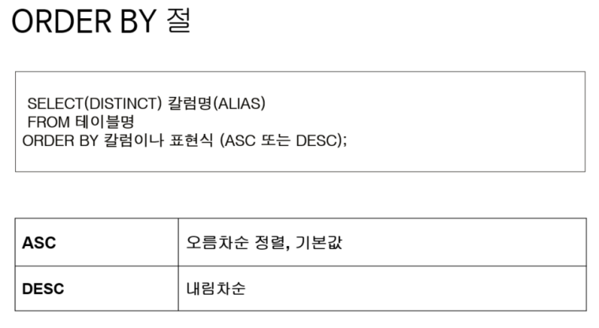](https://www.boostcourse.org/web326/lecture/258484/?isDesc=false#)

- **ORDER BY 절**

**SELECT 구문 예제(정렬하기)**

예제 : employee 테이블에서 직원의 사번(empno), 이름(name), 직업(job)을 출력하시오.

단, 이름을 기준으로 오름차순 정렬합니다.

```markup
select empno, name, job from employee order by name;

select empno as 사번, name as 이름, job as 직업 from employee order by 이름;
```

[.png)](https://www.boostcourse.org/web326/lecture/258484/?isDesc=false#)

- **select 구문 예제(alias를 사용하지 않았을 경우)**

[.png)](https://www.boostcourse.org/web326/lecture/258484/?isDesc=false#)

- **select 구문 예제(alias를 사용했을 경우)**

**SELECT 구문 예제(정렬하기)**

예제 : employee 테이블에서 직원의 사번(empno), 이름(name), 직업(job)을 출력하시오.

단, 이름을 기준으로 내림차순 정렬합니다.

```markup
select empno, name, job from employee order by name desc;
```

[.png)](https://www.boostcourse.org/web326/lecture/258484/?isDesc=false#)

- **select 구문 예제(이름 기준 내림 차순 정렬하기 결과)**


**SELECT 구문 예제(특정 행 검색- where절)**


[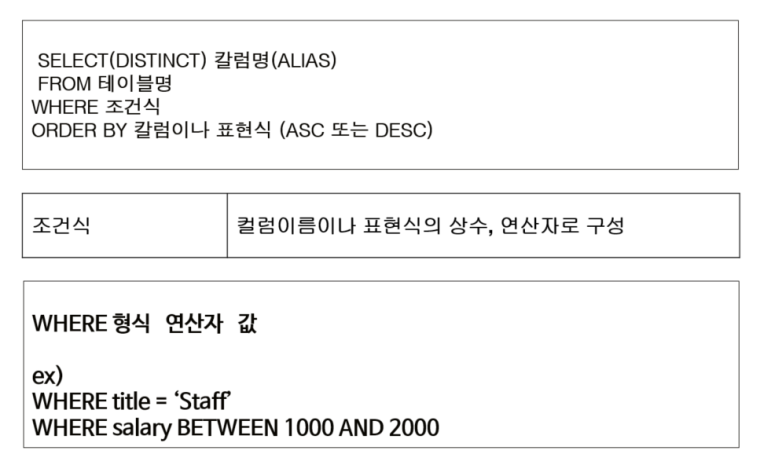](https://www.boostcourse.org/web326/lecture/258485/?isDesc=false#)

- **SELECT 구문 예제(특정 행 검색- where절)**

- 산술비교 연산자

예제 : employee 테이블에서 고용일(hiredate)이 1981년 이전의 사원이름과 고용일을 출력하시오.

```markup
select name, hiredate from employee where hiredate < '1981-01-01';
```

[.png)](https://www.boostcourse.org/web326/lecture/258485/?isDesc=false#)

- **select 구문 예제(특정 행 검색-where절)**

- 논리연산자

예제 : employee 테이블에서 부서번호가 30인 사원이름과 부서번호를 출력하시오.

```markup
select name, deptno from employee where deptno = 30;
```

[-2.png)](https://www.boostcourse.org/web326/lecture/258485/?isDesc=false#)

- **select 구문 예제(특정 행 검색-where절)-2**

- IN 키워드

예제 : employee 테이블에서 부서번호가 10또는 30인 사원이름과 부서번호를 출력하시오.

```markup
select name, deptno from employee where deptno in (10, 30);
```

[-3.png)](https://www.boostcourse.org/web326/lecture/258485/?isDesc=false#)

- **select 구문 예제(특정 행 검색-where절)-3**

- LIKE 키워드
- 와일드 카드를 사용하여 특정 문자를 포함한 값에 대한 조건을 처리
- % 는 0에서부터 여러 개의 문자열을 나타냄
- _ 는 단 하나의 문자를 나타내는 와일드 카드

예제 : employee 테이블에서 이름에 'A'가 포함된 사원의 이름(name)과 직업(job)을 출력하시오.

```markup
select name, job from employee where name like '%A%';
```

[-4.png)](https://www.boostcourse.org/web326/lecture/258485/?isDesc=false#)

- **select 구문 예제(특정 행 검색-where절)-4**

**SELECT 구문 예제(함수의 사용)**

- UCASE, UPPER

```markup
mysql> SELECT UPPER('SEoul'), UCASE('seOUL');
 +-----------------+-----------------+
  | UPPER('SEoul') | UCASE('seOUL') |
  +-----------------+-----------------+
  | SEOUL            | SEOUL            |
  +-----------------+-----------------+
```

from 다음에 테이블이 없을 경우에는 테이블에서 조회하는 것이 아닙니다.

- LCASE, LOWER

```markup
mysql> SELECT LOWER('SEoul'), LCASE('seOUL');
 +-----------------+-----------------+
  | LOWER('SEoul') | LCASE('seOUL') |
  +-----------------+-----------------+
  | seoul              | seoul             |
  +-----------------+-----------------+
```

- substring // 시작인덱스는 1

```markup
mysql> SELECT SUBSTRING('Happy Day',3,2); 
  +-----------------+-----------------+
  | SUBSTRING('Happy Day',3,2)      |
  +-----------------+-----------------+
  | pp                                       |
  +-----------------+-----------------+
```

- LPAD, RPAD // (기존 문자열, 채운 뒤 결과 문자열 길이, 채울 문자)

```markup
mysql> SELECT LPAD('hi',5,'?'),LPAD('joe',7,'*');
  +------------------+-------------------+
  | LPAD('hi',5,'?')    | LPAD('joe',7,'*')   |
  +------------------+-------------------+
  | ???hi               |           ****joe    |
  +------------------+-------------------+
```

- TRIM, LTRIM, RTRIM // 공백 제거

```markup
mysql> SELECT LTRIM(' hello '), RTRIM(' hello ');
+-------------------------------------+
| LTRIM(' hello ') | RTRIM(' hello ')  |
+-------------------------------------+
| 'hello '            | '  hello‘            |
+-------------------------------------+
mysql> SELECT TRIM(' hi '),TRIM(BOTH 'x' FROM 'xxxhixxx');
+----------------+-----------------------------------+
| TRIM(' hi ')     | TRIM(BOTH 'x' FROM 'xxxhixxx') |
+----------------+-----------------------------------+
| hi                 | hi                                       |
+----------------+-----------------------------------+
```

- ABS(x) : x의 절대값을 구합니다.

```markup
mysql> SELECT ABS(2), ABS(-2);
+-----------+------------+ 
| ABS(2)     | ABS(-2)    | 
+-----------+------------+ 
| 2            | 2             | 
+-----------+------------+
```

- MOD(n,m) % : n을 m으로 나눈 나머지 값을 출력합니다.

```markup
mysql> SELECT MOD(234,10), 253 % 7, MOD(29,9);
+----------------+------------+-------------+ 
| MOD(234,10)  | 253 % 7   | MOD(29,9) | 
+----------------+------------+-------------+ 
|      4.             |       1      |      2         | 
+----------------+------------+-------------+
```


**SELECT 구문(함수의 사용)**

- FLOOR(x) : x보다 크지 않은 가장 큰 정수를 반환합니다. BIGINT로 자동 변환합니다.
- CEILING(x) : x보다 작지 않은 가장 작은 정수를 반환합니다.
- ROUND(x) : x에 가장 근접한 정수를 반환합니다.
- POW(x,y) POWER(x,y) : x의 y 제곱 승을 반환합니다.
- GREATEST(x,y,...) : 가장 큰 값을 반환합니다.
- LEAST(x,y,...) : 가장 작은 값을 반환합니다.
- CURDATE(),CURRENT_DATE : 오늘 날짜를 YYYY-MM-DD나 YYYYMMDD 형식으로 반환합니다.
- CURTIME(), CURRENT_TIME : 현재 시각을 HH:MM:SS나 HHMMSS 형식으로 반환합니다.
- NOW(), SYSDATE() , CURRENT_TIMESTAMP : 오늘 현시각을 YYYY-MM-DD HH:MM:SS나 YYYYMMDDHHMMSS 형식으로 반환합니다. 
- DATE_FORMAT(date,format) : 입력된 date를 format 형식으로 반환합니다.
- PERIOD_DIFF(p1,p2) : YYMM이나 YYYYMM으로 표기되는 p1과 p2의 차이 개월을 반환합니다.


**SELECT 구문(CAST 형변환)**


[](https://www.boostcourse.org/web326/lecture/258486/?isDesc=false#)

- **SELECT 구문 (CAST 형변환)**

예제

```markup
mysql> select cast(now() as date);
+---------------------+
| cast(now() as date) |
+---------------------+
| 2003-09-25          |
+---------------------+
1 row in set (0.00 sec)
mysql> select cast(1-2 as unsigned);
+----------------------------+
|   cast(1-2 as unsigned)    |
+----------------------------+
|  18446744073709551615 |
+----------------------------+
```

 

**SELECT 구문(그룹함수)**

[.PNG)](https://www.boostcourse.org/web326/lecture/258486/?isDesc=false#)

- **SELECT 구문(그룹함수)**

**SELECT 구문 예제(그룹함수)**

예제 : employee 테이블에서 부서번호가 30인 직원의 급여 평균과 총합계를 출력하시오.

```markup
SELECT AVG(salary) , SUM(salary)
FROM employee
WHERE deptno = 30;
```

[.png)](https://www.boostcourse.org/web326/lecture/258486/?isDesc=false#)

- **SELECT 구문 예제(그룹함수)**

**SELECT 구문 예제(그룹함수와 groupby 절)**

예제 : employee 테이블에서 부서별 직원의 부서번호, 급여 평균과 총합계를 출력하시오.

```markup
SELECT deptno, AVG(salary) , SUM(salary)
FROM employee
group by deptno;
```

 

[.png)](https://www.boostcourse.org/web326/lecture/258486/?isDesc=false#)

- **SELECT 구문 예제(그룹함수와 groupby 절)**


**데이터 입력 (INSERT문)**

```markup
INSERT INTO 테이블명(필드1, 필드2, 필드3, 필드4, … ) 
        VALUES ( 필드1의 값, 필드2의 값, 필드3의 값, 필드4의 값, … )

INSERT INTO 테이블명
        VALUES ( 필드1의 값, 필드2의 값, 필드3의 값, 필드4의 값, … )
```

- 필드명을 지정해주는 방식은 디폴트 값이 세팅되는 필드는 생력할 수 있습니다.
- 필드명을 지정해주는 방식은 추 후, 필드가 추가/변경/수정 되는 변경에 유연하게 대처 가능합니다.
- 필드명을 생략했을 경우에는 모든 필드 값을 반드시 입력해야 합니다.

 

**데이터 입력 실습 (INSERT문)**

예제 : ROLE테이블에 role_id는 200, description에는 'CEO'로 한건의 데이터를 저장하시오.

```markup
insert into ROLE (role_id, description) values ( 200, 'CEO');
```

[.png)](https://www.boostcourse.org/web326/lecture/258487/?isDesc=false#)

**데이터 수정(UPDATE문)**

```markup
 UPDATE  테이블명
        SET  필드1=필드1의값, 필드2=필드2의값, 필드3=필드3의값, …
   WHERE  조건식
```

- 조건식을 통해 특정 row만 변경할 수 있습니다.
- 조건식을 주지 않으면 전체 로우가 영향을 미치니 조심해서 사용하도록 합니다.

[예제11] user 번호가 1인 사용자의 이름을 영문으로 바꾸고,  join_date을 현재 시간이 적용되도록 수정하시오.

```sql
update 
```


**데이터 수정 실습(UPDATE문)**

예제 : ROLE테이블에 role_id가 200일 경우 description을 'CTO'로 수정하시오.

```markup
update ROLE
set description = 'CTO'
where role_id = 200;
```

\* where절을 안줄 경우 모든 데이터가 수정되니 조심해야 합니다.

[.png)](https://www.boostcourse.org/web326/lecture/258487/?isDesc=false#)

- **데이터 수정 실습(UPDATE문)**

**데이터 삭제(DELETE문)**

```markup
 DELETE
      FROM  테이블명
WHERE  조건식
    
```

- 조건식을 통해 특정 row만 삭제할 수 있습니다.
- 조건식을 주지 않으면 전체 로우가 영향을 미치니 조심해서 사용하도록 합니다.

[예제12] user 번호가 1인 사용자를 삭제하시오.


**데이터 삭제 실습(DELETE문)**

예제 : ROLE테이블에서 role_id는 200인 정보를 삭제하시오.

```markup
delete from ROLE where role_id = 200;
```

\* where절을 안줄 경우 모든 데이터가 삭제되니 조심해야 합니다.

[.png)](https://www.boostcourse.org/web326/lecture/258487/?isDesc=false#)

- **데이터 삭제 실습(DELETE 문)**

**생각해보기**

사원의 이름과 그 사원이 속한 부서명을 구하려면 어떻게 해야할까요?

이 경우엔 EMPLOYEE 테이블과 DEPARTMENT 테이블을 조인(Join)해야 합니다. 

select문과 join에 대해 알아보세요.


**MySQL 데이터 타입**

[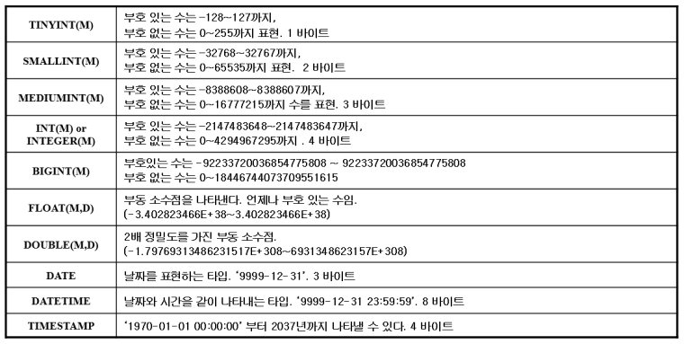](https://www.boostcourse.org/web326/lecture/58936/?isDesc=false#)

- **MySQL 데이터 타입-1**

[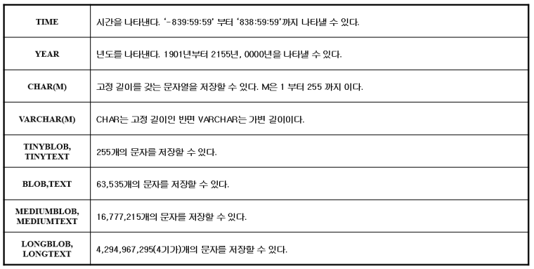](https://www.boostcourse.org/web326/lecture/58936/?isDesc=false#)

- **MySQL 데이터 타입-2**

**테이블 생성**

```sql
create table 테이블명( 
          필드명1 타입 [NULL | NOT NULL][DEFAULT ][AUTO_INCREMENT], 
          필드명2 타입 [NULL | NOT NULL][DEFAULT ][AUTO_INCREMENT], 
          필드명3 타입 [NULL | NOT NULL][DEFAULT ][AUTO_INCREMENT], 
          ........... 
          PRIMARY KEY(필드명));
```

- 데이터 형 외에도 속성값의 빈 값 허용 여부는 NULL 또는 NOT NULL로 설정
- DEFAULT 키워드와 함께 입력하지 않았을 때의 초기값을 지정
- 입력하지 않고 자동으로 1씩 증가하는 번호를 위한 AUTO_INCREMENT

 

**테이블 생성 실습**

EMPLOYEE와 같은 구조를 가진 EMPLOYEE2 테이블을 생성하시오.

[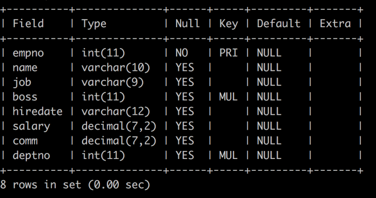](https://www.boostcourse.org/web326/lecture/58936/?isDesc=false#)

- **테이블 생성 실습**

```sql
CREATE TABLE EMPLOYEE2(   
            empno      INTEGER NOT NULL PRIMARY KEY,  
           name       VARCHAR(10),   
           job        VARCHAR(9),   
           boss       INTEGER,   
           hiredate   VARCHAR(12),   
           salary     DECIMAL(7, 2),   
           comm       DECIMAL(7, 2),   
          deptno     INTEGER);
```

 

**테이블 수정 (컬럼 추가 / 삭제)**

```sql
alter table 테이블명
          add  필드명 타입 [NULL | NOT NULL][DEFAULT ][AUTO_INCREMENT];

alter table 테이블명
         drop  필드명;
```

 

**테이블 수정 실습 (컬럼 추가)**

실습 – EMPLOYEE2 테이블에 생일(birthdate)칼럼을 varchar(12)형식으로 추가하시오.

```sql
alter table EMPLOYEE2
add birthdate varchar(12);
```

[.png)](https://www.boostcourse.org/web326/lecture/58936/?isDesc=false#)

- **테이블 수정 실습(컬럼추가)**

**테이블 수정 실습 (컬럼 삭제)**

실습 – EMPLOYEE2 테이블의 생일(birthdate)칼럼을 삭제하시오.

```sql
alter table EMPLOYEE2
drop birthdate;
```

[-20211105210235062.png)](https://www.boostcourse.org/web326/lecture/58936/?isDesc=false#)

- **테이블 수정 실습(컬럼추가삭제)**

**테이블 수정 (컬럼 수정)**

```sql
alter table  테이블명
     change  필드명  새필드명 타입 [NULL | NOT NULL][DEFAULT ][AUTO_INCREMENT];
```

- change 키워드를 사용하고 칼럼을 새롭게 재정의 (이름부터 속성까지 전부)

 

**테이블 수정 실습 (컬럼 수정)**

실습 – EMPLOYEE2 테이블의 부서번호(deptno)를 dept_no로 수정하시오.

```sql
alter table EMPLOYEE2
change deptno dept_no int(11);
```

[-20211105210235075.png)](https://www.boostcourse.org/web326/lecture/58936/?isDesc=false#)

- **테이블 수정 실습(컬럼수정)**

**테이블 이름 변경**

```sql
alter table  테이블명 rename 변경이름
```

 

**테이블 이름 변경 실습**

실습 – EMPLOYEE2 테이블의 이름을 EMPLOYEE3로 변경하시오.

```sql
alter table EMPLOYEE2
rename EMPLOYEE3;
```

[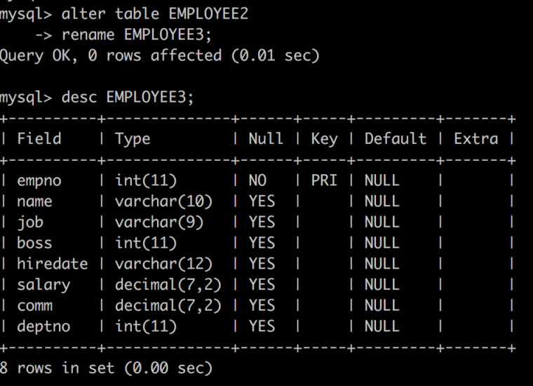](https://www.boostcourse.org/web326/lecture/58936/?isDesc=false#)

- **테이블 이름 변경 실습**

**테이블 삭제하기**

```sql
drop table 테이블이름;
```

참고로, 제약 조건이 있을 경우에는 drop table 명령으로도 테이블이 삭제되지 않을 수 있습니다.

그럴 경우는 테이블을 생성한 반대 순서로 삭제를 해야합니다.

 

**테이블 삭제 실습**

\* 테이블 삭제 후 desc 명령을 수행하면, 존재하지 않는 테이블이라고 표시됩니다.

실습 – EMPLOYEE2 테이블을 삭제하시오.

```sql
drop table EMPLOYEE2;
```

[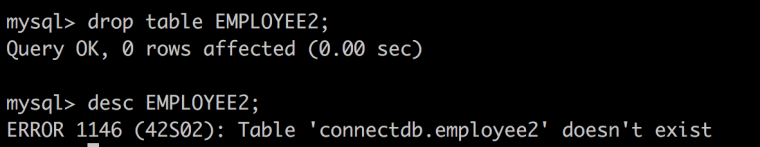](https://www.boostcourse.org/web326/lecture/58936/?isDesc=false#)

- **테이블 삭제 실습**


### 3) 개발환경 설정

JAVA언어를 작성된 프로그램을 실행하기 위해선 JRE(Java SE Runtime Environment)가 필요합니다.

JAVA언어를 사용하는 개발자가 아니라 JAVA언어로 만들어진 프로그램을 실행하는 사용자라면 JRE만 컴퓨터에 설치하면 됩니다.

보통 사용자 입장에서 JAVA를 설치한다는 것은 JRE를 설치하는 것을 말합니다.

JAVA언어를 사용하는 개발자는 JAVA언어로 작성된 소스(Source)를 컴파일하고 관리할 필요가 있습니다.

이때 사용되는 도구를 JDK(Java SE Development Kit)라고 말합니다.

JDK안에는 JRE도 포함되어 있습니다.

컴파일한 결과를 실행하기 위해서는 JRE가 필요하기 때문입니다.


JDK를 설치한 이후에는 JDK를 콘솔(console) 환경에서 잘 실행될 수 있도록 시스템 환경 설정을 해야 합니다.

시스템 환경 설정을 하는 방법은 운영체제에 따라서 다릅니다. 


**JAVA 환경설정**

JDK설치가 완료되었다면, JDK에 대한 시스템 환경설정을 해야 합니다.

시스템 환경설정을 하는 방법은 운영체제마다 다릅니다.

운영체제 마다 시스템 환경설정하는 방법은 다르지만, 설정해야 할 환경변수의 이름은 같습니다.

설정해야 할 환경변수는 다음과 같은 3가지입니다.

- JAVA_HOME : JAVA가 설치된 경로를 지정
- CLASSPATH : JAVA 클래스가 있는 경로들을 지정
- PATH : JAVA 실행파일이 있는 경로를 추가

JAVA_HOME, CLASSPATH는 시스템 환경변수에 새롭게 추가될 환경 변수이고, PATH는 기존에 존재하는 환경 변수입니다.


**1. MS Windows 10에서의 환경설정**

MS Windows 10에서 JDK 관련된 환경변수를 설정해 보도록 하겠습니다.

[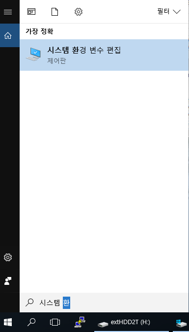](https://www.boostcourse.org/web326/lecture/58949/?isDesc=false#)

- 

  찾기 버튼을 누른 다음에 "시스템 환" 까지 입력합니다. 그러면 검색 결과에 "시스템 환경 변수 편집"이라는 결과가 보여질 것입니다. "시스템 환경 변수 편집"을 선택합니다.

[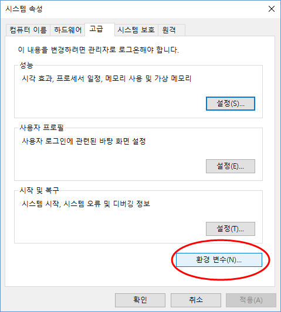](https://www.boostcourse.org/web326/lecture/58949/?isDesc=false#)

- 

  위와 같은 창이 열리면 "환경변수" 버튼을 클릭합니다.

[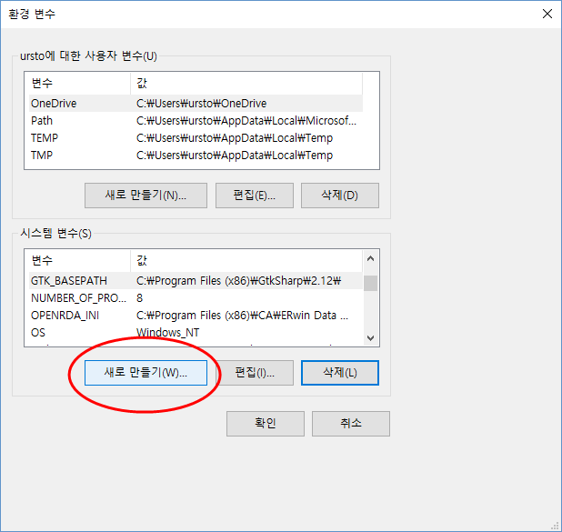](https://www.boostcourse.org/web326/lecture/58949/?isDesc=false#)

- 

  시스템 변수 영역의 "새로 만들기"버튼을 클릭합니다.

[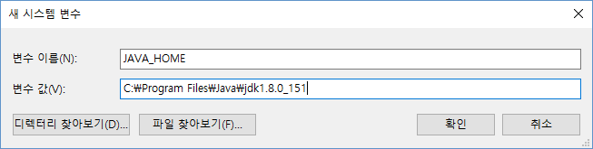](https://www.boostcourse.org/web326/lecture/58949/?isDesc=false#)

- 

  위의 그림과 같이 변수이름엔 "JAVA_HOME"을 변수 값엔 JDK가 설치된 경로를 입력합니다. (파일 탐색기에서 해당 경로로 이동한 후 복사하여 붙이기를 추천합니다.)

[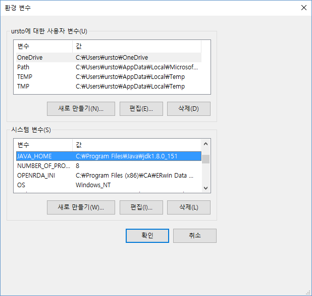](https://www.boostcourse.org/web326/lecture/58949/?isDesc=false#)

- 

  위의 그림과 같이 "JAVA_HOME" 환경변수가 시스템 변수 영역에 추가된 것을 확인할 수 있습니다.

[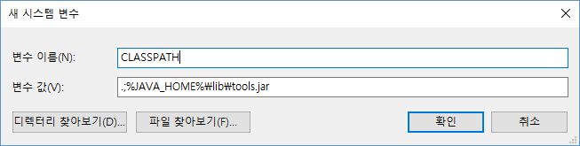](https://www.boostcourse.org/web326/lecture/58949/?isDesc=false#)

- 

  같은 방법으로 "CLASSPATH" 환경변수를 추가합니다. 값은 ".;%JAVA_HOME%\lib\tools.jar" 로 입력합니다. "%JAVA_HOME%"은 앞에서 설정한 JAVA_HOME 환경변수의 값으로 치환하라는 의미입니다.

[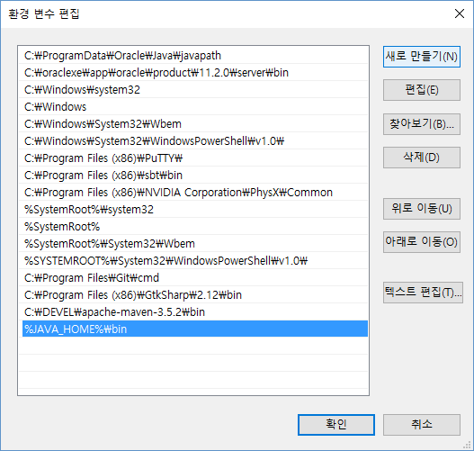](https://www.boostcourse.org/web326/lecture/58949/?isDesc=false#)

- 

  시스템 변수 영역에서 PATH를 찾아서 선택한 후 "편집" 버튼을 클릭한 후 위의 그림과 같은 창이 열리면 우측의 "새로 만들기" 버튼을 클릭한 후 "%JAVA_HOME%\bin"을 입력합니다.

[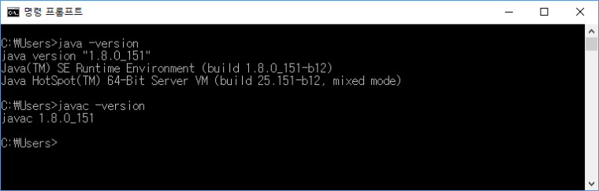](https://www.boostcourse.org/web326/lecture/58949/?isDesc=false#)

"윈도키 + R"을 입력하여 실행창이 열리도록 한 후, "cmd"라고 입력하고 엔터를 입력합니다.
이 때 cmd 콘솔(console)창이 열리게 됩니다.
해당 콘솔창에서 다음과 같이 내용을 입력합니다.

```java
java -version
javac -version
```

java 명령은 JAVA로 작성된 프로그램을 실행할 때 사용하는 명령이고, javac 명령은 java로 작성된 프로그램을 컴파일할 때 사용하는 명령입니다.

위의 그림과 같이 실행 결과가 보인다면 설치가 잘 된 것입니다.

만약 java는 잘 실행되는데 javac가 제대로 실행되지 않는다면, 시스템 환경 변수 설정이 잘못 설정되었거나 JDK가 아닌 JRE만 설치되었을 때입니다.

환경변수에 오타가 있는지 확인하고 알맞게 수정하여 주세요.

환경변수가 수정되었다면 cmd 콘솔창을 닫고 다시 cmd 콘솔창을 열어서 명령을 실행해야 합니다.

 

**2. Mac OS에서의 환경설정**

설치가 완료된 이후에, 터미널을 연 후 아래와 같이 명령을 내립니다.

```markup
cd /Library/Java/JavaVirtualMachines
ls -la
```

그러면 아래와 같이 보일 것입니다.

위에서 사용한 명령은 맥 터미널 명령입니다. ( 리눅스도 같은 명령을 사용할 수 있습니다. )

필자의 경우 2가지 버전의 jdk가 설치되어 있기 때문에 jdk1.8.0_121.jdk 와 jdk1.8.0_91.jdk 2가지가 보입니다.

처음 설치했다면 경로가 하나만 보일 것입니다.

[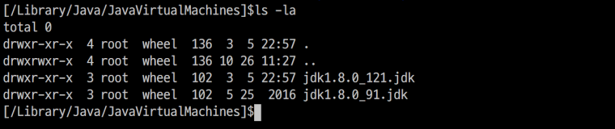](https://www.boostcourse.org/web326/lecture/58949/?isDesc=false#)

```markup
cd /Library/Java/JavaVirtualMachines/jdk1.8.0_121.jdk/Contents/Home  
```

위와 같은 명령으로 경로를 이동해보세요.

중간에 있는 jdk1.8.0_121.jdk는 본인이 설치한 jdk와 같은 경로여야 합니다.

해당 경로를 JAVA_HOME 경로라고 합니다.

해당 경로에서 ls -la 명령을 내려보면 윈도우에서 설치한 JDK와 같은 내용이 보이는 것을 알 수 있을 것입니다.

이제 맥에서 JDK를 사용하기 위해서 환경설정을 해야 합니다.

먼저 다음과 같은 명령을 실행합니다.

```markup
sudo su -
```

위의 명령은 터미널에서 관리자로 권한을 바꾸겠다는 것을 의미합니다.

```markup
vi /etc/paths
```

위의 명령은 vi라는 에디터로 /etc/paths 라는 파일을 편집하겠다는 것을 의미합니다.

vi 에디터는 처음 사용하면 굉장히 어렵습니다.

인터넷에서 vi 에디터에 대한 사용법을 미리 공부한 후 사용해주세요.

에디터로 /etc/paths라는 파일을 열었다면 맨 아랫줄에 다음의 경로를 추가합니다.

```markup
/Library/Java/JavaVirtualMachines/jdk1.8.0_121.jdk/Contents/Home/bin
```

그리고 파일을 저장합니다.

이렇게 저장을 한 후, 다시 터미널을 열면 어디서든 java명령을 실행할 수 있습니다.

이번엔 다음과 같은 명령으로 JAVA_HOME 과 CLASSPATH 환경변수를 지정합니다.

```markup
vi /etc/profile
```

위의 명령을 실행한 후 맨 아랫줄에 다음의 내용을 추가합니다.

```markup
export JAVA_HOME=/Library/Java/JavaVirtualMachines/jdk1.8.0_121.jdk/Contents/Home
export CLASSPATH=.:$JAVA_HOME/lib/tools.jar
```

CLASSPATH=다음에 있는 문자열은 점(.) 과 콜론(:)입니다.

점은 현재 경로를 말하고 콜론은 구분자입니다.

CLASSPATH로 현재 경로와 $JAVA_HOME/lib/tools.jar를 지정하라는 것을 의미합니다.

자 위와 같이 설정하였다면 터미널을 종료 후 다시 실행합니다.

그리고 아래와 같이 명령을 내려봅시다.

```markup
java -version
```

아래의 그림과 같이 결과가 출력된다면 설치가 잘 된 것입니다.

[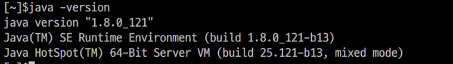](https://www.boostcourse.org/web326/lecture/58949/?isDesc=false#)

**간단한 JAVA 프로그램 컴파일 및 실행**

메모장을 열어 "Hello.java"라는 파일로 다음의 내용을 저장합니다.

```java
public class Hello{
     public static void main(String args[]){
       System.out.println("hello world");
     }
}
```

어떤 디렉토리에 저장해도 상관은 없습니다.

저는 c:\temp 폴더에 저장하였습니다.

cmd 콘솔창을 연 후 다음과 같이 입력합니다.

c:\temp 가 아닌 다른 디렉토리에 저장하였을 경우에는 본인이 저장한 디렉토리를 입력하면 됩니다. 

```java
cd c:\temp
javac Hello.java
```

위의 명령은 Hello.java소스파일을 컴파일하라는 명령입니다.

컴파일 되면 Hello.class파일이 생성됩니다.

Hello.class파일이 생성되었다면, 다음의 명령으로 실행합니다.

```java
java Hello
```

"hello world"가 잘 출력되었다면, JDK설치부터 환경변수설정까지 잘 되었다는 것을 알 수 있습니다.


 

------

**생각해보기**

1. 자바로 작성된 프로그램을 실행하려면 JRE만 설치하면 됩니다. 이때는 환경변수를 설정할 필요가 없습니다.
2. 그런데, JDK를 설치할 때는 환경변수를 설정해야 합니다. 환경변수를 설정하는 이유가 무엇일까요?
3. 현재 설치된 JDK보다 높은 버전의 JDK를 설치했습니다. 이때 수정해야 할 환경변수는 무엇일까요?


**이클립스란?**

IBM에서 웹 스피어 스튜디오 애플리케이션 디벨로퍼(WebSpheare Studio Application Developer)란 이름으로 JAVA언어를 이용하여 개발되었던 것인데, 핵심 부분을 오픈 소스로 공개하여 지금의 이클립스로 발전하게 되었습니다.

이클립스는 윈도우, 맥, 리눅스 등 다양한 운영체제에서 동작하며, JAVA를 비롯한 다양한 프로그래밍 언어를 개발할 수 있는 통합 개발 환경( Integrated Development Environment, IDE)이라고 말할 수 있습니다.

통합 개발 환경이란 코딩, 디버그, 컴파일, 배포 등 프로그램 개발에 관련된 모든 작업을 하나의 프로그램 안에서 처리할 수 있도록 환경을 제공하는 소프트웨어라고 생각하면 됩니다.

이클립스는 플러그인 구조로 쉽게 기능을 추가할 수 있는 구조로 되어 있습니다.

이런 구조 때문에 이클립스 기반으로 만들어진 다양한 도구들이 존재합니다.

또한 이클립스는 윈도우, 맥, 리눅스 운영체제를 지원하기 때문에 대부분의 환경에서 사용할 수 있다는 장점이 있습니다.

2001년 세상에 첫선을 보인 이래로 지속적으로 발전하여 최고의 개발 도구 중의 하나로 사랑받고 있습니다.


이클립스를 이용하여 자바 웹 어플리케이션을 개발할 때 사용하려면 "Eclipse IDE for Java EE Developers"를 다운로드 받아야 합니다.


[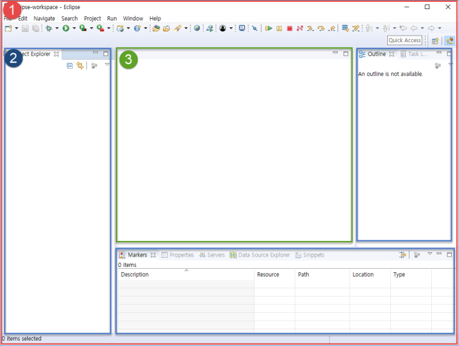](https://www.boostcourse.org/web326/lecture/58950/?isDesc=false#)

이클립스를 다운로드 받을 때 보면, 다양한 종류의 이클립스가 있던 것을 볼 수 있었습니다.

이클립스는 플러그인(Plugin)이란 구조로 만들어져 있습니다.

이클립스에 다양한 플러그인을 설치함으로써 다양한 방식으로 사용할 수 있습니다.

이클립스에 아무 플러그인도 설치하지 않았다면, 빈 윈도우 화면이 보여질 것입니다.

"Eclipse IDE for Java EE Developers" 는 자바와 자바 웹 개발을 위한 플러그인들이 설치된 버전이라고 생각하면 됩니다.

(1)번 영역은 퍼스팩티브(Perspective)라고 합니다.

퍼스팩티브는 여러개의 뷰(View)와 에디터 영역, 메뉴 등으로 구성되어 있습니다.

우리는 자바 개발과 자바웹 개발을 위한 퍼스팩티브를 사용할 것입니다.

(2)번 영역은 뷰(View)라고 합니다.

이클립스는 다양한 뷰를 제공해줍니다.

파일 탐색기와 유사항 뷰부터 시작해서 서버실행화면을 보여주는 뷰 등 다양한 뷰를 제공합니다.

(3)번 영역은 에디터(Editor) 영역이라고 합니다.

보통 에디터가 위치하기 때문입니다. 에디터 영역에서 앞으로 JAVA코드를 작성할 것입니다.

 

**이클립스 설치 후 인코딩 설정하기**

프로젝트 내에서 JAVA, HTML, xml등의 다양한 종류의 파일이 사용되는데 파일마다 인코딩하는 방법이 다르면 글자가 깨지는 현상이 발생합니다.

이런 문제가 발생하지 않도록 인코딩을 설정해 두는 것이 좋습니다.

이 과정에서는 UTF-8로 설정하도록 하겠습니다.

아래와 같이 인코딩을 설정해 주세요.


[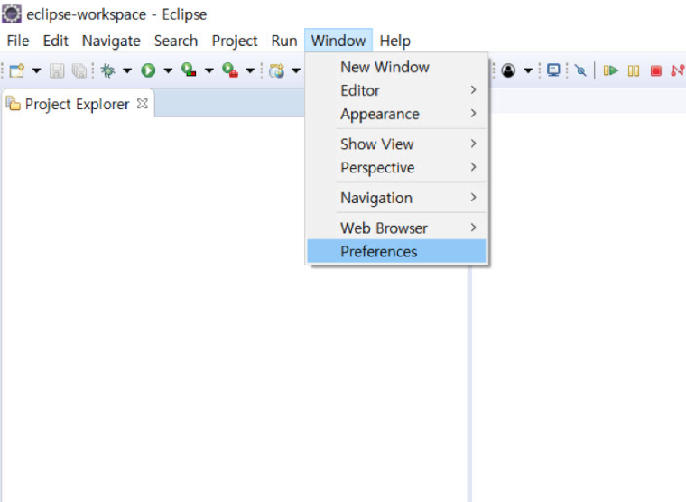](https://www.boostcourse.org/web326/lecture/58950/?isDesc=false#)

- 

  Window -> Preferences 메뉴를 클릭합니다.

[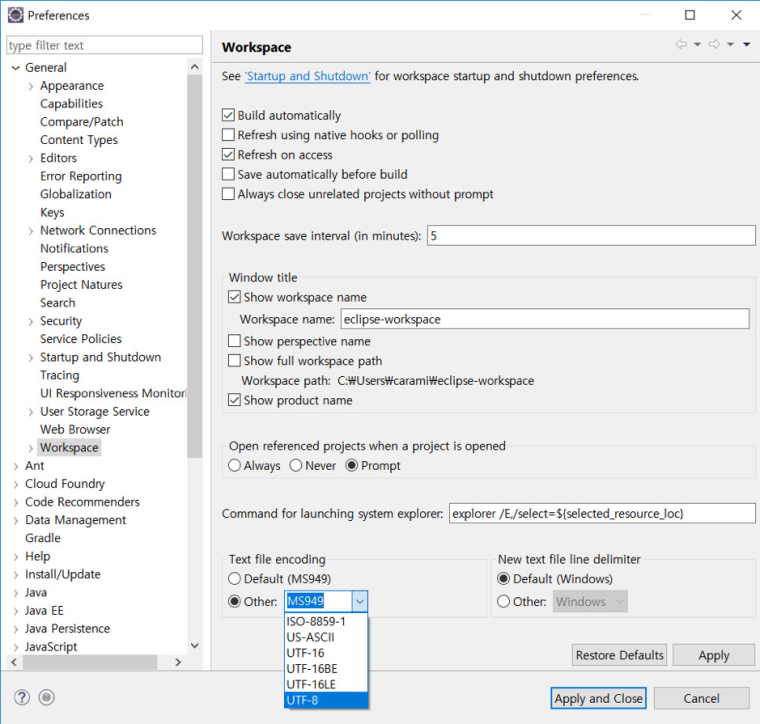](https://www.boostcourse.org/web326/lecture/58950/?isDesc=false#)

- 

  Preferences 다이얼로그가 열리면, General -> Workspace 메뉴를 활성화하고, 하단의 Text file encoding 메뉴에서 Other 라디오버튼을 클릭하고 UTF-8 로 선택하고 Apply 버튼을 클릭합니다. 이렇게 설정하면 주로 자바 파일들에 대한 기본 인코딩이 UTF-8 로 설정됩니다.

[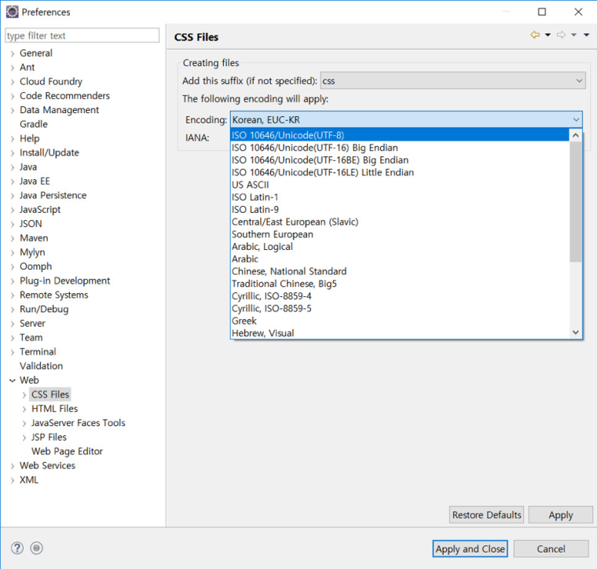](https://www.boostcourse.org/web326/lecture/58950/?isDesc=false#)

- **CSS Files**

  좌측 메뉴에서 Web을 활성화해주고 CSS Files 메뉴를 클릭하면 우측 메뉴가 바뀌는데 우측의 Encoding 항목에서 UTF-8을 선택하고 Apply 버튼을 눌러줍니다. 같은 방법으로 HTML Files, JSP Files 의 인코딩 설정도 바꿔줍니다.

[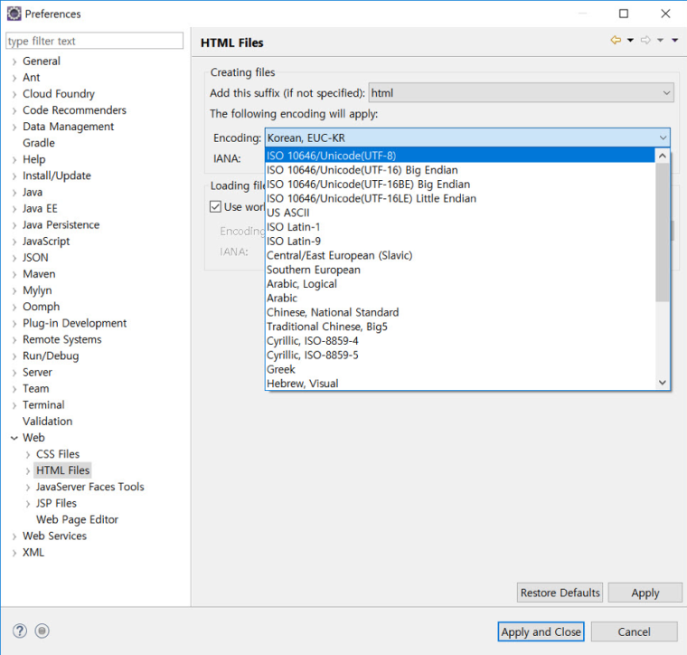](https://www.boostcourse.org/web326/lecture/58950/?isDesc=false#)

- **HTML Files**

[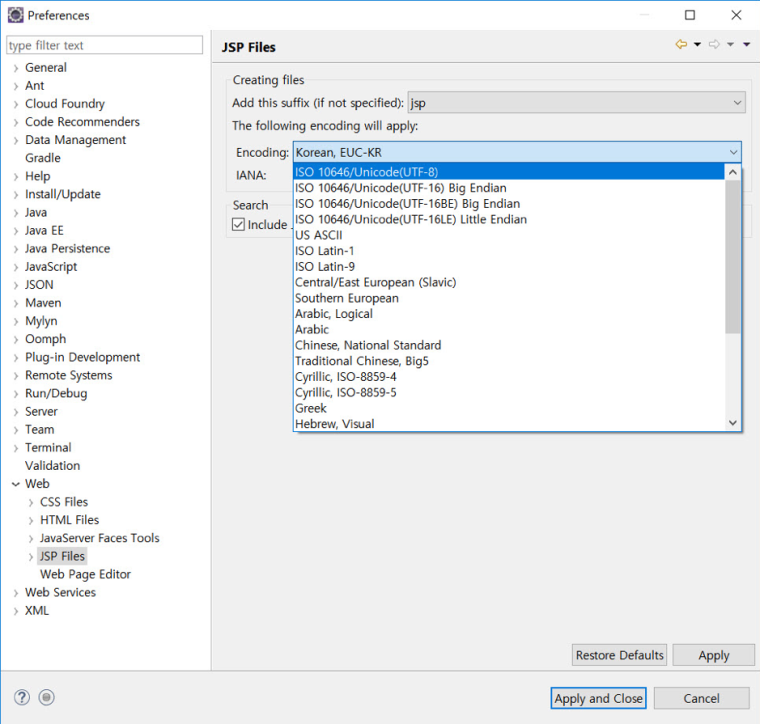](https://www.boostcourse.org/web326/lecture/58950/?isDesc=false#)

- **JSP Files**

------

**생각해보기**

1. 이클립스는 자바로 만들어진 프로그램입니다. 이클립스가 실행되기 위해서 설치되어 있어야 할 프로그램은 무엇일까요?
2. 이클립스에 모든 플러그인을 제거하면 빈 윈도우만 남는다고 하였습니다. 플러그인을 제작할 수 있다면, 이 빈 윈도우에 플러그인을 채워 넣을 수 있을 것입니다. 이런 방식으로 개발하는 것을 이클립스 RCP(Rich Client Platform)이라고 말합니다. 이클립스 RCP를 이용하여 만들어진 소프트웨어에는 어떤 것들이 있을까요?


**이클립스 프로젝트**

**Java Code Conventions (프로그래머들끼리의 약속)** 

- 클래스명 : 첫글자를 대문자로
- 프로젝트명, 패키지명 : 소문자

**참고 자료**

[**[참고링크\] 구글 Java 코딩 컨벤션**https://google.github.io](https://google.github.io/styleguide/javaguide.html)

[**[참고링크\] 자바 코딩 규칙(Java Code Conventions)**http://myeonguni.tistory.com](http://myeonguni.tistory.com/1596)

[**[참고링크\] Code Conventions for the Java Programming Language: Contents**http://www.oracle.comSUN Java 코딩 컨벤션](http://www.oracle.com/technetwork/java/javase/documentation/codeconvtoc-136057.html)


### 4) Maven

**Maven이란?**

Maven은 지금까지 애플리케이션을 개발하기 위해 반복적으로 진행해왔던 작업들을 지원하기 위하여 등장한 도구입니다. 

Maven을 사용하면 빌드(Build), 패키징, 문서화, 테스트와 테스트 리포팅, git, 의존성관리, svn등과 같은 형상관리서버와 연동(SCMs), 배포 등의 작업을 손쉽게 할 수 있습니다.

Maven을 이해하려면 CoC(Convention over Configuration)라는 단어를 먼저 이해해야 합니다.

CoC란 일종의 관습을 말하는데, 예를 들자면 프로그램의 소스파일은 어떤 위치에 있어야 하고, 소스가 컴파일된 파일들은 어떤 위치에 있어야 하고 등을 미리 정해놨다는 것입니다.

이 말은 관습에 이미 익숙한 사용자는 쉽게 Maven을 사용할 수 있는데, 관습에 익숙하지 않은 사용자는 이러한 제약사항에 대해서 심한 거부감을 느낄 수 있습니다.

Maven을 사용한다는 것은 어쩌면 이러한 관습 즉 CoC에 대해서 알아나가는 것이라고도 말할 수 있습니다. 


**Maven을 사용할 경우 얻게 되는 이점은?**

Maven을 사용할 경우, 굉장히 편리한 점들이 많습니다.

많은 사람이 손꼽는 장점 중에는 편리한 의존성 라이브러리 관리가 있습니다.

앞에서 JSTL을 학습할 때, 몇 가지 파일을 다운로드 하여 /WEB-INF/lib폴더에 복사하여 사용했었습니다.

관련된 라이브러리가 많아질수록 이러한 방식은 상당히 불편해집니다.

Maven을 사용하면 설정 파일에 몇 줄 적어줌으로써 직접 다운로드 받거나 하는 것을 하지 않아도 라이브러리를 사용할 수 있습니다.

프로젝트에 참여하는 개발자가 많아지게 되면, 프로젝트를 빌드하는 방법에 대하여 가이드하는 것도 쉬운 일이 아닙니다.

Maven을 사용하게 되면 Maven에 설정한 대로 모든 개발자가 일관된 방식으로 빌드를 수행할 수 있게 됩니다.

Maven은 또한 다양한 플러그인을 제공해줘서, 굉장히 많은 일들을 자동화시킬 수 있습니다.

 

**Maven 기본**

Archetype을 이용하여 Maven 기반 프로젝트를 생성할 경우 생성된 프로젝트 하위에 pom.xml 파일이 생성됩니다.

pom.xml 파일을 살펴보면 다음과 같습니다. 

```markup
<project xmlns="http://maven.apache.org/POM/4.0.0"
    xmlns:xsi="http://www.w3.org/2001/XMLSchema-instance"
    xsi:schemaLocation="http://maven.apache.org/POM/4.0.0 http://maven.apache.org/maven-v4_0_0.xsd">
    <modelVersion>4.0.0</modelVersion>
    <groupId>kr.or.connect</groupId>
    <artifactId>examples</artifactId>
    <packaging>jar</packaging>
    <version>1.0-SNAPSHOT</version>
    <name>mysample</name>
    <url>http://maven.apache.org</url>
    <dependencies>
        <dependency>
            <groupId>junit</groupId>
            <artifactId>junit</artifactId>
            <version>3.8.1</version>
            <scope>test</scope>
        </dependency>
    </dependencies>
</project>
```

각각의 태그의 의미는 다음과 같습니다.

- **project** : pom.xml 파일의 최상위 루트 엘리먼트(Root Element)입니다.
- **modelVersion** : POM model의 버전입니다. 
- **groupId** : 프로젝트를 생성하는 조직의 고유 아이디를 결정합니다. 일반적으로 도메인 이름을 거꾸로 적습니다.
- **artifactId** : 해당 프로젝트에 의하여 생성되는 artifact의 고유 아이디를 결정합니다. Maven을 이용하여 pom.xml을 빌드할 경우 다음과 같은 규칙으로 artifact가 생성됩니다. artifactid-version.packaging. 위 예의 경우 빌드할 경우 examples-1.0-SNAPSHOT.jar 파일이 생성됩니다.
- **packaging** : 해당 프로젝트를 어떤 형태로 packaging 할 것인지 결정합니다. jar, war, ear 등이 해당됩니다.
- **version** : 프로젝트의 현재 버전. 추후 살펴보겠지만 프로젝트가 개발 중일 때는 SNAPSHOT을 접미사로 사용합니다. Maven의 버전 관리 기능은 라이브러리 관리를 편하게 합니다.
- **name** : 프로젝트의 이름입니다.
- **url** : 프로젝트 사이트가 있다면 사이트 URL을 등록하는 것이 가능합니다.

Maven 을 이용할 경우 얻게 되는 큰 이점 중의 하나는 Dependency Management 기능입니다.

위 pom.xml 파일에서 <dependencies/> 엘리먼트가 Dependency Management 기능의 핵심이라고 할 수 있습니다.

해당 엘리먼트 안에 필요한 라이브러리를 지정하게 됩니다.


 

------

**생각해보기**

Maven은 정해진 관습을 사용하기 때문에, 처음 배울 때는 갑갑한 느낌이 듭니다.

이러한 관습에 빨리 익숙해지려면, 많이 찾아보고 사용해봐야합니다.

인터넷에서 pom.xml파일의 작성방법에 대해 조사해보세요.


 

------

**참고 자료**

[**[참고링크\] Maven – Welcome to Apache Maven**http://maven.apache.org](http://maven.apache.org/)


이번 시간에는 Maven을 이용해 웹 어플리케이션 프로젝트를 생성하고, 실행해보도록 하겠습니다.

이클립스를 실행하고, 이클립스의 메뉴 중 File - New - Project를 선택합니다.

[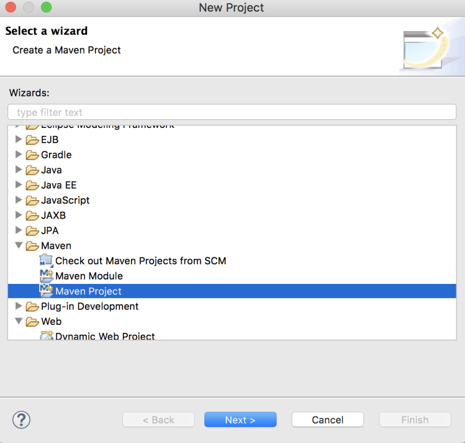](https://www.boostcourse.org/web326/lecture/58938/?isDesc=false#)

- 

  프로젝트 위자드(Wizard)가 뜨면, Maven아래의 Maven Project를 선택한 후 Next버튼을 클릭합니다.

[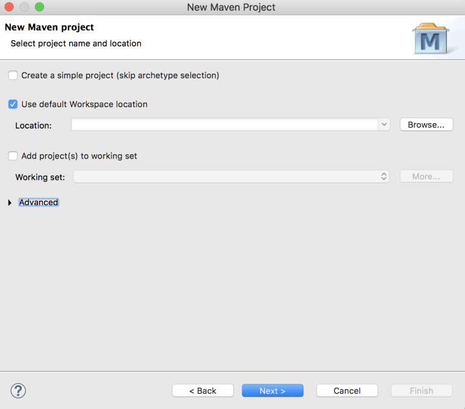](https://www.boostcourse.org/web326/lecture/58938/?isDesc=false#)

- 

  Maven프로젝트가 기존 워크스페이스 경로에 생성되도록 합니다. Next버튼을 클릭합니다.

[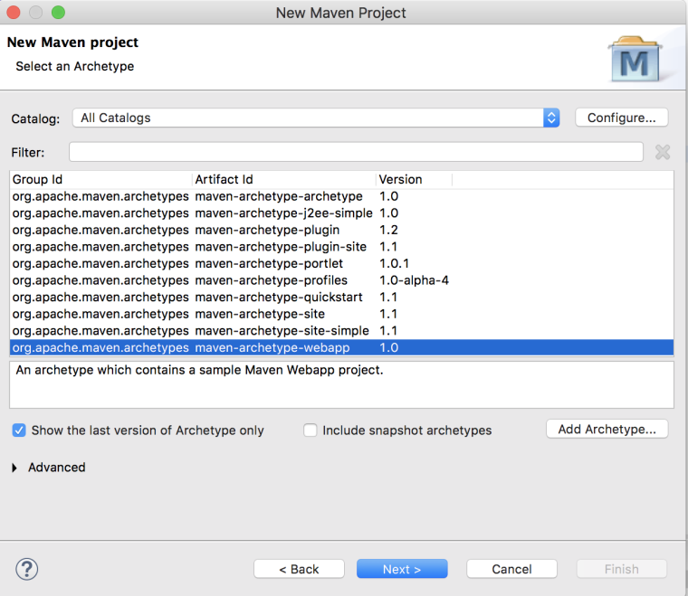](https://www.boostcourse.org/web326/lecture/58938/?isDesc=false#)

- 

  아키타입(Archetype)을 선택합니다. 아키타입이란 일종의 프로젝트 템플릿(Template)이라고 말할 수 있습니다. 어떤 아키타입을 선택했느냐에 따라서 자동으로, 여러 가지 파일들을 생성하거나 라이브러리를 셋팅해주거나 등의 일을 해줍니다. Maven을 이용하여 웹 어플리케이션을 개발하기 위해서 maven-archetype-webapp를 선택한 후 Next 버튼을 클릭합니다.

[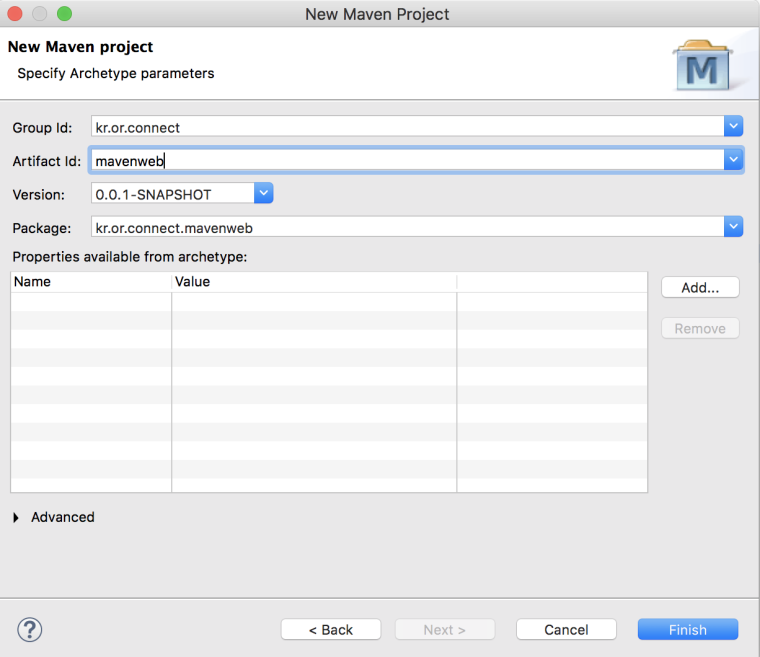](https://www.boostcourse.org/web326/lecture/58938/?isDesc=false#)

- 

  Group Id는 보통 프로젝트를 진행하는 회사나 팀의 도메인 이름을 거꾸로 적습니다. Artifact Id는 해당 프로젝트의 이름을 적습니다. 버전은 보통 기본값(0.0.1-SNAPSHOT)으로 설정합니다. package이름은 group id와 Artifact Id가 조합된 이름이 됩니다. Group Id를 kr.or.connect이고 Artifact Id가 mavenweb으로 설정했기 때문에 package이름은 kr.or.connect.mavenweb이 됩니다. finish버튼을 클릭합니다.

[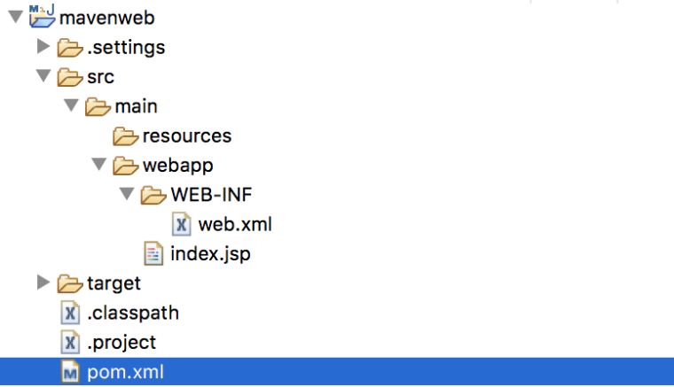](https://www.boostcourse.org/web326/lecture/58938/?isDesc=false#)

- 

  프로젝트가 생성된 프로젝트의 디렉토리 구조입니다. 디렉토리의 구조를 보기 위해서 이클립스의 Navigator view를 통해서 확인하였습니다. Maven으로 생성된 프로젝트의 경우 자바 소스는 src/main/java 폴더에 생성됩니다. 웹 어플리케이션과 관련된 html, css등은 src/main/webapp 폴더에서 작성해야 합니다. 그런데, 생성된 프로젝트를 보면 src/main/java 폴더가 보이지 않습니다. 필요한 폴더는 별도로 만들어줄 필요가 있습니다.

[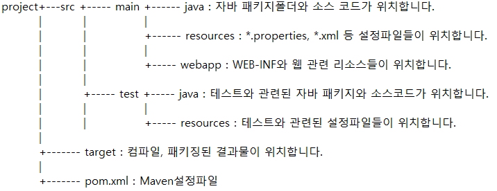](https://www.boostcourse.org/web326/lecture/58938/?isDesc=false#)

[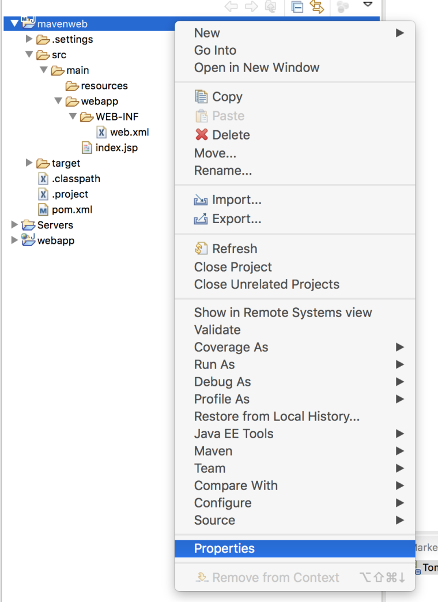](https://www.boostcourse.org/web326/lecture/58938/?isDesc=false#)

[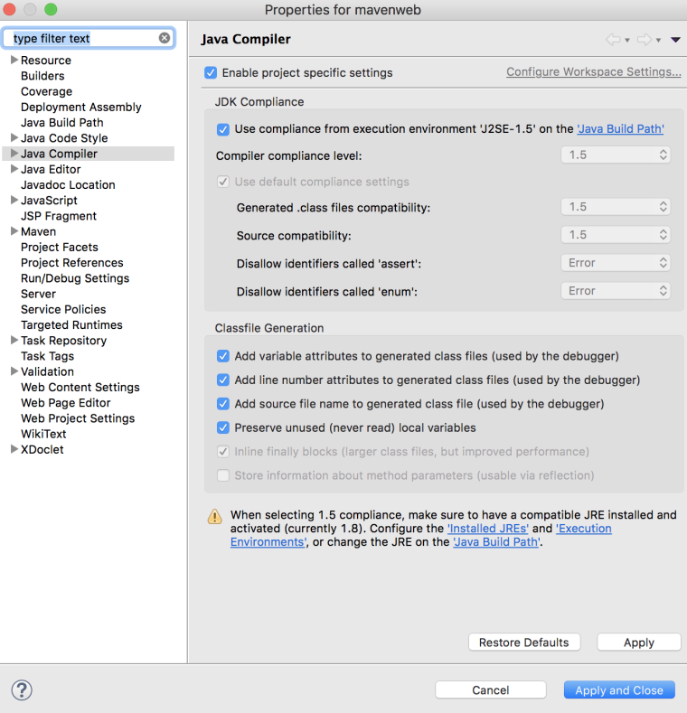](https://www.boostcourse.org/web326/lecture/58938/?isDesc=false#)

- 

  프로젝트를 선택하고, 우측버튼을 눌러 properties를 선택합니다. 그리고, Java Compiler메뉴를 선택합니다. 선택을 해보면 기본적으로 JDK 1.5 버전을 사용하는 것을 알 수 있습니다. Maven으로 프로젝트를 생성하면 기본적으로 JDK 1.5를 사용하게 됩니다. JDK8을 사용하도록 하려면 Maven설정 파일인 pom.xml파일을 수정해야 합니다. pom.xml파일을 더블클릭하면 다음과 같이 보입니다.

[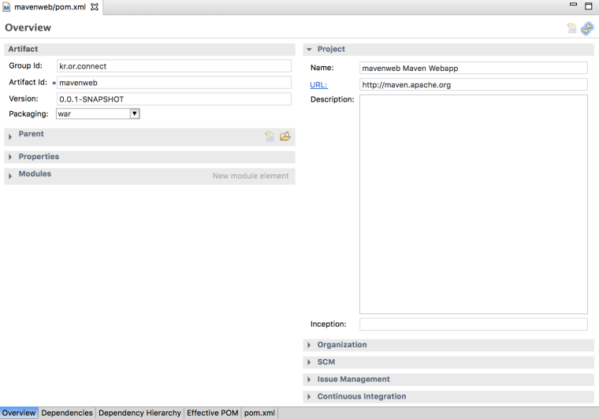](https://www.boostcourse.org/web326/lecture/58938/?isDesc=false#)

- 

  아래쪽의 pom.xml 탭을 선택하면 소스가 보입니다.

```markup
<project xmlns="http://maven.apache.org/POM/4.0.0" xmlns:xsi="http://www.w3.org/2001/XMLSchema-instance"
  xsi:schemaLocation="http://maven.apache.org/POM/4.0.0 http://maven.apache.org/maven-v4_0_0.xsd">
  <modelVersion>4.0.0</modelVersion>
  <groupId>kr.or.connect</groupId>
  <artifactId>mavenweb</artifactId>
  <packaging>war</packaging>
  <version>0.0.1-SNAPSHOT</version>
  <name>mavenweb Maven Webapp</name>
  <url>http://maven.apache.org</url>
  
  <dependencies>
    <dependency>
      <groupId>junit</groupId>
      <artifactId>junit</artifactId>
      <version>3.8.1</version>
      <scope>test</scope>
    </dependency>
  </dependencies>
  <build>
    <finalName>mavenweb</finalName>
  </build>
</project>
```

자동으로 juint 3.8.1 라이브러리를 추가하고 있습니다.

junit은 테스트를 위한 라이브러리입니다.

위의 내용에 다음의 코드를 입력합니다.

```markup
<project xmlns="http://maven.apache.org/POM/4.0.0" xmlns:xsi="http://www.w3.org/2001/XMLSchema-instance"
  xsi:schemaLocation="http://maven.apache.org/POM/4.0.0 http://maven.apache.org/maven-v4_0_0.xsd">
  <modelVersion>4.0.0</modelVersion>
  <groupId>kr.or.connect</groupId>
  <artifactId>mavenweb</artifactId>
  <packaging>war</packaging>
  <version>0.0.1-SNAPSHOT</version>
  <name>mavenweb Maven Webapp</name>
  <url>http://maven.apache.org</url>

  <dependencies>
    <dependency>
      <groupId>junit</groupId>
      <artifactId>junit</artifactId>
      <version>3.8.1</version>
      <scope>test</scope>
    </dependency>
  </dependencies>
  <build>
    <finalName>mavenweb</finalName>
        <plugins>
        <plugin>
            <groupId>org.apache.maven.plugins</groupId>
            <artifactId>maven-compiler-plugin</artifactId>
            <version>3.6.1</version>
            <configuration>
                <source>1.8</source>
                <target>1.8</target>
            </configuration>
        </plugin>
    </plugins>
  </build>
</project>
```

코드를 입력하였으면, 저장합니다.

수정 후 다시 프로젝트 프로퍼티의 자바 컴파일러 항목을 보면 여전히 1.5 입니다.

[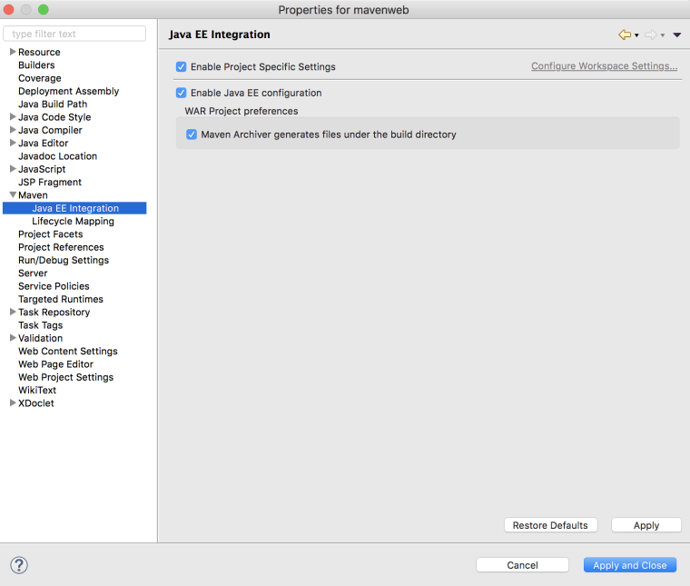](https://www.boostcourse.org/web326/lecture/58938/?isDesc=false#)

- 

  프로젝트 프로퍼티를 선택한 후 Maven메뉴 아래의 Java EE Integration을 선택합니다. 보이는 것처럼 Enable Project Specific Settings 앞의 체크박스를 선택합니다. 그리고 아래의 Apply and Close버튼을 클릭합니다. 그리고, 다시 프로퍼티의 자바 컴파일러 버전을 확인하도록 하겠습니다. JDK 1.8이 사용되는 것을 알 수 있습니다. Maven의 설정을 바꾸면, 이클립스 프로젝트 설정이 연동되게 된 것입니다. 이번엔 webapp폴더 아래의 index.jsp를 열어보도록 하겠습니다.

[](https://www.boostcourse.org/web326/lecture/58938/?isDesc=false#)

- 

  HttpServlet을 찾을 수 없다는 오류 메시지가 보입니다. 다음에 배우게 되는 웹 백엔드 프로그래밍 기초 에서는 Dynamic Web Application을 만들 볼텐데요. 그 때는 WAS Runtime설정을 하면서 Tomcat을 지정합니다. Tomcat안에 있는 서블릿 라이브러리가 사용되면서 문제가 없게 됩니다. 실행시에도 WAS 위에서 실행되기 때문에 WAS의 서블릿 라이브러리를 사용하게 됩니다. Maven프로젝트로 생성했을 경우에는 WAS 런타임이 지정을 안 했기 때문에 서블릿 라이브러리를 찾을 수 없습니다. dependencies 엘리먼트 아래에 다음을 추가합니다.

```markup
<dependency>
        <groupId>javax.servlet</groupId>
        <artifactId>javax.servlet-api</artifactId>
        <version>3.1.0</version>
        <scope>provided</scope>
    </dependency>
```

위의 내용을 보면 scope에 provided라는 항목이 있는데 servlet라이브러리를 컴파일 시에만 사용되고 배포 시에는 사용되지 않는다는 것을 의미합니다.

scope는 다음과 같은 4가지가 있습니다.

- **compile** : 컴파일 할 때 필요. 테스트 및 런타임에도 클래스 패스에 포함됩니다. scope 을 설정하지 않는 경우 기본값입니다.
- **runtime** : 런타임에 필요. JDBC 드라이버 등이 예가 됩니다. 컴파일 시에는 필요하지 않지만, 실행 시에 필요한 경우입니다.
- **provided** : 컴파일 시에 필요하지만, 실제 런타임 때에는 컨테이너 같은 것에서 제공되는 모듈. servlet, jsp api 등이 이에 해당. 배포 시 제외됩니다. 
- **test** : 테스트 코드를 컴파일 할 때 필요. 테스트 시 클래스 패스에 포함되며, 배포 시 제외됩니다.

위의 내용을 추가하고 index.html을 가보면 오류가 발생하지 않는 것을 알 수 있습니다.

[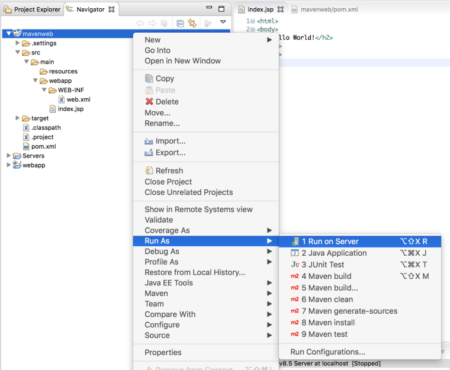](https://www.boostcourse.org/web326/lecture/58938/?isDesc=false#)

- 

  해당 프로젝트를 실행해 보도록 하겠습니다. 프로젝트를 선택한 후 우측버튼을 클릭하여 Run on Server를 선택합니다. 해당 웹 어플리케이션을 실행할 Runtime을 지정하고, 항상 해당 런타임을 사용하겠다는 아래쪽 체크박스도 선택한 후 Finish버튼을 클릭합니다.

[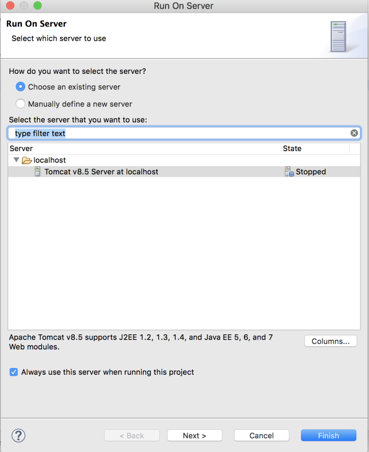](https://www.boostcourse.org/web326/lecture/58938/?isDesc=false#)

- 

  브라우저가 실행되면서 index.html이 보여지는 것을 확인할 수 있습니다. 이번엔 pom.xml 파일에 JSTL라이브러리를 추가하도록 하겠습니다.

```markup
<dependency>
        <groupId>javax.servlet</groupId>
        <artifactId>jstl</artifactId>
        <version>1.2</version>
    </dependency>
```

JSTL은 Tomcat이 기본으로 제공하지 않기 때문에, 컴파일할 때도 배포할 때도 사용돼야 합니다.

그래서 scope에 이번엔 provided가 있지 않습니다.

webapp폴더에 앞에서 작성했던 jstl02.jsp 를 붙여넣기를 하도록 하겠습니다.

라이브러리가 변경되었으니, 다시 run on server를 합니다.

실행해도 결과가 아무것도 나오지 않는 것을 확인할 수 있습니다.

프로젝트 프로퍼티를 선택한 후, Project facets 항목을 보면 다이나믹 웹 모듈의 버전이 2.3입니다.

다이나믹 웹 모듈의 2.4부터 EL이 기본으로 사용할 수 있도록 설정되기 때문에 2.3일 경우에는 EL표기법의 결과가 출력되지 않습니다.

앞의 프로젝트처럼 다이나믹 웹 모듈 3.1이 되도록 설정해보도록 하겠습니다.

먼저 WEB-INF의 web.xml 파일을 열어보도록 하겠습니다.

```markup
<!DOCTYPE web-app PUBLIC
 "-//Sun Microsystems, Inc.//DTD Web Application 2.3//EN"
 "http://java.sun.com/dtd/web-app_2_3.dtd" >

<web-app>
  <display-name>Archetype Created Web Application</display-name>
</web-app>
```

위의 내용을 다음과 같이 수정합니다.

```markup
<?xml version="1.0" encoding="UTF-8"?>
<web-app xmlns="http://xmlns.jcp.org/xml/ns/javaee" xmlns:xsi="http://www.w3.org/2001/XMLSchema-instance" 
         xsi:schemaLocation="http://xmlns.jcp.org/xml/ns/javaee http://xmlns.jcp.org/xml/ns/javaee/web-app_3_1.xsd" version="3.1">
  <display-name>Archetype Created Web Application</display-name>
</web-app>
```

프로젝트아래의 .settings/org.eclipse.wst.common.project.facet.core.xml 파일을 엽니다.

Windows > Show veiw > Navigator로 파일을 보면 .settings 파일을 발견할 수 있습니다.

```markup
<?xml version="1.0" encoding="UTF-8"?>
<faceted-project>
  <fixed facet="wst.jsdt.web"/>
  <installed facet="jst.web" version="2.3"/>
  <installed facet="wst.jsdt.web" version="1.0"/>
  <installed facet="java" version="1.8"/>
</faceted-project>
```

을 아래와 같이 수정합니다.

```markup
<?xml version="1.0" encoding="UTF-8"?>
<faceted-project>
  <fixed facet="wst.jsdt.web"/>
  <installed facet="jst.web" version="3.1"/>
  <installed facet="wst.jsdt.web" version="1.0"/>
  <installed facet="java" version="1.8"/>
</faceted-project>
```

프로젝트 프로퍼티의 Project facets항목을 보면 다이나믹 웹 모듈이 3.1로 바뀐 것을 볼 수 있습니다.

이제 jstl02.jsp를 run on server로 실행합니다.

실행을 하지만 오류가 나면서 실행이 안 되는 경우가 있을 수 있습니다.

이클립스의 버그로, 수정되기 전의 데이터와 수정된 데이터가 섞여서 실행되기 때문입니다.

이 경우 웹 어플리케이션을 깔끔히 초기화하고 실행하는 것이 좋을 수 있습니다.

1. 기존 tomcat을 종료합니다.
2. 혹시 바뀌지 않았다면 프로젝트를 선택하고, 우측버튼을 눌러서 Maven 메뉴 아래의 update project를 선택한 후 확인하세요.
3. Servers view에서 기존 Tomcat Runtime을 삭제
4. Project 메뉴의 Clean선택
5. 프로젝트 익스플로러에서 Server 삭제

위와 같은 과정을 거친 후 Run on Server로 실행해보세요.

결과가 잘 나오는 것을 확인할 수 있습니다.

지금까지 배웠던 내용 중에서 가장 복잡한 것 같은데요.

다이나믹 웹 모듈을 2.3에서 3.1로 바꾸는 것은 프로젝트가 한번 만들어지면, 그 이후부터는 그 프로젝트가 더 이상 사용되지 않을 때까지 계속 사용되기 때문에 자주 개발자가 해야 할 일은 아닙니다.

그 이후부터는 pom.xml에 원하는 기능을 추가하면서 개발을 진행하면 됩니다.

수고하셨습니다.


------

**생각해보기**

1. 이클립스에는 Maven이 내장되어 있습니다. 이번 시간엔 이클립스에 내장된 Maven을 이용해 프로젝트를 생성해보았습니다. cmd창이나 터미널에서 maven명령을 수행해서 컴파일하고 실행할 수도 있습니다. 이를 위해선 Maven을 별도로 설치를 해야 합니다. Maven을 설치하고, 콘솔이나 터미널에서 실행할 방법을 찾아보세요.

 

 

------

**참고 자료**

[ 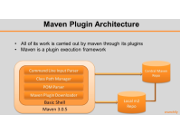**[참고링크\] How to Create Dynamic Web Project using Maven in Eclipse? • Crunchify**http://crunchify.com](http://crunchify.com/how-to-create-dynamic-web-project-using-maven-in-eclipse/)

[ 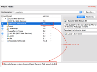**[참고링크\] How to fix Cannot change version of project facet Dynamic Web Module to 3.0 Error in Eclipse • Crunchify**http://crunchify.com](http://crunchify.com/how-to-fix-cannot-change-version-of-project-facet-dynamic-web-module-to-3-0-error-in-eclipse/)

[**[참고링크\] Maven in 5 Minutes**https://maven.apache.org](https://maven.apache.org/guides/getting-started/maven-in-five-minutes.html)


### 5) JDBC

**JDBC 개요**

- JDBC(Java Database Connectivity)의 정의
  \- 자바를 이용한 데이터베이스 접속과 SQL 문장의 실행, 그리고 실행 결과로 얻어진 데이터의 핸들링을 제공하는 방법과 절차에 관한 규약
  \- 자바 프로그램 내에서 SQL문을 실행하기 위한 자바 API
  \- SQL과 프로그래밍 언어의 통합 접근 중 한 형태
- JAVA는 표준 인터페이스인 JDBC API를 제공
- 데이터베이스 벤더, 또는 기타 써드파티에서는 JDBC 인터페이스를 구현한 드라이버(driver)를 제공한다.


**JDBC 환경 구성**

- JDK 설치
- JDBC 드라이버 설치
  \- Maven에 다음과 같은 의존성을 추가한다. MySQL사이트에서 다운로드 한다.

```markup
<dependency>   
  <groupId>mysql</groupId>   
       <artifactId>mysql-connector-java</artifactId>
       <version>5.1.45</version>
 </dependency>
```

- [Java API Reference 참고 바로가기](https://docs.oracle.com/javase/8/docs/api/)
- [JDBC Tutorial 참고 바로가기](https://docs.oracle.com/javase/tutorial/jdbc/basics/index.html)


**JDBC를 이용한 프로그래밍 방법**

1. import java.sql.*;
2. 드라이버를 로드 한다.
3. Connection 객체를 생성한다.
4. Statement 객체를 생성 및 질의 수행
5. SQL문에 결과물이 있다면 ResultSet 객체를 생성한다.
6. 모든 객체를 닫는다.


**JDBC 클래스의 생성 관계**

[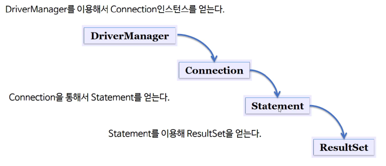](https://www.boostcourse.org/web326/lecture/58939/?isDesc=false#)

**JDBC 사용 - 단계별 설명**

1. IMPORT

```java
import java.sql.*;
```

 

2. 드라이버 로드

```java
Class.forName( "com.mysql.jdbc.Driver" );
```

 

3. Connection 얻기

```java
String dburl  = "jdbc:mysql://localhost/dbName";

Connection con =  DriverManager.getConnection ( dburl, ID, PWD );
```

 

소스코드 예제

```java
public static Connection getConnection() throws Exception{
	String url = "jdbc:oracle:thin:@117.16.46.111:1521:xe";
	String user = "smu";
	String password = "smu";
	Connection conn = null;
	Class.forName("oracle.jdbc.driver.OracleDriver");
	conn = DriverManager.getConnection(url, user, password);
	return conn;
}
```

 

4. Statement 생성

```java
Statement stmt = con.createStatement();
```

 

5. 질의 수행

```java
ResultSet rs = stmt.executeQuery("select no from user" );

// 참고
stmt.execute(“query”);             //any SQL -> return true or false
stmt.executeQuery(“query”);     //SELECT -> return ResultSet
stmt.executeUpdate(“query”);   //INSERT, UPDATE, DELETE -> return row count
```

 

6. ResultSet으로 결과 받기

```java
ResultSet rs =  stmt.executeQuery( "select no from user" );
while ( rs.next() )
      System.out.println( rs.getInt( "no") );
```

 

7. Close

```java
rs.close();

stmt.close();

con.close();
```

 

소스코드 예제

```java
public List<GuestBookVO> getGuestBookList(){
		List<GuestBookVO> list = new ArrayList<>();
		GuestBookVO vo = null;
		Connection conn = null;
		PreparedStatement ps = null;
		ResultSet rs = null;
		try{
			conn = DBUtil.getConnection();
			String sql = "select * from guestbook";
			ps = conn.prepareStatement(sql);
			rs = ps.executeQuery();
			while(rs.next()){
				vo = new GuestBookVO();
				vo.setNo(rs.getInt(1));
				vo.setId(rs.getString(2));
				vo.setTitle(rs.getString(3));
				vo.setConetnt(rs.getString(4));
				vo.setRegDate(rs.getString(5));
				list.add(vo);
			}
		}catch(Exception e){
			e.printStackTrace();
		}finally {
			DBUtil.close(conn, ps, rs);
		}		
		return list;		
	}
```

 

소스코드 예제

```java
public int addGuestBook(GuestBookVO vo){
		int result = 0;
		Connection conn = null;
		PreparedStatement ps = null;
		try{
			conn = DBUtil.getConnection();
			String sql = "insert into guestbook values("
					+ "guestbook_seq.nextval,?,?,?,sysdate)";
			ps = conn.prepareStatement(sql);
			ps.setString(1, vo.getId());
			ps.setString(2, vo.getTitle());
			ps.setString(3, vo.getConetnt());
			result = ps.executeUpdate();
		}catch(Exception e){
			e.printStackTrace();
		}finally {
			DBUtil.close(conn, ps);
		}
		
		return result;
	}
```

 

소스코드 예제

```java
public static void close(Connection conn, PreparedStatement ps){
		if (ps != null) {
			try {
				ps.close();
			} catch (SQLException e) {e.printStackTrace(); }
		}
		if (conn != null) {
			try {
				conn.close();
			} catch (SQLException e) {e.printStackTrace();}
		}
	}
```


 

------

**생각해보기**

java.sql패키지를 보면 대부분이 interface로 되어 있는 것을 알 수 있습니다.

이를 실제로 구현하는 것은 DBMS를 만든 회사입니다.

java.sql외에 JAVA가 인터페이스만 대부분 제공하는 패키지는 또 어떤 것이 있을까요?

참고로 XML문서의 표준은 w3c에서 정합니다.


**JDBC 실습1**

 **실습코드**

pom.xml

```xml
<project xmlns="http://maven.apache.org/POM/4.0.0" xmlns:xsi="http://www.w3.org/2001/XMLSchema-instance"
	xsi:schemaLocation="http://maven.apache.org/POM/4.0.0 http://maven.apache.org/xsd/maven-4.0.0.xsd">
	<modelVersion>4.0.0</modelVersion>

	<groupId>kr.or.connect</groupId>
	<artifactId>jdbcexam</artifactId>
	<version>0.0.1-SNAPSHOT</version>
	<packaging>jar</packaging>

	<name>jdbcexam</name>
	<url>http://maven.apache.org</url>

	<properties>
		<project.build.sourceEncoding>UTF-8</project.build.sourceEncoding>
	</properties>

	<dependencies>
		<dependency>
			<groupId>mysql</groupId>
			<artifactId>mysql-connector-java</artifactId>
			<version>5.1.45</version>
		</dependency>
		<dependency>
			<groupId>junit</groupId>
			<artifactId>junit</artifactId>
			<version>3.8.1</version>
			<scope>test</scope>
		</dependency>
	</dependencies>
	<build>
		<plugins>
			<plugin>
				<groupId>org.apache.maven.plugins</groupId>
				<artifactId>maven-compiler-plugin</artifactId>
				<version>3.6.1</version>
				<configuration>
					<source>1.8</source>
					<target>1.8</target>
				</configuration>
			</plugin>
		</plugins>
	</build>
</project>
```

 

Role.java

```java
package kr.or.connect.jdbcexam.dto;

public class Role {
	private Integer roleId;
	private String description;

	public Role() {

	}

	public Role(Integer roleId, String description) {
		super();
		this.roleId = roleId;
		this.description = description;
	}

	public Integer getRoleId() {
		return roleId;
	}

	public void setRoleId(Integer roleId) {
		this.roleId = roleId;
	}

	public String getDescription() {
		return description;
	}

	public void setDescription(String description) {
		this.description = description;
	}

	@Override
	public String toString() {
		return "Role [roleId=" + roleId + ", description=" + description + "]";
	}
}
```

 

RoleDao.java - Select

```java
package kr.or.connect.jdbcexam.dao;

import java.sql.Connection;
import java.sql.DriverManager;
import java.sql.PreparedStatement;
import java.sql.ResultSet;
import java.sql.SQLException;

import kr.or.connect.jdbcexam.dto.Role;

public class RoleDao {
	private static String dburl = "jdbc:mysql://localhost:3306/connectdb";
	private static String dbUser = "connectuser";
	private static String dbpasswd = "connect123!@#";

	public Role getRole(Integer roleId) {
		Role role = null;
		Connection conn = null;
		PreparedStatement ps = null;
		ResultSet rs = null;

		try {
			Class.forName("com.mysql.jdbc.Driver");
			conn = DriverManager.getConnection(dburl, dbUser, dbpasswd);
			String sql = "SELECT description,role_id FROM role WHERE role_id = ?";
			ps = conn.prepareStatement(sql);
			ps.setInt(1, roleId);
			rs = ps.executeQuery();

			if (rs.next()) {
				String description = rs.getString(1);
				int id = rs.getInt("role_id");
				role = new Role(id, description);
			}
		} catch (Exception e) {
			e.printStackTrace();
		} finally {
			if (rs != null) {
				try {
					rs.close();
				} catch (SQLException e) {
					e.printStackTrace();
				}
			}
			if (ps != null) {
				try {
					ps.close();
				} catch (SQLException e) {
					e.printStackTrace();
				}
			}
			if (conn != null) {
				try {
					conn.close();
				} catch (SQLException e) {
					e.printStackTrace();
				}
			}
		}

		return role;
	}
}
```

 

jdbcExam1.java - Select

```java
package kr.or.connect.jdbcexam;

import kr.or.connect.jdbcexam.dao.RoleDao;
import kr.or.connect.jdbcexam.dto.Role;

public class JDBCExam1 {

	public static void main(String[] args) {
		RoleDao dao = new RoleDao();
		Role role = dao.getRole(100);
		System.out.println(role);
	}

}
```


**JDBC 실습2**

**실습코드**

RoleDao.java - Insert

```java
package kr.or.connect.jdbcexam.dao;

import java.sql.Connection;
import java.sql.DriverManager;
import java.sql.PreparedStatement;
import java.sql.ResultSet;
import java.sql.SQLException;
import java.util.ArrayList;
import java.util.List;

import kr.or.connect.jdbcexam.dto.Role;

public class RoleDao {
	private static String dburl = "jdbc:mysql://localhost:3306/connectdb";
	private static String dbUser = "connectuser";
	private static String dbpasswd = "connect123!@#";

	public int addRole(Role role) {
		int insertCount = 0;

		try {
			Class.forName("com.mysql.jdbc.Driver");
		} catch (ClassNotFoundException e) {
			e.printStackTrace();
		}
		String sql = "INSERT INTO role (role_id, description) VALUES ( ?, ? )";

		try (Connection conn = DriverManager.getConnection(dburl, dbUser, dbpasswd);
				PreparedStatement ps = conn.prepareStatement(sql)) {

			ps.setInt(1, role.getRoleId());
			ps.setString(2, role.getDescription());

			insertCount = ps.executeUpdate();

		} catch (Exception ex) {
			ex.printStackTrace();
		}
		return insertCount;
	}
}
```


JDBCExam2.java - Insert

```java
package kr.or.connect.jdbcexam;

import kr.or.connect.jdbcexam.dao.RoleDao;
import kr.or.connect.jdbcexam.dto.Role;

public class JDBCExam2 {
	public static void main(String[] args) {
		int roleId = 501;
		String description = "CTO";
		
		Role role = new Role(roleId, description);
		
		RoleDao dao = new RoleDao();
		int insertCount = dao.addRole(role);

		System.out.println(insertCount);
	}
}
```


**JDBC 실습 3**

**실습코드**

RoleDao.java - SELECT

```java
package kr.or.connect.jdbcexam.dao;

import java.sql.Connection;
import java.sql.DriverManager;
import java.sql.PreparedStatement;
import java.sql.ResultSet;
import java.sql.SQLException;
import java.util.ArrayList;
import java.util.List;

import kr.or.connect.jdbcexam.dto.Role;

public class RoleDao {
	private static String dburl = "jdbc:mysql://localhost:3306/connectdb";
	private static String dbUser = "connectuser";
	private static String dbpasswd = "connect123!@#";

	public List<Role> getRoles() {
		List<Role> list = new ArrayList<>();

		try {
			Class.forName("com.mysql.jdbc.Driver");
		} catch (ClassNotFoundException e) {
			e.printStackTrace();
		}

		String sql = "SELECT description, role_id FROM role order by role_id desc";
		try (Connection conn = DriverManager.getConnection(dburl, dbUser, dbpasswd);
				PreparedStatement ps = conn.prepareStatement(sql)) {

			try (ResultSet rs = ps.executeQuery()) {

				while (rs.next()) {
					String description = rs.getString(1);
					int id = rs.getInt("role_id");
					Role role = new Role(id, description);
					list.add(role); // list에 반복할때마다 Role인스턴스를 생성하여 list에 추가한다.
				}
			} catch (Exception e) {
				e.printStackTrace();
			}
		} catch (Exception ex) {
			ex.printStackTrace();
		}
		return list;
	}
}
```

 

JDBCExam3.java - SELECT

```java
package kr.or.connect.jdbcexam;

import java.util.List;

import kr.or.connect.jdbcexam.dao.RoleDao;
import kr.or.connect.jdbcexam.dto.Role;

public class JDBCExam3 {
	public static void main(String[] args) {

		RoleDao dao = new RoleDao();
		
		List<Role> list = dao.getRoles();

		for(Role role : list) {
			System.out.println(role);
		}
	} 
}
```

 

RoleDao.java - Delete

```java
package kr.or.connect.jdbcexam.dao;

import java.sql.Connection;
import java.sql.DriverManager;
import java.sql.PreparedStatement;
import java.sql.ResultSet;
import java.sql.SQLException;
import java.util.ArrayList;
import java.util.List;

import kr.or.connect.jdbcexam.dto.Role;

public class RoleDao {
	private static String dburl = "jdbc:mysql://localhost:3306/connectdb";
	private static String dbUser = "connectuser";
	private static String dbpasswd = "connect123!@#";

	public int deleteRole(Integer roleId) {
		int deleteCount = 0;
		
		Connection conn = null;
		PreparedStatement ps = null;
		
		try {
			Class.forName( "com.mysql.jdbc.Driver" );
			
			conn = DriverManager.getConnection ( dburl, dbUser, dbpasswd );
			
			String sql = "DELETE FROM role WHERE role_id = ?";

			ps = conn.prepareStatement(sql);
			
			ps.setInt(1,  roleId);

			deleteCount = ps.executeUpdate();

		}catch(Exception ex) {
			ex.printStackTrace();
		}finally {
			if(ps != null) {
				try {
					ps.close();
				}catch(Exception ex) {}
			} // if
			
			if(conn != null) {
				try {
					conn.close();
				}catch(Exception ex) {}
			} // if
		} // finally

		return deleteCount;
	}
}
```

 

JDBCExam4.java - Delete

```java
package kr.or.connect.jdbcexam;

import kr.or.connect.jdbcexam.dao.RoleDao;

public class JDBCExam4 {
	public static void main(String[] args) {
//삭제 테스트
		int roleId = 500;

		RoleDao dao = new RoleDao();
		int deleteCount = dao.deleteRole(roleId);

		System.out.println(deleteCount);
	}
}
```

 

RoleDao.java - Update

```java
package kr.or.connect.jdbcexam.dao;

import java.sql.Connection;
import java.sql.DriverManager;
import java.sql.PreparedStatement;
import java.sql.ResultSet;
import java.sql.SQLException;
import java.util.ArrayList;
import java.util.List;

import kr.or.connect.jdbcexam.dto.Role;

public class RoleDao {
	private static String dburl = "jdbc:mysql://localhost:3306/connectdb";
	private static String dbUser = "connectuser";
	private static String dbpasswd = "connect123!@#";
	
	public int updateRole(Role role) {
		int updateCount = 0;
		
		
		Connection conn = null;
		PreparedStatement ps = null;
		
		try {
			Class.forName( "com.mysql.jdbc.Driver" );
			
			conn = DriverManager.getConnection ( dburl, dbUser, dbpasswd );
			
			String sql = "update role set description = ? where role_id = ?";
			
			ps = conn.prepareStatement(sql);
			
			ps.setString(1, role.getDescription());
			ps.setInt(2,  role.getRoleId());
			
			updateCount = ps.executeUpdate();

		}catch(Exception ex) {
			ex.printStackTrace();
		}finally {
			if(ps != null) {
				try {
					ps.close();
				}catch(Exception ex) {}
			} // if
			
			if(conn != null) {
				try {
					conn.close();
				}catch(Exception ex) {}
			} // if
		} // finally
		
		return updateCount;
	}
}
```

 

JDBCExam5.java - Update

```java
package kr.or.connect.jdbcexam;

import kr.or.connect.jdbcexam.dao.RoleDao;
import kr.or.connect.jdbcexam.dto.Role;

public class JDBCExam5 {
	public static void main(String[] args) {
//수정테스트
		int roleId = 500;
		String description = "CEO";
		
		Role role = new Role(roleId, description);
		
		RoleDao dao = new RoleDao();
		int updateCount = dao.updateRole(role);

		System.out.println(updateCount);
	} 
}
```


[참고] Role 스키마 구조

```markup
mysql> describe Role;
+-------------+--------------+------+-----+---------+-------+
| Field       | Type         | Null | Key | Default | Extra |
+-------------+--------------+------+-----+---------+-------+
| role_id     | int(11)      | NO   | PRI | NULL    |       |
| description | varchar(100) | YES  |     | NULL    |       |
+-------------+--------------+------+-----+---------+-------+
```

 

------

**생각해보기**

1.  JDBC를 이용해서 입력/수정/삭제/조회 메소드를 만들다 보면, 반복적인 코드가 많다는 것을 알 수 있습니다.반복되는 부분을 별도의 메서드나 클래스로 추출한다면 어떤 부분의 중복을 제거할수 있을까요?
2.  JDK7부터 추가된 try-with-resource 구문을 이용한다면 예제 코드 중 어떤 부분을 줄일 수 있을까요? 


**프로젝트A. 명함 관리 프로그램**

```sql
 create table BUSINESSCARD (  
   name varchar(10) not null primary key,
   phone varchar(25), 
   companyName varchar(25), 
   createDate datetime DEFAULT CURRENT_TIMESTAMP);
```


## 2. 웹 백엔드 프로그래밍 기초

### 1) 웹 프로그래밍을 위한 프로그램 언어들

**저급 언어**

저급 언어는 기계 중심의 언어라고 말할 수 있습니다.

기계가 직접 알아들을 수 있는 말로 '프로그램 코드를 작성한다'고 말할 수 있습니다.

컴퓨터는 전기로 동작합니다.

즉, 전기신호인 켜졌다(on)와 꺼졌다(off) 2가지 상태 값으로 동작한다고 말할 수 있습니다.

보통 숫자로 표현하면 켜졌다는 1, 꺼졌다는 0을 의미합니다. 0과 1로 표현되는 숫자를 우리는 2진수라고 말합니다.

2진수로 이뤄진 값으로 작성하는 프로그래밍 언어를 **기계어(Machine Language)**라고 말합니다.

숫자로만 되어 있기 때문에 유지보수도 굉장히 어렵습니다.

숫자로만 된 프로그래밍 언어는 사용이 굉장히 어려웠습니다.

그래서, 이 숫자로 된 문장과 1:1로 대응하는 기호를 만들고, 그 기호로 프로그래밍을 하게 되었습니다.

단 기호로 작성된 프로그램은 기계가 바로 알아들을 수 없기 때문에 기호로 작성된 문장들을 원래의 숫자로 바꿔야 하는 과정이 더 필요하게 되었습니다.

이러한 과정에서 사용되는 도구를 컴파일러(Compiler)라고 말하며, 이러한 기호로 작성된 언어를 **어셈블리어(Assembly Language)**라고 말합니다.

현재는 아주 특수한 경우를 제외하고는 기계어와 어셈블리어로 프로그램을 개발하는 경우는 거의 없습니다.

그만큼 프로그래밍이 어렵고 유지보수가 어렵기 때문입니다.


**고급 언어**

고급 언어는 사람 중심의 언어라고 말할 수 있습니다.

사람이 좀 더 이해하기 쉬운 문법으로 프로그래밍을 할 수 있습니다.

이런 일이 가능하기 위해선 작성된 소스코드를 번역하는 과정이 필요합니다.

이를 컴파일한다고 말하며, 이러한 일을 수행하는 것을 컴파일러라고 말합니다.

앞에서 어셈블리어도 기계어로 컴파일이 된다고 말했었죠?

컴퓨터 성능이 좋아지고, 컴파일러와 관련된 기술이 발전하면서 사람 중심의 언어로 프로그래밍할 수 있다고 생각하면 됩니다.

이러한 고급 언어로는 다음과 같은 언어들이 있습니다.

- FORTRAN : 최초의 고급언어 중의 하나라고 말할 수 있으며, 과학 계산용으로 주로 사용됩니다. 현재 공대에서도 많이 사용되고 있습니다.
- COBOL : FORTRAN과 더불어 역사가 오래된 언어입니다. 일반 업무에서 사용할 목적으로 만들어졌으며, 현재도 은행 등에서 사용되고 있습니다.
- PROLOG : 논리형 프로그래밍 언어로써, 논리식을 토대로 오브젝트와 오브젝트 간의 관계에 관한 문제를 해결하기 위해 사용됩니다.
- C : 1972년 미국 벨 연구소의 데니스 리치에 의해 개발된 고급 언어로써 시스템 프로그래밍에 가장 적합한 평가를 받는 언어입니다.
- Erlang :스웨덴의 에릭슨에서 개발한 함수형 병행성 프로그래밍 언어이며 통신 인프라를 위한 언어입니다.
- Lisp : LISt Processsor의 약자로써 대표적인 함수형 언어입니다. 프로그래밍 언어의 역사를 말할 때, 현대의 컴퓨터를 위해 등장한 고급 언어 중 가장 오래된 것이 포트란이고, 두 번째로 오래된 것이 바로 이 리스프입니다.
- Swift : 2014년 WWDC(Apple WorldWide Developers Conference)에서 공개한 프로그래밍 언어입니다. 최근에 만들어진 언어로 현대 프로그래밍 언어의 발전을 대다수 계승한 모던 프로그래밍 언어라고 말할 수 있습니다.
- Kotlin : IntelliJ IDEA의 개발사 JetBrains에서 2011년에 개발한 프로그래밍 언어입니다. JVM기반의 언어이며 Java와의 상호 운영이 100% 지원됩니다. Swift와 마찬가지로 현대 프로그래밍 언어의 발전을 대다수 계승한 모던 프로그래밍 언어라 말할 수 있습니다.
- Clojure : 클로저(Clojure)는 리치 히키(Rich Hickey)가 만든 리스프 프로그래밍 언어의 방언으로서, 범용 함수형 언어입니다.
- Python : 프로그래밍 입문자가 읽기 쉽고 적은 코드를 사용하여 프로그램을 개발할 수 있습니다. 많은 사람에게 추천되는 언어이며, 데이터 과학에서도 자주 사용되며 웹사이트 개발에서도 많이 사용되고 있습니다. 최근 python은 ML (machine learning)에서도 많이 사용됩니다.
- JAVA : 1995년 썬 마이크로 시스템즈에서 개발한 객체지향 프로그래밍 언어입니다. 거의 매년 세계에서 가장 많이 사용되는 인기 1등을 차지하고 있습니다. 


**웹 프로그래밍에서 인기가 많은 언어**

프로그래밍 언어 중에서 가장 인기 있는 언어는 무엇일까요?

사람마다 다른 관점으로 언어를 바라보기 때문에 순위를 매긴다는 것은 쉽지 않을 것입니다.

기업이나 언론의 경우 인기 있는 프로그래밍 언어를 알기 위해서 github, stackoverflow와 같은 사이트에서 언급되는 횟수를 활용하기도 합니다.

[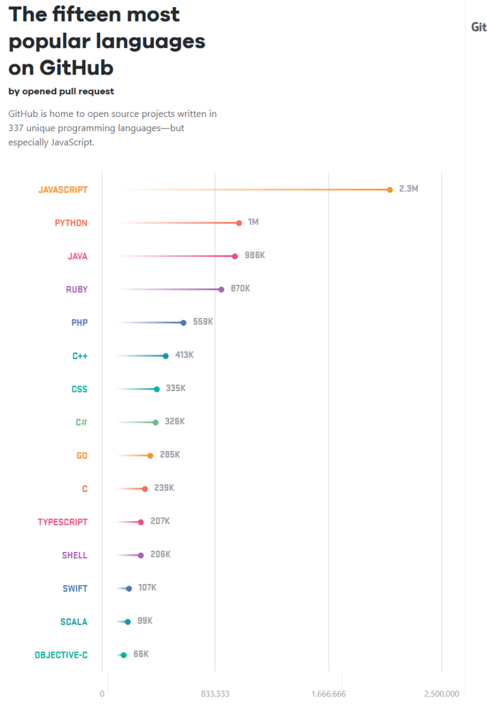](https://www.boostcourse.org/web326/lecture/58941?isDesc=false#)

- **Github에서 가장 인기 있는 언어 15개**

  출처 https://octoverse.github.com/

이외에도 티오베([https://www.tiobe.com](https://www.tiobe.com/))의 자료를 많은 개발자가 공신력이 있다고 생각하고 있습니다.

티오베는 소프트웨어 품질 관련 서비스를 제공하고 있는 기업으로써 위키피디아, 아마존, 유튜브, 구글 검색창의 입력되는 정보를 이용하여 순위를 정하게 됩니다.

[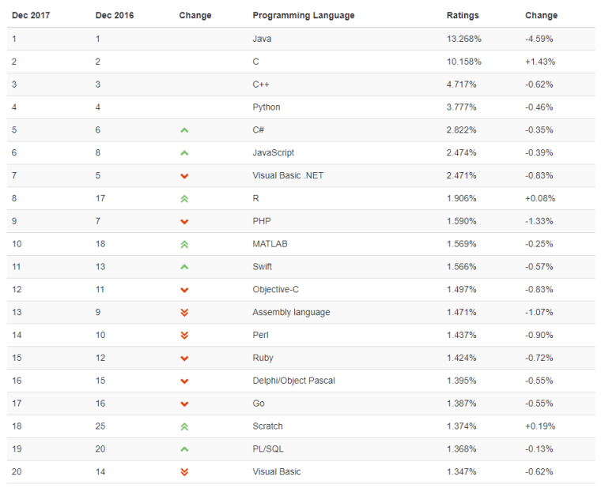](https://www.boostcourse.org/web326/lecture/58941?isDesc=false#)

- **티오베의 순위**

티오베의 순위를 보면 2016, 2017년도 1등은 Java언어가 차지하고 있는 것을 알 수 있습니다.

단, 다른 언어들의 인기가 높아지면서 비율이 떨어진 것을 알 수 있습니다.

2006년부터 웹과 관련된 언어들이 인기를 얻기 시작하였고, 2012년부터는 모바일 앱을 만들기 위한 언어가 인기를 얻게 되었습니다.

그리고 2016년부터는 데이터 과학과 관련된 언어들이 인기를 얻고 있습니다.

 

**웹 관련 인기 언어**

- Python : 프로그래밍 입문자가 읽기 쉽고 적은 코드를 사용하여 프로그램을 개발할 수 있습니다. 많은 사람에게 추천되는 언어이며, 데이터 과학에서도 자주 사용되며 웹사이트 개발에서도 많이 사용되고 있습니다.
- PHP : 웹의 80% 이상이 PHP로 만들어졌다고 말합니다. 그만큼 PHP는 웹 개발에서 많이 사용됩니다. 
- JavaScript : 자바 스크립트는 처음 시작이 브라우저에서 동작하는 언어였습니다. 현재는 서버에서도 작성하는 프로그램으로 점차 영역을 넓혀가고 있습니다. 프론트 개발자라면 반드시 알아야 할 언어입니다. 자바스크립트 커뮤니티도 점점 더 거대해지고 있습니다.
- JAVA : 엔터프라이즈 소프트웨어 환경에 잘 맞는 언어입니다. 큰 규모의 소프트웨어 개발에 자바언어가 많이 사용되고 있습니다. JAVA언어를 지원하는 수많은 커뮤니티에 위해서, 지속적으로 발전되어 훌륭한 구조와 설계 기법들이 잘 갖춰져 있습니다.
- Ruby : 빠른 개발에 널리 사용되며, 단순함과 세련된 웹 어플리케이션을 만들 수 있기 때문에 인기 있는 언어 중의 하나입니다.


**HTTP (Hypertext Transfer Protocol)란?**

- 팀 버너스리(Tim Berners-Lee)와 그가 속한 팀은 CERN에서 HTML뿐만 아니라 웹 브라우저 및 웹 브라우저 관련 기술과 HTTP를 발명하였습니다.
- 문서화된 최초의 HTTP버전은 HTTP v0.9(1991년)입니다.
- HTTP는 서버와 클라이언트가 인터넷상에서 데이터를 주고받기 위한 프로토콜(protocol)입니다.
- HTTP는 계속 발전하여 HTTP/2까지 버전이 등장한 상태입니다.

 

**HTTP 작동방식**

- HTTP는 서버/클라이언트 모델을 따릅니다.
- 장점
  \- 불특정 다수를 대상으로 하는 서비스에는 적합하다.
  \- 클라이언트와 서버가 계속 연결된 형태가 아니기 때문에 클라이언트와 서버 간의 최대 연결 수보다 훨씬 많은 요청과 응답을 처리할 수 있다.
- 단점
  \- 연결을 끊어버리기 때문에, 클라이언트의 이전 상황을 알 수가 없다.
  \- 이러한 특징을 무상태(Stateless)라고 말한다.
  \- 이러한 특징 때문에 정보를 유지하기 위해서 Cookie와 같은 기술이 등장하게 되었다.

 

**URL (Uniform Resource Locator)**

- 인터넷 상의 자원의 위치
- 특정 웹 서버의 특정 파일에 접근하기 위한 경로 혹은 주소

[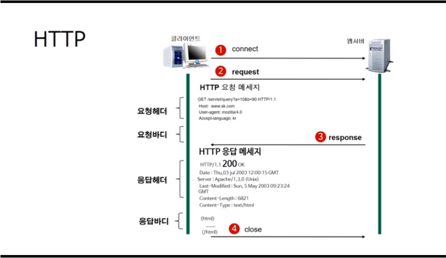](https://www.boostcourse.org/web326/lecture/58942/?isDesc=false#)

- **HTTP (Hypertext Transfer Protocol)**

- 요청 메서드 : GET, PUT, POST, PUSH, OPTIONS 등의 요청 방식이 온다.
- 요청 URI : 요청하는 자원의 위치를 명시한다.
- HTTP 프로토콜 버전 : 웹 브라우저가 사용하는 프로토콜 버전이다.

첫번째 줄의 요청메소드는 서버에게 요청의 종류를 알려주기 위해서 사용됩니다.

각각의 메소드 이름은 다음과 같은 의미를 가집니다.

참고로 최초의 웹 서버는 GET방식만 지원해줬습니다.

- GET : 정보를 요청하기 위해서 사용한다. (SELECT)
- POST : 정보를 밀어넣기 위해서 사용한다. (INSERT)
- PUT : 정보를 업데이트하기 위해서 사용한다. (UPDATE)
- DELETE : 정보를 삭제하기 위해서 사용한다. (DELETE)
- HEAD : (HTTP)헤더 정보만 요청한다. 해당 자원이 존재하는지 혹은 서버에 문제가 없는지를 확인하기 위해서 사용한다.
- OPTIONS : 웹서버가 지원하는 메서드의 종류를 요청한다.
- TRACE : 클라이언트의 요청을 그대로 반환한다. 예컨데 echo 서비스로 서버 상태를 확인하기 위한 목적으로 주로 사용한다.


**웹프론트엔드?**

사용자에게 웹을 통해 다양한 콘텐츠(문서, 동영상, 사진 등)를 제공합니다.

또한, 사용자의 요청(요구사항)에 반응해서 동작합니다.


**웹프론트엔드의 역할**

- 웹콘텐츠를 잘 보여주기 위해 구조를 만들어야 합니다.(신문,책등과 같이) - HTML
- 적절한 배치와 일관된 디자인 등을 제공해야 합니다.(보기 좋게) - CSS
- 사용자 요청을 잘 반영해야 합니다.(소통하듯이) - Javascript


**HTML 코드 예시**

원하는 문서의 구조를 프로그래밍 언어로 표현해야 합니다.

HTML이라는 것은 그 구조를 잘 표현해 줍니다.

```markup
<h1> 우리집에 오신걸 환영합니다 </h1>
<section >
   <h2> 위치</h2>
    <p> 경기도 시흥시 어딘가 위치하고 있어요~</p>
   <h2> 특징</h2>
    <p>  우리집은 마루가 아주 작아요~  하지만 옹기종기 모여있기 좋은 구조에요</p>
</section>
<footer>email : crong@kdd123.com</footer>
```


**스타일 - CSS 코드예시**

웹페이지를 꾸미기 위해서는 각각의 HTML 태그(문서의 구조를 표현한 각 조각 단위)를 꾸미기 위한 규칙이 필요합니다

CSS는 이를 표현할 수 있는 프로그래밍 언어입니다.

```css
.window-header-icon {
left: -28px;
position: absolute;
top: 8px
}

.window-header-inline-content {
cursor: default;
display: inline-block;
margin: 4px 6px 0 0
}
```


**동작 - JavaScript 코드예시**

HTML,CSS를 이리저리 움직이고 변경할 필요가 있을 거예요.

JavaScript가 그걸 해줍니다.

```javascript
let aCardList = [];
for (var i = 0; i < cardList.length; i++) {
let str =`${cardList[i]}번째 카드`;
let id = `list-${cardList[i]}`;
aCardList.push(<li id={id} key={i} draggable='true' onDragStart={dragStart}> {str} </li>)
}
```


**백 엔드(Back-End)란?**

backend는 정보를 처리하고 저장하며, 요청에 따라 정보를 내려주는 역할을 한다. 가령 쇼핑몰이라면, 상품 정보를 가지고 있고, 주문을 받아서 저장하고, 사용자가 관심있어 하는 상품을 골라주는 역할이 back-End의 역할이다


**백 엔드 개발자가 알아야 할 것들**

- 프로그래밍 언어(JAVA, Python, PHP, Javascript 등)
- 웹의 동작 원리
- 알고리즘(algorithm), 자료구조 등 프로그래밍 기반 지식
- 운영체제, 네트워크 등에 대한 이해
- 프레임워크에 대한 이해(예: Spring)
- DBMS에 대한 이해와 사용방법(예: MySQL, Oracle 등)


**browser의 동작**

브라우저는 월드와이드웹(WWW)에서 정보를 검색, 표현하고 탐색하기 위한 소프트웨어입니다.

 

인터넷에서 특정 정보로 이동할 수 있는 주소 입력창이 있고 서버와 HTTP로 정보를 주고 받을 수 있는 네트워크 모듈도 포함하고 있습니다.

그리고 서버에서 받은 문서(HTML, CSS, Javascript)를 해석하고 실행하여 화면에 표현하기 위한 해석기(Parser)들을 가지고 있습니다.

브라우저마다 서로 다른 엔진을 포함하고 있습니다.

아래 그림이 대표적인 내용입니다.

[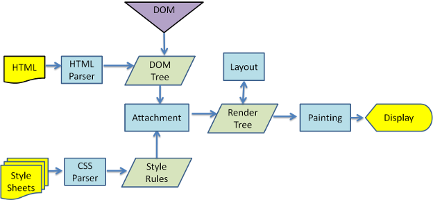](https://www.boostcourse.org/web326/lecture/258496/?isDesc=false#)

- **사파리 브라우저에서 처리되는 webkit렌더링엔진의 처리과정**

  출처 https://www.html5rocks.com/en/tutorials/internals/howbrowserswork/

HTML을 해석해서 DOM Tree를 만들고, CSS를 해석해서 역시 CSS Tree(CSS Object Model)을 만듭니다. 

이 과정에서 Parsing 과정이 필요하며 토큰 단위로 해석되는 방식은 일반적인 소스코드의 컴파일 과정이라고 보시면 됩니다.

DOM Tree와 CSS Tree, 이 두 개는 연관되어 있으므로 Render Tree로 다시 조합됩니다.

이렇게 조합된 결과는 화면에 어떻게 배치할지 크기와 위치 정보를 담고 있습니다.

이후에 이렇게 구성된 Render Tree정보를 통해서 화면에 어떤 부분에 어떻게 색칠을 할지 Painting과정을 거치게 됩니다.


**웹 서버란?**

- 웹 서버는 소프트웨어(Software)를 보통 말하지만, 웹 서버 소프트웨어가 동작하는 컴퓨터를 말합니다.
- 웹 서버의 가장 중요한 기능은 클라이언트(Client)가 요청하는 HTML 문서나 각종 리소스(Resource)를 전달하는 것입니다.
- 웹 브라우저나 웹 크롤러가 요청하는 리소스는 컴퓨터에 저장된 정적(static)인 데이터이거나 동적인 결과가 될 수 있습니다.

 

**웹 서버 소프트웨어의 종류**

- 가장 많이 사용하는 웹 서버는 Apache, Nginx, Microsoft IIS
- Apache웹 서버는 Apache Software Foundation에서 개발한 웹서버로 오픈소스 소프트웨어(Open-source Software)이며, 거의 대부분 운영체제에서 설치 및 사용을 할 수 있습니다.
- Nginx는 차세대 웹서버로 불리며 더 적은 자원으로 더 빠르게 데이터를 서비스하는 것을 목적으로 만들어진 서버이며 Apache웹 서버와 마찬가지로 오픈소스 소프트웨어입니다.


**클라이언트/서버 구조**

클라이언트(Client)는 서비스(Service)를 제공하는 서버(Server)에게 정보를 요청하여 응답 받은 결과를 사용합니다.

[](https://www.boostcourse.org/web326/lecture/58947/?isDesc=false#)

- **클라이언트/서버 구조**

**DBMS (DataBase Management System)**

다수의 사용자가 데이터베이스 내의 데이터에 접근할 수 있도록 해주는 소프트웨어입니다.

[](https://www.boostcourse.org/web326/lecture/58947/?isDesc=false#)

- **DBMS (DataBase Management System)**

**미들웨어 (MiddleWare)**

클라이언트 쪽에 비즈니스 로직이 많을 경우, 클라이언트 관리(배포 등)로 인해 비용이 많이 발생하는 문제가 있습니다.

비즈니스 로직을 클라이언트와 DBMS사이의 미들웨어 서버에서 동작하도록 함으로써 클라이언트는 입력과 출력만 담당하도록 합니다.

[](https://www.boostcourse.org/web326/lecture/58947/?isDesc=false#)

- **미들웨어(MiddleWare)**

**WAS (Web Application Server)**

WAS는 일종의 미들웨어로 웹 클라이언트(보통 웹 브라우저)의 요청 중 웹 애플리케이션이 동작하도록 지원하는 목적을 가집니다.

- 기능
  - 프로그램 실행 환경과 DBMS 접속 기능을 제공한다.
  - 여러 개의 트랜잭션을 관리한다.
  - 업무를 처리하는 비즈니스 로직을 처리한다.

[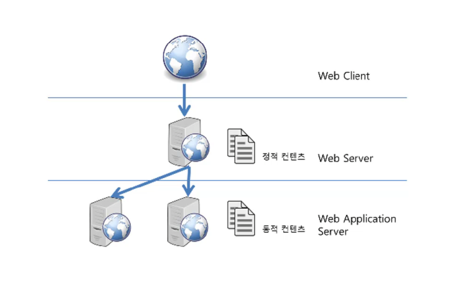](https://www.boostcourse.org/web326/lecture/58947/?isDesc=false#)

- **WAS (Web Application Server)**

**웹 서버 vs WAS**

- WAS도 보통 자체적으로 웹 서버 기능을 내장하고 있습니다.
- 현재는 WAS가 가지고 있는 웹 서버도 정적인 콘텐츠를 처리하는 데 있어서 성능상 큰 차이가 없습니다.
- 규모가 커질수록 웹 서버와 WAS를 분리합니다.
- 자원 이용의 효율성 및 장애 극복, 배포 및 유지보수의 편의성을 위해 웹서버와 WAS를 대체로 분리합니다.
  - 웹서버는  WAS보다 상대적으로 간단한 구조로 이루어짐. 
  - WAS가 문제가 있을 경우 웹서버에서 해당 WAS를 사용하지 못하게 하는 장애극복기능을 이용하여 무중단 배포가 가능하다.


### 2) 웹 개발환경 설정

**Apache Tomcat이란?**

아파치 톰캣(Apache Tomcat)은 아파치 소프트웨어 재단(Apache Software Foundation, ASF)에서 개발한 세계에서 가장 많이 사용되는 WAS(Web Application Server)입니다.

컴퓨터에 운영체제를 설치해야만 컴퓨터를 사용할 수 있는 것처럼, 자바를 이용하여 작성된 웹 어플리케이션은 WAS가 있어야만 실행할 수 있습니다.

이때 가장 많이 사용되는 WAS가 아파치 톰캣이라고 말할 수 있습니다.

아파치 톰캣은 오픈소스 소프트웨어로써 누구나 무료로 사용할 수 있습니다.

참고로 Tomcat은 '수고양이'를 뜻합니다. 톰과 제리의 톰이 생각나기도 합니다.


### 3) Servlet

**자바 웹 어플리케이션(Java Web Application)**

WAS에 설치(deploy)되어 동작하는 어플리케이션입니다.

자바 웹 어플리케이션에는 HTML, CSS, 이미지, 자바로 작성된 클래스(Servlet도 포함됨, package, 인터페이스 등), 각종 설정 파일 등이 포함됩니다.

 

**자바 웹 어플리케이션의 폴더 구조**

[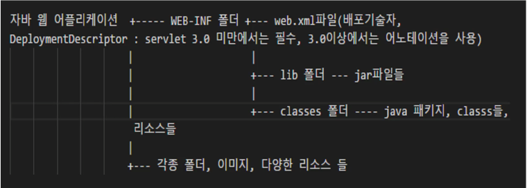](https://www.boostcourse.org/web326/lecture/58954/?isDesc=false#)

- **자바 웹 어플리케이션의 폴더 구조**

**서블릿이란?**

자바 웹 어플리케이션의 구성요소 중 동적인 처리를 하는 프로그램의 역할입니다.

서블릿을 정의해보면 서블릿(servlet)은 WAS에 동작하는 JAVA 클래스입니다. 

서블릿은 HttpServlet 클래스를 상속받아야 합니다.

서블릿과 JSP로부터 최상의 결과를 얻으려면, 웹 페이지를 개발할 때 이 두 가지(JSP, 서블릿)를 조화롭게 사용해야 합니다.

예를 들어, 웹 페이지를 구성하는 화면(HTML)은 JSP로 표현하고, 복잡한 프로그래밍은 서블릿으로 구현합니다.


**버전에 따른 Servlet 작성 방법**

**1. Servlet 3.0 spec 이상에서 사용하는 방법**

- web.xml 파일을 사용하지 않습니다.
- 자바 어노테이션(annotation)을 사용합니다.
- 앞에서 실습했던 first web에서 사용합니다.

**2. Servlet 3.0 spec미만에서 사용하는 방법**

- servlet을 등록할 때 web.xml 파일에 등록합니다.


**LifecycleServlet**

HttpServlet의 3가지 메소드를 오버라이딩

- init()
- service(request, response)
- destroy()


[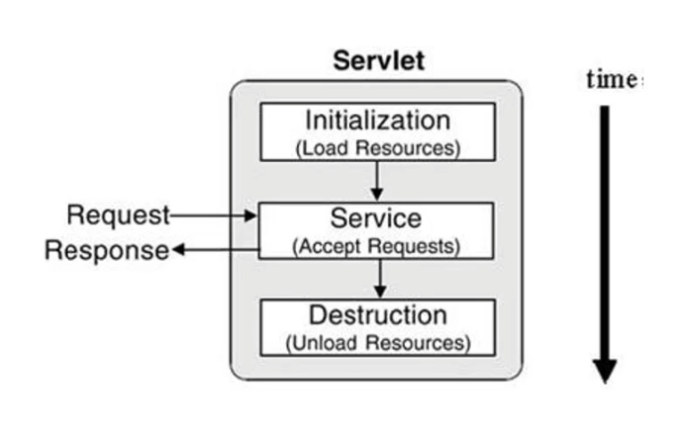](https://www.boostcourse.org/web326/lecture/258505/?isDesc=false#)

- **Servlet**

**Servlet 생명주기**

- WAS는 서블릿 요청을 받으면 해당 서블릿이 메모리에 있는지 확인합니다.
-  if (메모리에 없음) {
   \- 해당 서블릿 클래스를 메모리에 올림
   \- init() 메소드를 실행
  }
   \- service()메소드를 실행
- was가 종료되거나, 웹 어플리케이션이 새롭게 갱신될 경우 destroy() 메소드가 실행됩니다.


**실습코드**

LifecycleServlet.java

```java
package examples;

import java.io.IOException;
import java.io.PrintWriter;

import javax.servlet.ServletConfig;
import javax.servlet.ServletException;
import javax.servlet.annotation.WebServlet;
import javax.servlet.http.HttpServlet;
import javax.servlet.http.HttpServletRequest;
import javax.servlet.http.HttpServletResponse;


@WebServlet("/LifecycleServlet")
public class LifecycleServlet extends HttpServlet {
	private static final long serialVersionUID = 1L;
       
 
    public LifecycleServlet() {
        System.out.println("LifecycleServlet 생성!!");
    }

	public void init(ServletConfig config) throws ServletException {
		System.out.println("init test 호출!!");
	}

	
	public void destroy() {
		System.out.println("destroy 호출!!");
	}

	@Override
	protected void doGet(HttpServletRequest request, HttpServletResponse response) throws ServletException, IOException {
		response.setContentType("text/html");
		PrintWriter out = response.getWriter();
		out.println("<html>");
		out.println("<head><title>form</title></head>");
		out.println("<body>");
		out.println("<form method='post' action='/firstweb/LifecycleServlet'>");
		out.println("name : <input type='text' name='name'><br>");
		out.println("<input type='submit' value='ok'><br>");                                                 
		out.println("</form>");
		out.println("</body>");
		out.println("</html>");
		out.close();
	}

	protected void doPost(HttpServletRequest request, HttpServletResponse response) throws ServletException, IOException {
		response.setContentType("text/html");
		PrintWriter out = response.getWriter();
		String name = request.getParameter("name");
		out.println("<h1> hello " + name + "</h1>");
		out.close();
	}

//	protected void service(HttpServletRequest request, HttpServletResponse response) throws ServletException, IOException {
//		System.out.println("service 호출!!");
//	}
//	
	

}
```

 

**service(request, response) 메소드**

HttpServlet의 service메소드는 템플릿 메소드 패턴으로 구현합니다.

- 클라이언트의 요청이 GET일 경우에는 자신이 가지고 있는 doGet(request, response)메소드를 호출
- 클라이언트의 요청이 Post일 경우에는 자신이 가지고 있는 doPost(request, response)를 호출


**LifecycleServlet 수정 실습**

- Service(request, response)메소드 주석처리
- HttpServlet의 doGet(request, response)메소드 오버라이딩
- HttpServlet의 doPost(request, response)메소드 오버라이딩


[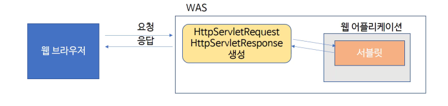](https://www.boostcourse.org/web326/lecture/258511/?isDesc=false#)

- **요청과 응답**

**요청과 응답**

WAS는 웹 브라우저로부터 Servlet요청을 받으면,

- 요청할 때 가지고 있는 정보를 HttpServletRequest객체를 생성하여 저장합니다.
- 웹 브라우저에게 응답을 보낼 때 사용하기 위하여 HttpServletResponse객체를 생성합니다.
- 생성된 HttpServletRequest, HttpServletResponse 객체를 서블릿에게 전달합니다.

 

**HttpServletRequest**

- http프로토콜의 request정보를 서블릿에게 전달하기 위한 목적으로 사용합니다.
- 헤더정보, 파라미터, 쿠키, URI, URL 등의 정보를 읽어 들이는 메소드를 가지고 있습니다.
- Body의 Stream을 읽어 들이는 메소드를 가지고 있습니다.


**HttpServletResponse**

- WAS는 어떤 클라이언트가 요청을 보냈는지 알고 있고, 해당 클라이언트에게 응답을 보내기 위한 HttpServleResponse객체를 생성하여 서블릿에게 전달합니다.
- 서블릿은 해당 객체를 이용하여 content type, 응답코드, 응답 메시지등을 전송합니다.


### 4) JSP

**JSP 등장 배경**

- 마이크로소프트에서 ASP(Active Server Page)라는 쉽게 웹을 개발할 수 있는 스크립트(script) 엔진을 발표함 (1998년)
- 1997년에 발표된 서블릿은 ASP에 비하여 상대적으로 개발 방식이 불편함
- ASP에 대항하기 위하여 1999년 썬마이크로시스템즈에서 JSP를 발표
- JSP는 실제로 서블릿 기술을 사용


**JSP의 실행순서**

1. 브라우저가 웹서버에 JSP에 대한 요청 정보를 전달한다.
2. 브라우저가 요청한 JSP가 최초로 요청했을 경우만 JSP로 작성된 코드가 서블릿으로 코드로 변환한다. (java 파일 생성)
3. 서블릿 코드를 컴파일해서 실행가능한 bytecode로 변환한다. (class 파일 생성)
4. 서블릿 클래스를 로딩하고 인스턴스를 생성한다.
5. 서블릿이 실행되어 요청을 처리하고 응답 정보를 생성한다.


lifecycle.jsp

```jsp
<%@ page language="java" contentType="text/html; charset=UTF-8"
    pageEncoding="UTF-8"%>
<!DOCTYPE html PUBLIC "-//W3C//DTD HTML 4.01 Transitional//EN" "http://www.w3.org/TR/html4/loose.dtd">
<html>
<head>
<meta http-equiv="Content-Type" content="text/html; charset=UTF-8">
<title>Insert title here</title>
</head>
<body>
hello
<%
	System.out.println("_jspService()");
%>

<%!
public void jspInit() {
	System.out.println("jspInit()!");
}

public void jspDestroy() {
	System.out.println("jspDestroy()");
}
%>

</body>
</html>
```

 

**스크립트 요소의 이해**

- JSP 페이지에서는 선언문(Declaration), 스크립트릿(Scriptlet), 표현식(Expression) 이라는 3가지의 스크립트 요소를 제공

[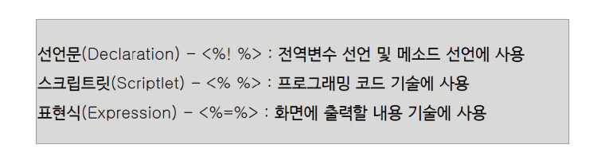](https://www.boostcourse.org/web326/lecture/58960/?isDesc=false#)

- **스크립트 요소의 이해**

 **선언문**

- 선언문 : <%! %>
- 선언문은 JSP 페이지 내에서 필요한 멤버변수나 메소드가 필요할 때 선언해 사용하는 요소
- 선언문의 문법
  - <%! 문장 %>


**스크립트릿**

- 스크립트릿 : <% %>
- 가장 일반적으로 많이 쓰이는 스크립트 요소
- 주로 프로그래밍의 로직을 기술할 때 사용
- 스크립트릿에서 선언된 변수는 지역변수
- 스크립트릿의 문법
  - <% 문장%>


**표현식(Expression)**

- 표현식 : <%=%>
- JSP 페이지에서 웹 브라우저에 출력할 부분을 표현 (즉, 화면에 출력하기 위한 것)
- 스크립트릿내에서 출력할 부분은 내장객체인 out 객체의 print() 또는 println() 메소드를 사용해서 출력
- 표현식의 문법
  - <%=문장%>


**주석(Comment)**

- JSP페이지에서 사용할 수 있는 주석
- HTML주석, 자바주석, JSP주석

 

1. HTML 주석

- HTML 주석은 <!--로 시작해서 -->로 끝나는 형태
- HTML 주석은 HTML주석을 사용한 페이지를 웹에서 서비스할 때 화면에 주석이 내용이 표시되지는 않으나 , [소스보기]수행하면 HTML주석의 내용이 화면에 표시.
- HTML주석의 예시

```markup
<!-- html 주석입니다. -->
```


2. JSP주석

- JSP 페이지에서만 사용되며 <%--로 시작해서 --%>로 끝나는 형태
- JSP 주석은 해당 페이지를, 웹 브라우저를 통해 출력 결과로서 표시하거나, 웹 브라우저 상에서 소스 보기를 해도 표시 되지 않음. 또한 JSP주석 내에 실행코드를 넣어도 그 코드는 실행되지 않음.
- JSP주석의 예시

```markup
<%-- JSP 주석입니다. --%>
```


3. 자바주석

- 자바 주석은 //, /**/을 사용해서 작성.
- //은 한 줄짜리 주석을 작성할 때 사용되고, /**/은 여러 줄의 주석을 작성할 때 사용
- 스크립트릿이나 선언문에서 사용되는 주석으로, 자바와 주석 처리 방법이 같음
- 자바주석의 예시

```java
//주석

/*주석

여러 줄에 걸친 주석이다.

*/
```


**JSP 내장 객체란?**

- JSP를 실행하면 서블릿 소스가 생성되고 실행된다.
- JSP에 입력한 대부분의 코드는 생성되는 서블릿 소스의 _jspService() 메소드 안에 삽입되는 코드로 생성된다.
- _jspService()에 삽입된 코드의 윗부분에 미리 선언된 객체들이 있는데, 해당 객체들은 jsp에서도 사용 가능하다.
- response, request, application, session, out과 같은 변수를 내장객체라고 한다.


**내장 객체의 종류**

[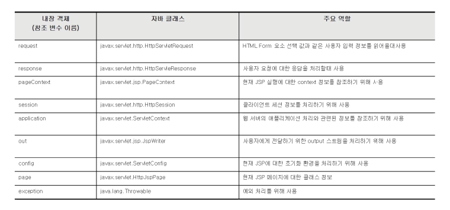](https://www.boostcourse.org/web326/lecture/58961/?isDesc=false#)

 

### 5) scope

[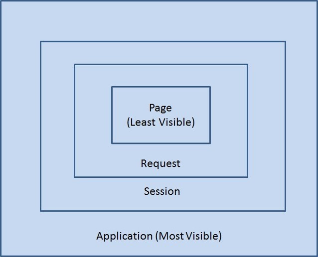](https://www.boostcourse.org/web326/lecture/58962/?isDesc=false#)

- 출처 http://inheritingjava.blogspot.kr/2011/04/chapter-42-scope-of-javabeans-in-jsp.html

**4가지 Scope**

- Application : 웹 어플리케이션이 시작되고 종료될 때까지 변수가 유지되는 경우 사용
- Session : 웹 브라우저 별로 변수가 관리되는 경우 사용
- Request : http요청을 WAS가 받아서 웹 브라우저에게 응답할 때까지 변수가 유지되는 경우 사용
- Page : 페이지 내에서 지역변수처럼 사용


**Page Scope**

- PageContext 추상 클래스를 사용한다.
- JSP 페이지에서 pageContext라는 내장 객체로 사용 가능 하다.
- forward가 될 경우 해당 Page scope에 지정된 변수는 사용할 수 없다.
- 사용방법은 Application scope나 Session scope, request scope와 같다.
- 마치 지역변수처럼 사용된다는 것이 다른 Scope들과 다릅니다.
- jsp에서 pageScope에 값을 저장한 후 해당 값을 EL표기법 등에서 사용할 때 사용됩니다.
- 지역 변수처럼 해당 jsp나 서블릿이 실행되는 동안에만 정보를 유지하고자 할 때 사용됩니다.


**Request Scope**

- http 요청을 WAS가 받아서 웹 브라우저에게 응답할 때까지 변수값을 유지하고자 할 경우 사용한다.
- HttpServletRequest 객체를 사용한다.
- JSP에서는 request 내장 변수를 사용한다.
- 서블릿에서는 HttpServletRequest 객체를 사용한다.
- 값을 저장할 때는 request 객체의 setAttribute()메소드를 사용한다.
- 값을 읽어 들일 때는 request 객체의 getAttribute()메소드를 사용한다.
- forward 시 값을 유지하고자 사용한다.
- 앞에서 forward에 대하여 배울 때 forward 하기 전에 request 객체의 setAttribute() 메소드로 값을 설정한 후, 서블릿이나 jsp에게 결과를 전달하여 값을 출력하도록 하였는데 이렇게 포워드 되는 동안 값이 유지되는 것이 Request scope를 이용했다고 합니다.

 

**Session Scope**

- 웹 브라우저별로 변수를 관리하고자 할 경우 사용한다.
- 웹 브라우저간의 탭 간에는 세션정보가 공유되기 때문에, 각각의 탭에서는 같은 세션정보를 사용할 수 있다.
- HttpSession 인터페이스를 구현한 객체를 사용한다.
- JSP에서는 session 내장 변수를 사용한다.
- 서블릿에서는 HttpServletRequest의 getSession()메소드를 이용하여 session 객체를 얻는다.
- 값을 저장할 때는 session 객체의 setAttribute()메소드를 사용한다.
- 값을 읽어 들일 때는 session 객체의 getAttribute()메소드를 사용한다.
- 장바구니처럼 사용자별로 유지가 되어야 할 정보가 있을 때 사용한다.


**Application Scope**

- 웹 어플리케이션이 시작되고 종료될 때까지 변수를 사용할 수 있다.
- ServletContext 인터페이스를 구현한 객체를 사용한다.
- jsp에서는 application 내장 객체를 이용한다.
- 서블릿의 경우는 getServletContext()메소드를 이용하여 application객체를 이용한다.
- 웹 어플리케이션 하나당 하나의 application객체가 사용된다.
- 값을 저장할 때는 application객체의 setAttribute()메소드를 사용한다.
- 값을 읽어 들일 때는 application객체의 getAttribute()메소드를 사용한다.
- 모든 클라이언트가 공통으로 사용해야 할 값들이 있을 때 사용한다.


### 6) JSTL & EL

**표현 언어란?**

- 표현 언어(Expression Language)는 값을 표현하는 데 사용되는 스크립트 언어로서 JSP의 기본 문법을 보완하는 역할을 한다.


**표현 언어가 제공하는 기능**

- JSP의 스코프(scope)에 맞는 속성 사용
- 집합 객체에 대한 접근 방법 제공
- 수치 연산, 관계 연산, 논리 연산자 제공
- 자바 클래스 메소드 호출 기능 제공
- 표현언어만의 기본 객체 제공


**표현언어의 표현방법**

[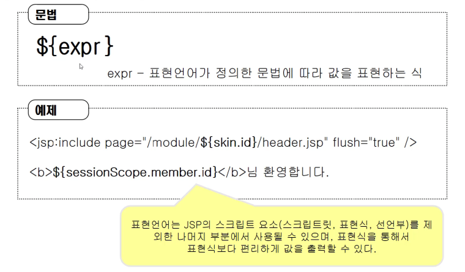](https://www.boostcourse.org/web326/lecture/258517/?isDesc=false#)


**표현언어의 기본 객체**

[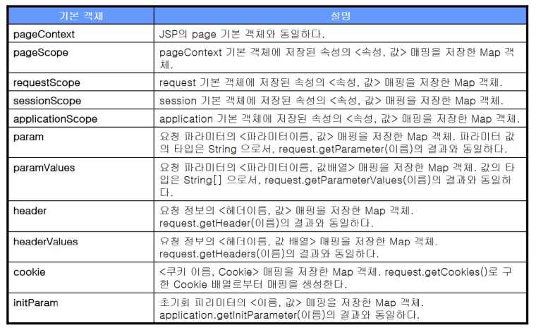](https://www.boostcourse.org/web326/lecture/258517/?isDesc=false#)


**표현 언어의 기본 객체 사용 예**

[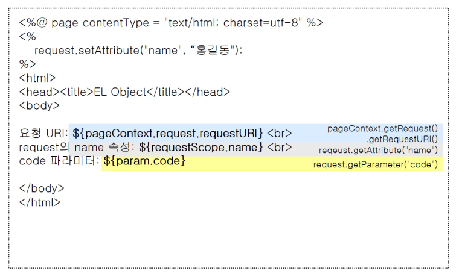](https://www.boostcourse.org/web326/lecture/258517/?isDesc=false#)


**표현 언어의 데이터 타입**

- 불리언 타입 - true와 false
- 정수타입 - 0~9로 이루어진 정수 값 음수의 경우 '-'가 붙음
- 실수타입 - 0~9로 이루어져 있으며, 소수점('.')을 사용할 수 있고, 3.24e3과 같이 지수형으로 표현 가능하다.
- 문자열 타입 - 따옴표( ' 또는" )로 둘러싼 문자열. 만약 작은 따옴표(')를 사용해서 표현할 경우 값에 포함된 작은 따옴표는 \' 와 같이 \ 기호와 함께 사용해야 한다.
- \ 기호 자체는 \\ 로 표시한다.
- 널 타입 - null

 


[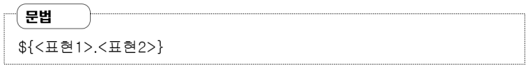](https://www.boostcourse.org/web326/lecture/258517/?isDesc=false#)

**객체 접근 규칙**

- 표현 1이나 표현 2가 null이면 null을 반환한다.
- 표현1이 Map일 경우 표현2를 key로한 값을 반환한다.
- 표현1이 List나 배열이면 표현2가 정수일 경우 해당 정수 번째 index에 해당하는 값을 반환한다.
- 만약 정수가 아닐 경우에는 오류가 발생한다.
- 표현1이 객체일 경우는 표현2에 해당하는 getter메소드에 해당하는 메소드를 호출한 결과를 반환한다.

 

**표현 언어의 수치 연산자**

- \+ : 덧셈
- \- : 뺄셈
- \* : 곱셈
- / 또는 div : 나눗셈
- % 또는 mod : 나머지
- 숫자가 아닌 객체와 수치 연산자를 사용할 경우 객체를 숫자 값으로 변환 후 연산자를 수행 : ${"10"+1} → ${10+1}
- 숫자로 변환할 수 없는 객체와 수치 연산자를 함께 사용하면 에러를 발생 : ${"열"+1} → 에러
- 수치 연산자에서 사용되는 객체가 null이면 0으로 처리 : ${null + 1} → ${0+1}

 

**비교 연산자**

- == 또는 eq
- != 또는 ne
- < 또는 lt
- \> 또는 gt
- <= 또는 le
- \>= 또는 ge
- 문자열 비교: ${str == '값'} str.compareTo("값") == 0 과 동일

 

**논리 연산자**

- && 또는 and
- || 또는 or
- ! 또는 not

 

**empty 연산자, 비교선택 연산자**

[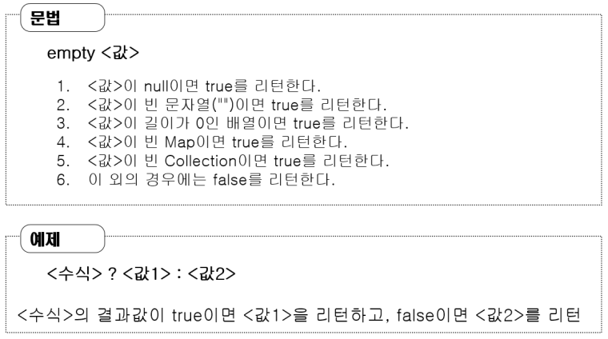](https://www.boostcourse.org/web326/lecture/258517/?isDesc=false#)


**연산자 우선순위**

1. [] .
2. ()
3. \- (단일) not ! empty
4. \* / div % mod
5. \+ -
6. < > <= >= lt gt le ge
7. == != eq ne
8. && and
9. || or
10. ? :

 

**표현 언어 비활성화 : JSP에 명시하기**

- <%@ page isELIgnored = "true" %>

[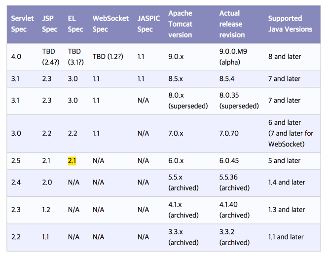](https://www.boostcourse.org/web326/lecture/258517/?isDesc=false#)

- 출처 https://docs.oracle.com/cd/E19316-01/819-3669/bnaic/index.html


**JSTL이란?**

- JSTL(JSP Standard Tag Library)은 JSP 페이지에서 조건문 처리, 반복문 처리 등을 html tag형태로 작성할 수 있게 도와줍니다.

[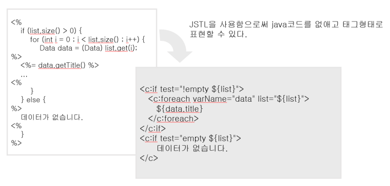](https://www.boostcourse.org/web326/lecture/258521/?isDesc=false#)


**JSTL을 사용하려면?**

- http://tomcat.apache.org/download-taglibs.cgi
- 위의 사이트에서 3가지 jar파일을 다운로드 한 후 WEB-INF/lib/ 폴더에 복사를 한다.

[](https://www.boostcourse.org/web326/lecture/258521/?isDesc=false#)


**JSTL이 제공하는 태그의 종류**

[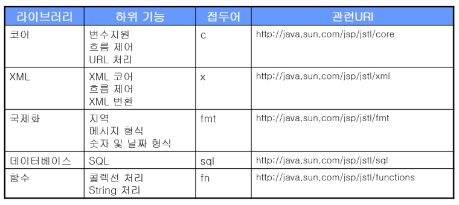](https://www.boostcourse.org/web326/lecture/258521/?isDesc=false#)


**코어 태그**

[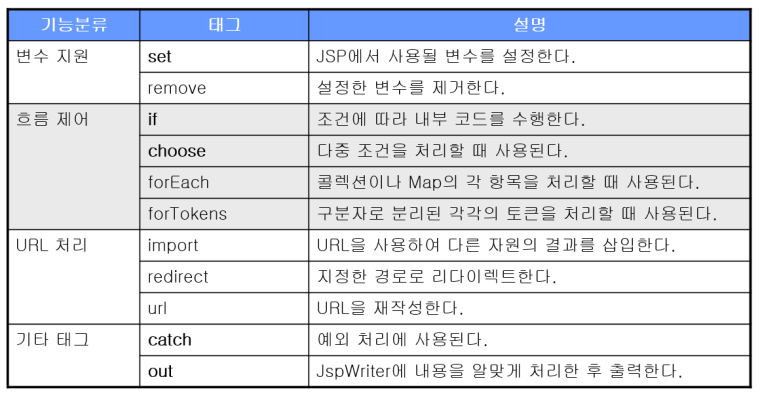


**코어 태그: 변수 지원 태그 - set, remove**

[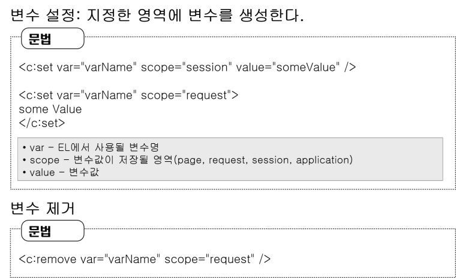](https://www.boostcourse.org/web326/lecture/258521/?isDesc=false#)


**코어태그: 변수 지원 태그 - 프로퍼티, 맵의 처리**

[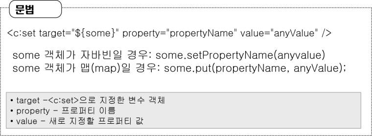](https://www.boostcourse.org/web326/lecture/258522/?isDesc=false#)


**코어 태그: 흐름제어 태그**

[](https://www.boostcourse.org/web326/lecture/258522/?isDesc=false#)


**코어 태그: 흐름제어 태그 - choose**

[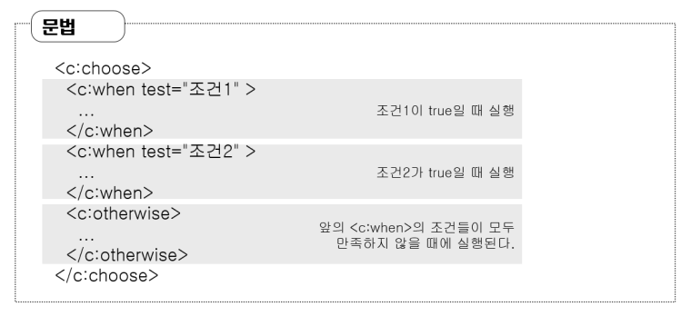](https://www.boostcourse.org/web326/lecture/258522/?isDesc=false#)


**코어 태그: 흐름제어 태그 - forEach**

[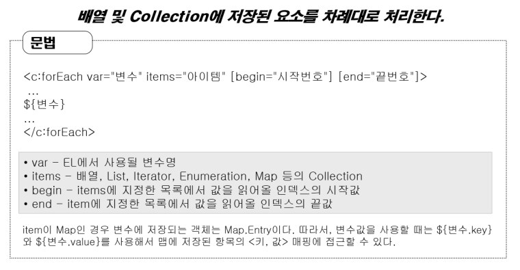](https://www.boostcourse.org/web326/lecture/258523/?isDesc=false#)

**코어 태그: 흐름제어태그 - import**

[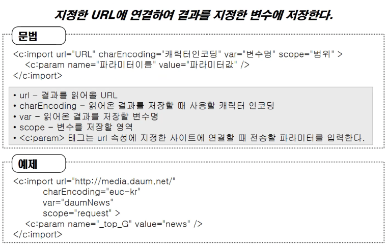](https://www.boostcourse.org/web326/lecture/258523/?isDesc=false#)


**코어 태그: 흐름제어태그 - redirect**

[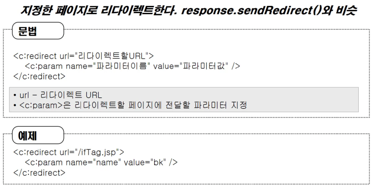](https://www.boostcourse.org/web326/lecture/258524/?isDesc=false#)


**코어 태그: 기타태그 - out**

[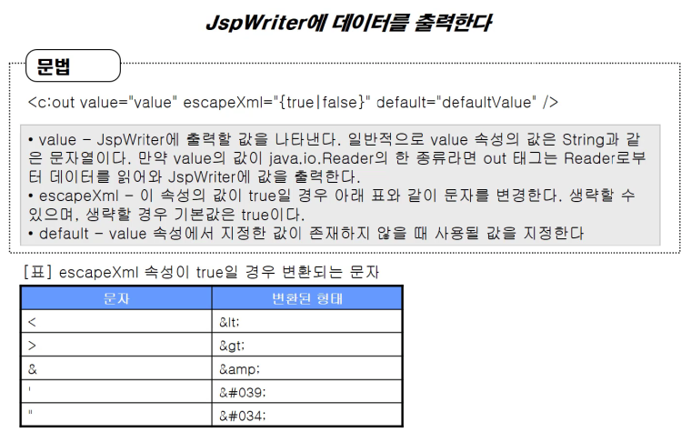](https://www.boostcourse.org/web326/lecture/258524/?isDesc=false#)


```sql
CREATE TABLE `guestbook` (
  `id` INT(11) NOT NULL AUTO_INCREMENT COMMENT 'guestbook id',
   `name` VARCHAR(255) NOT NULL COMMENT 'user name',
  `content` TEXT NOT NULL COMMENT 'guestbook content',
  `regdate` DATETIME NULL DEFAULT NULL COMMENT '등록일',
  PRIMARY KEY (`id`)) ENGINE=InnoDB DEFAULT CHARSET=utf8;
```


## 3~6. 웹 앱 개발 예약 서비스

### 1) Spring Core

**Spring Framework란?**

- 엔터프라이즈급 어플리케이션을 구축할 수 있는 가벼운 솔루션이자, 원스-스탑-숍(One-Stop-Shop)
- 원하는 부분만 가져다 사용할 수 있도록 모듈화가 잘 되어 있습니다.
- IoC 컨테이너입니다.
- 선언적으로 트랜잭션을 관리할 수 있습니다.
- 완전한 기능을 갖춘 MVC Framework를 제공합니다.
- AOP 지원합니다.
- 스프링은 도메인 논리 코드와 쉽게 분리될 수 있는 구조로 되어 있습니다.


**프레임 워크 모듈**

[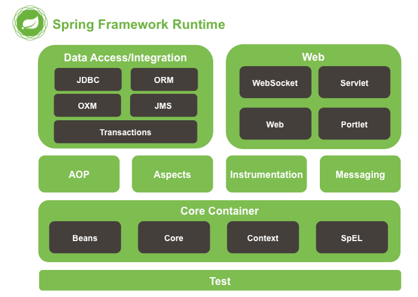](https://www.boostcourse.org/web326/lecture/58969/?isDesc=false#)

- 스프링 프레임워크는 약 20개의 모듈로 구성되어 있습니다.
- 필요한 모듈만 가져다 사용할 수 있습니다.


**AOP 와 인스트루멘테이션 (Instrumentation)**

- spring-AOP : AOP 얼라이언스(Alliance)와 호환되는 방법으로 AOP를 지원합니다.
- spring-aspects : AspectJ와의 통합을 제공합니다.
- spring-instrument : 인스트루멘테이션을 지원하는 클래스와 특정 WAS에서 사용하는 클래스로 더 구현체를 제공합니다. 참고로 BCI(Byte Code Instrumentations)은 런타임이나 로드(Load) 때 클래스의 바이트 코드에 변경을 가하는 방법을 말합니다.

 

**메시징(Messaging)**

- spring-messaging : 스프링 프레임워크 4는 메시지 기반 어플리케이션을 작성할 수 있는 Message, MessageChannel, MessageHandler 등을 제공합니다. 또한, 해당 모듈에는 메소드에 메시지를 맵핑하기 위한 어노테이션도 포함되어 있으며, Spring MVC 어노테이션과 유사합니다.

 

**데이터 엑서스(Data Access) / 통합(Integration)**

- 데이터 엑세스/통합 계층은 JDBC, ORM, OXM, JMS 및 트랜잭션 모듈로 구성되어 있다.
- **spring-jdbc** : 자바 JDBC프로그래밍을 쉽게 할 수 있도록 기능을 제공합니다.
- **spring-tx** : 선언적 트랜잭션 관리를 할 수 있는 기능을 제공합니다.
- spring-orm : JPA, JDO및 Hibernate를 포함한 ORM API를 위한 통합 레이어를 제공합니다.
- spring-oxm : JAXB, Castor, XMLBeans, JiBX 및 XStream과 같은 Object/XML 맵핑을 지원합니다.
- spring-jms : 메시지 생성(producing) 및 사용(consuming)을 위한 기능을 제공, Spring Framework 4.1부터 spring-messaging모듈과의 통합을 제공합니다.

 

**웹(Web)**

- 웹 계층은 spring-web, spring-webmvc, spring-websocket, spring-webmvc-portlet 모듈로 구성됩니다.
- **spring-web** : 멀티 파트 파일 업로드, 서블릿 리스너 등 웹 지향 통합 기능을 제공한다. HTTP클라이언트와 Spring의 원격 지원을 위한 웹 관련 부분을 제공합니다.
- **spring-webmvc** : Web-Servlet 모듈이라고도 불리며, Spring MVC 및 REST 웹 서비스 구현을 포함합니다.
- spring-websocket : 웹 소켓을 지원합니다.
- spring-webmvc-portlet : 포틀릿 환경에서 사용할 MVC 구현을 제공합니다.


**컨테이너(Container)**

컨테이너는 인스턴스의 생명주기를 관리하며, 생성된 인스턴스에게 추가적인 기능을 제공합니다.

예를 들어, Servlet을 실행해주는 WAS는 Servlet 컨테이너를 가지고 있다고 말합니다.

WAS는 웹 브라우저로부터 서블릿 URL에 해당하는 요청을 받으면, 서블릿을 메모리에 올린 후 실행합니다.

개발자가 서블릿 클래스를 작성했지만, 실제로 메모리에 올리고 실행하는 것은 WAS가 가지고 있는 Servlet 컨테이너입니다.

Servlet컨테이너는 동일한 서블릿에 해당하는 요청을 받으면, 또 메모리에 올리지 않고 기존에 메모리에 올라간 서블릿을 실행하여 그 결과를 웹 브라우저에게 전달합니다.

컨테이너는 보통 인스턴스의 생명주기를 관리하며, 생성된 인스턴스들에게 추가적인 기능을 제공하는 것을 말합니다.


**IoC(Inversion of Control)** 

컨테이너가 코드 대신 오브젝트의 제어권을 갖고 있어 IoC(제어의 역전)이라 합니다.

예를 들어, 서블릿 클래스는 개발자가 만들지만, 그 서블릿의 메소드를 알맞게 호출하는 것은 WAS입니다.

이렇게 개발자가 만든 어떤 클래스나 메소드를 다른 프로그램이 대신 실행해주는 것을 제어의 역전이라고 합니다.

 

**DI(Dependency Injection)**

DI는 의존성 주입이란 뜻을 가지고 있으며, 클래스 사이의 의존 관계를 빈(Bean) 설정 정보를 바탕으로 컨테이너가 자동으로 연결해주는 것을 말합니다.

 

**DI가 적용 안 된 예**

개발자가 직접 인스턴스를 생성합니다.

```java
class 엔진 {

}

class 자동차 {
     엔진 v5 = new 엔진();
}
```


[](https://www.boostcourse.org/web326/lecture/58970/?isDesc=false#)

**Spring에서 DI가 적용된 예**

엔진 type의 v5변수에 아직 인스턴스가 할당되지 않았습니다.

컨테이너가 v5변수에 인스턴스를 할당해주게 됩니다.

```java
@Component
class 엔진 {

}

@Component
class 자동차 {
     @Autowired
     엔진 v5;
}
```

[](https://www.boostcourse.org/web326/lecture/58970/?isDesc=false#)

**Spring에서 제공하는 IoC/DI 컨테이너**

- BeanFactory : IoC/DI에 대한 기본 기능을 가지고 있습니다.
- ApplicationContext : BeanFactory의 모든 기능을 포함하며, 일반적으로 BeanFactory보다 추천됩니다. 트랜잭션처리, AOP등에 대한 처리를 할 수 있습니다. BeanPostProcessor, BeanFactoryPostProcessor등을 자동으로 등록하고, 국제화 처리, 어플리케이션 이벤트 등을 처리할 수 습니다.

- BeanPostProcessor : 컨테이너의 기본로직을 오버라이딩하여 인스턴스화 와 의존성 처리 로직 등을 개발자가 원하는 대로 구현 할 수 있도록 합니다.
- BeanFactoryPostProcessor : 설정된 메타 데이터를 커스터마이징 할 수 있습니다.

 

 **Java config를 이용한 설정을 위한 어노테이션**

**@Configuration**

- 스프링 설정 클래스를 선언하는 어노테이션

**@Bean**

- bean을 정의하는 어노테이션

**@ComponentScan**

- @Controller, @Service, @Repository, @Component 어노테이션이 붙은 클래스를 찾아 컨테이너에 등록

**@Component**

- 컴포넌트 스캔의 대상이 되는 애노테이션 중 하나로써 주로 유틸, 기타 지원 클래스에 붙이는 어노테이션

**@Autowired**

- 주입 대상이되는 bean을 컨테이너에 찾아 주입하는 어노테이션


### 2) Spring Test

**1. 테스팅이란 무엇인가?**

**'테스팅'**이란 응용 프로그램 또는 시스템(구성요소 포함)의 동작과 성능, 안정성이

요구하는 수준을 만족하는지 확인하기 위해 결함을 발견하는 과정이라고 말할 수 있습니다.


전통적인 테스팅 개념은 응용 프로그램 또는 시스템이 잘 작동하는지 확인하는 것입니다.

현재의 테스팅 개념은 사용자의 기대 수준과 요구 사항에 맞게 구현되고 동작하는지를 확인하고 이를 통해 결함을 발견하고,

최종적으로 결함 데이터를 근간으로 개발 프로젝트의 리스크(Risk)에 대한 수치적인 판단 근거를

의사 결정권자(프로젝트 관리자 등)에게 전달하는 것을 말합니다.


개발 프로젝트 초기에 개발 중간 산출물(Work products)을 테스팅 관점에서 리뷰(Review)하고,

테스트 케이스를 미리 만드는 과정에서 결함을 발견하는 작업(결함 예방 활동)도 테스팅 활동의

중요한 부분이라고 말할 수 있습니다.


생각해 보세요. 사용자에게 전혀 필요없는 부분을 개발하고 개발한 부분을 테스트한다면 무의미 하지 않을까요?

'요구사항이 잘못된것 아닐까?'와 같은 리뷰가 중요할까요? 개발이 중요한 것일까요?

이 2가지 물음 중에서 현재의 테스팅은 전자가 더 중요하다고 생각합니다.

 

프로그램을 개발하기 전에 요구사항 등을 리뷰하는 것을 **정적 테스트**라고 하고,

프로그램 개발 이후에 실제 실행하면서 테스트하는 것을 **동적 테스트**라고 합니다.

 

본 수업에서는 정적 테스트보다 동적 테스트를 하는 방법에 좀 더 초점이 맞춰져 있습니다.


**2. 소프트웨어에서 테스트가 필요한 이유**

소프트웨어가 올바르게 동작하지 않는 경우, 다음과 같은 문제가 발생할 수 있습니다.

 

**1) 금전적인 손실**

**2) 시간 낭비**

**3) 비즈니스의 이미지 손상**

**4) 부상이나 사망**

 

소프트웨어가 올바르게 동작하지 않는다고 해서 부상이나 사망을 할 수 있다는 문제에 대해 의아해 할수 있습니다.

하지만 오늘날에는 우주선, 비행기, 선박, 자동차 등 다양한 곳에서 소프트웨어가 사용되기 때문에

오동작을 일으킬 경우 실제로 부상이나 사망까지도 일어나게 할 수 있습니다.

 

따라서, 테스팅은 이러한 소프트웨어 시스템의 문제를 최소화기 위해 필요합니다.

 


**3. 소프트웨어 결함의 원인**

소프트웨어가 결함이 발생하는 이유는 무엇일까요?

개발자가 잘못 작성한 오류로 인하여 결함(Defects 또는 Bug)이 발생합니다.

결함이 있는 소프트웨어를 실행하게 되면 장애(Failure)가 발생하여 의도한대로 소프트웨어가 동작하지 않거나

또는 소프트웨어가 동작하지 않아야 하는 상황에서 동작하는 문제가 발생할 수 있습니다.

단, 모든 결함의 원인이 인간이 범하는 오류 떄문 만은 아닙니다.


인간이 오류를 범하기 쉽기 때문에 발생하는 결함도 있지만 시간적인 압박, 복잡한 코드, 기반환경의 복잡성,

기술이나 시스템의 변경, 그리고 수많은 시스템 상호간의 연동 등의 이유로 발생할 수도 있습니다.


**4. 소프트웨어 개발, 유지보수, 운영 시 테스팅의 역할**

소프트웨어는 개발이 완료되고 실제 환경에 배포를 해야 운영됩니다.

운영되는 도중에도 해당 소프트웨어를 더 이상 사용하지 않을 때까지 계속해서 유지보수를 하게 됩니다. 

테스팅은 개발 시에만 필요한 것이 아니라 개발, 유지보수, 운영 시에 모두 필요합니다.

그렇다면 테스트가 언제 필요한지 알아볼까요?


**1) 테스팅을 통해 릴리즈 전에 발견되지 않은 결함들이 수정된다면,** 

**운영 환경 내에서 발생하는 리스크(risk)를 줄이는데 기여할 수 있으며** 

**소프트웨어 품질에 도움을 줍니다.**

 

**2) 테스팅은 개발 초기의 요구사항 분석 단계부터 리뷰 및 인스펙션을 통해 정적으로 이뤄질 수 있으며**

**각각의 개발 단계에 대응하는 테스트 레벨(test level)에 따른 테스팅이 이뤄집니다.**

 

**3) 기존에 운영되는 소프트웨어 시스템이 유지 보수 활동으로 변경 및 단종되거나** 

**환경이 변하는 경우, 변경된 소프트웨어에 대한 테스팅과** 

**변경된 환경에서의 운영 테스팅이 요구됩니다.**

 

**4) 소프트웨어 테스팅은 계약상(법적) 요구조건들, 또는 산업에 특화된 표준들을 만족시키기 위해서 필요합니다.**


**5. 테스팅과 품질**

 테스팅으로 발견된 결함이 소수이거나 없을 경우에 소프트웨어의 품질에 대한 확신(Confidence)를 가지게 됩니다.

잘 설계된 테스트는 시스템의 전반적인 리스크를 감소시키고 결함을 발견합니다.

발견된 결함이 수정될 때 소프트웨어 시스템의 품질 증가됩니다.

 

품질을 높이기 위해서는 이전 프로젝트를 통해 많은 테스팅 경험과 정보를 확보할 필요성이 있습니다. 

다른 프로젝트에서 발견된 결함의 근본적인 원인에 대한 이해함으로써 프로세스를 개선할 수 있으며,

그러한 결함의 재발을 방지함으로써, 결과적으로, 차후 시스템의 품질을 개선할 수 있게 됩니다.


개발 표준이나 교육 훈련 그리고 결함 분석 등과 함께 테스팅은 품질 보증 활동의 하나로

테스팅을 통해 소프트웨어 시스템의 품질을 확보할 수 있습니다.


**6. 테스팅은 얼마나 해야 충분한가?**

그렇다면 테스팅은 얼마나 해야 충분하다고 말할 수 있을까요? 

어느 정도 테스팅 하는 것이 적절한지를 파악하기 위해서는 다음과 같은 리스크(Risk) 수준과

프로젝트 제약사항을 고려해야합니다.

 

**1) 기술적인 내용**

**2) 비즈니스 제품**

**3) 프로젝트 리스크**

**4) 시간과 비용**

 

테스팅은 개발 프로젝트 관련자들이 테스트된 소프트웨어나 시스템의 다음 개발 단계로의 릴리즈(Release)에 대한 결정 

또는 고객에게 이양(Handover)하는 릴리즈에 대한 결정을 내릴 수 있도록 충분한 정보를 제공해야 합니다.

 

 

**7. 테스팅의 일반적인 원리**

 다수의 테스팅의 원리가 40여년간 제안되어 왔으며 테스팅의 원리는 테스팅 전반에 대한 

일반적인 가이드 라인 역할을 해오고 있습니다.


**원리 1 – 테스팅은 결함이 존재함을 밝히는 활동이다.**

테스팅은 결함이 존재함을 드러내지만, 결함이 없다는 것을 증명할 수 없습니다. 

즉, 프로그램이 완벽하다고 증명할 수 없습니다. 

이는 테스트 한 부분까지만 잘 동작한다고 말할 수 있고 테스트를 하지 않은 부분은

결함 있는지 또는 없는지에 대해서 예측할 수 없다는 의미입니다.

 

**원리 2 – 완벽한 테스팅(Exhaustive testing)은 불가능하다.**

모든 가능성(입력과 사전 조건의 모든 조합)을 테스팅하는 것은 지극히 간단한 소프트웨어를 제외하고 가능하지 않습니다.

보통 다음과 같은 이유 때문입니다.

 

\- 한 프로그램 내의 내부 조건이 무수히 많음. (무한 경로)

\- 입력이 가질 수 있는 모든 값의 조건이 무수히 많음 (무한 입력 값)

\- GUI 이벤트 발생 순서에 대한 조합도 무수히 많음 (무한 타이밍)

 

완벽한 테스팅 대신, 리스크 분석과 결정된 우선순위에 따라 테스팅 활동 노력을 집중시켜야 합니다. (Risk-based testing) 

완벽한 테스팅은 우주항공, 의료 등 안전이 최우선(Safety critical)인 소프트웨어를 개발할 때 고려할 수 있으나

실제로 완벽한 것은 아니고 강력한 테스팅으로 볼 수 있습니다.


**원리 3 – 테스팅을 개발 초기에 시작한다.**

테스팅 활동은 소프트웨어나 시스템 개발 수명주기에서 가능한 초기에 시작되어야 하며, 

설정한 테스팅 목표에 집중해야 합니다. 

개발 초기에 테스팅을 시작한다는 것의 의미는 개발의 시작과 동시에 테스트를 계획하고

전략적으로 접근하는 것을 고려하는 것은 물론, 요구사항 분석서와 설계서 등의 개발 중간 산출물을 분석하여

테스트하는 것을 의미합니다.


**1. JUnit이란?**

프로그래밍 언어마다 테스트를 위한 프레임워크가 존재합니다.

이러한 도구들을 보통 xUnit이라고 말합니다. 자바언어의 경우는 JUnit이라고 말합니다.

각 언어마다 사용되는 xUnit은 다음과 같습니다.


[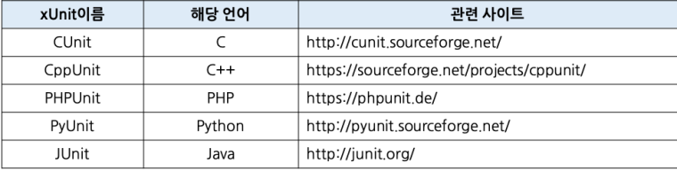](https://www.boostcourse.org/web326/lecture/58976/?isDesc=false#)

참고로 JUnit은 2020년 2월 2일 기준 최신 버전은 5입니다. 

 

 

**2. JUnit 사용하기**

JUnit을 사용하려면 JUnit 라이브러리가 클래스패스(CLASSPATH)에 존재해야 합니다.

직접 다운로드를 받는 것은 번거롭기 때문에 보통 빌드 도구인 Maven이나 Gradle을 이용해 다운로드 받아 사용합니다.

Maven을 사용할 경우 pom.xml에 다음을 추가합니다.

```markup
<dependency>
  <groupId>junit</groupId>
  <artifactId>junit</artifactId>
  <version>버전</version>
  <scope>test</scope>
</dependency> 
```

scope가 test인 이유는 해당 라이브러리가 테스트 시에만 사용된다는 뜻입니다. 

테스트가 아닌 상황에선 해당 라이브러리가 사용되지 않습니다.


**3. JUnit 어노테이션**

[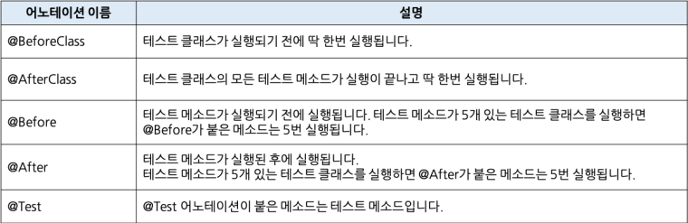](https://www.boostcourse.org/web326/lecture/58976/?isDesc=false#)


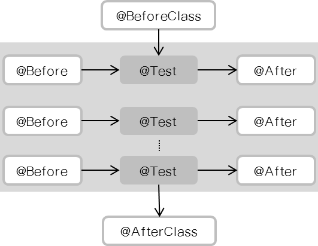

 

**4. JUnit의 중요 assert**

JUnit의 Assert클래스는 다양한 assert메소드를 가집니다.

그 중에서 자주 사용하는 메소드에 대해 알아보도록 하겠습니다.

[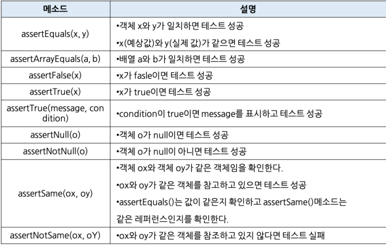
](https://www.boostcourse.org/web326/lecture/58976/?isDesc=false#)

**5. 스프링 빈 컨테이너에서 관리되는 빈 테스트**

기존 테스트 클래스 위에 **@RunWith(SpringJUnit4ClassRunner.class)**를 붙입니다.

@RunWith 어노테이션은 JUnit이 제공하는 어노테이션입니다.

JUnit은 확장기능을 가지는데, 스프링에서는 JUnit을 확장하도록 **SpringJUnit4ClassRunner.class**를 제공합니다.

해당 코드는 JUnit이 테스트 코드를 실행할 때 스프링 빈 컨테이너가 내부적으로 생성되도록 합니다.


**@ContextConfiguration(classes = {ApplicationConfig.class})**은 내부적으로 생성된 스프링 빈 컨테이너가

사용할 설정파일을 지정할 때 사용합니다.

 

위에서 설명한 2줄이 테스트 클래스 위에 있으면, 테스트 클래스 자체가 빈(Bean)객체가 되어 스프링에서 관리되게 됩니다. 

**@Autowired**

**CalculatorService calculatorService;**

CalcultorServiceTest 클래스가 빈으로 관리되면서, 스프링 빈 컨테이너는 CalculatorService를

주입(Inject)할 수 있게 됩니다. 이렇게 주입된 클래스를 테스트하면 됩니다.


**통합 테스트 integration test**

하나의 빈을 테스트할 때 관련된 빈들이 모두 잘 동작하는지 테스트하는 것

**단위 테스트 unit test**

관계된 다른 클래스와는 상관 없이 특정 빈이 가지고 있는 기능만 잘 동작하는지 확인하는 것


**목Mock 객체**

테스트할 객체가 다른 객체에 의존하여 작동하는 경우, 의존되는 객체에 오류가 있으면 정상적으로 작동하지 못한다. 

오류가 있는 객체를 사용하는 대신, 가짜 개체(목 객체)를 하나 생성하여 이용하여 테스트할 객체만 테스트를 수행하는 것.

mockito는 오픈소스 목 프레임워크입니다. 테스트를 위해 가짜 객체를 쉽게 만들어 줄 수 있는 프레임워크라고 생각하면 편합니다.

```java
package com.yazbyz.calculatorcli;

import org.junit.Assert;
import org.junit.Test;
import org.junit.runner.RunWith;
import org.mockito.InjectMocks;
import org.mockito.Mock;
import org.mockito.runners.MockitoJUnitRunner;

import static org.mockito.BDDMockito.given;
import static org.mockito.Matchers.anyInt;
import static org.mockito.Mockito.verify;

@RunWith(MockitoJUnitRunner.class) // mockito가 제공하는 Junit 확장 클래스 MockitoJunitRunner를 이용해 테스트 클래스를 실행
public class MyServiceTest {
    
	@InjectMocks // 목 객체를 사용하는 MyService 객체를 생성하여 초기화하라는 의미
	// 초기화하지 않아도 자동으로 MyService 객체가 생성되어 초기화됨.
    MyService myService;

    @Mock //@Mock 어노테이션은 calculatorService가 목 객체를 참조하도록 합니다.
    // 객체를 생성하지 않아도 자동으로 객체가 생성되고 해당 필드가 초기화 된다는 것을 의미합니다.
    CalculatorService calculatorService;

    @Test
    public void execute() throws Exception{
        // given
        int value1 = 5;
        int value2 = 10;
        given(calculatorService.plus(5, 10)).willReturn(15); // given()은 static메소드. calculatorService.plus(5,10)을 호출하면 plus메소드가 15를 반환하도록 하라

        // when
        int result = myService.execute(value1, value2); // value1, value2는 위에서 설정한대로만 동작

        // then
        verify(calculatorService).plus(anyInt(), anyInt()); // verify(), anyInt()메소드는 org.mockito.Mockito의 static한 메소드
        // 어떤 정수든지 2개를 파라미터로 넣어서 plus()메소드를 호출했는지를 검증하라는 의미 
        Assert.assertEquals(30, result);
    }
}
```


### 3) Spring JDBC

**Spring JDBC**

- JDBC 프로그래밍을 보면 반복되는 개발 요소가 있습니다.
- 이러한 반복적인 요소는 개발자를 지루하게 만듭니다.
- 개발하기 지루한 JDBC의 모든 저수준 세부사항을 스프링 프레임워크가 처리해줍니다.
- 개발자는 필요한 부분만 개발하면 됩니다.


**Spring JDBC - 개발자가 해야 할 일은?**

[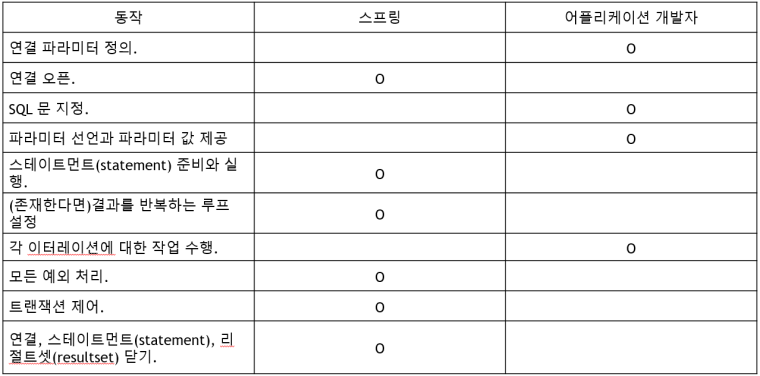](https://www.boostcourse.org/web326/lecture/58973/?isDesc=false#)


**Spring JDBC 패키지**

**org.springframework.jdbc.core**

- JdbcTemplate 및 관련 Helper 객체 제공

**org.springframework.jdbc.datasource**

- DataSource를 쉽게 접근하기 위한 유틸 클래스, 트랜젝션매니져 및 다양한 DataSource 구현을 제공

**org.springframework.jdbc.object**

- RDBMS 조회, 갱신, 저장등을 안전하고 재사용 가능한 객제 제공

**org.springframework.jdbc.support**

- jdbc.core 및 jdbc.object를 사용하는 JDBC 프레임워크를 지원


**JDBC Template**

- org.springframework.jdbc.core에서 가장 중요한 클래스입니다.
- 리소스 생성, 해지를 처리해서 연결을 닫는 것을 잊어 발생하는 문제 등을 피할 수 있도록 합니다.
- 스테이먼트(Statement)의 생성과 실행을 처리합니다.
- SQL 조회, 업데이트, 저장 프로시저 호출, ResultSet 반복호출 등을 실행합니다.
- JDBC 예외가 발생할 경우 org.springframework.dao패키지에 정의되어 있는 일반적인 예외로 변환시킵니다.


**JdbcTemplate외의 접근방법**

**NamedParameterJdbcTemplate**

- JdbcTemplate에서 JDBC statement 인자를 ?를 사용하는 대신 파라미터명을 사용하여 작성하는 것을 지원
- [NamedParameterJdbcTemplate 예제](https://docs.spring.io/spring/docs/current/spring-framework-reference/data-access.html#jdbc-NamedParameterJdbcTemplate)

**SimpleJdbcTemplate**

- JdbcTemplate과 NamedParameterJdbcTemplate 합쳐 놓은 템플릿 클래스
- 이제 JdbcTemplate과 NamedParameterJdbcTemplate에 모든 기능을 제공하기 때문에 삭제 예정될 예정(deprecated)
- [SimpleJdbcTemplate 예제](https://www.concretepage.com/spring/simplejdbctemplate-spring-example)

**SimpleJdbcInsert**

- 테이블에 쉽게 데이터 insert 기능을 제공
- [SimpleJdbcInsert 예제](https://www.tutorialspoint.com/springjdbc/springjdbc_simplejdbcinsert.htm)


**DTO란?**

- DTO란 Data Transfer Object의 약자입니다.
- 계층간 데이터 교환을 위한 자바빈즈입니다.
- 여기서의 계층이란 컨트롤러 뷰, 비지니스 계층, 퍼시스턴스 계층을 의미합니다.
- 일반적으로 DTO는 로직을 가지고 있지 않고, 순수한 데이터 객체입니다.
- 필드와 getter, setter를 가진다. 추가적으로 toString(), equals(), hashCode()등의 Object 메소드를 오버라이딩 할 수 있습니다.

 

**DAO란?**

- DAO란 Data Access Object의 약자로 데이터를 조회하거나 조작하는 기능을 전담하도록 만든 객체입니다.
- 보통 데이터베이스를 조작하는 기능을 전담하는 목적으로 만들어집니다.


**ConnectionPool 이란?**

- DB연결은 비용이 많이 듭니다.
- 커넥션 풀은 미리 커넥션을 여러 개 맺어 둡니다.
- 커넥션이 필요하면 커넥션 풀에게 빌려서 사용한 후 반납합니다.
- 커넥션을 반납하지 않으면 어떻게 될까요?

[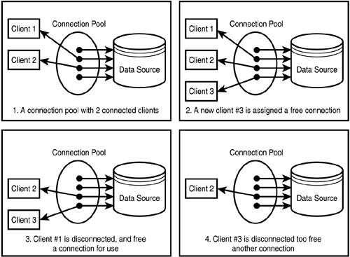](https://www.boostcourse.org/web326/lecture/258527/?isDesc=false#)


**DataSource란?**

- DataSource는 커넥션 풀을 관리하는 목적으로 사용되는 객체입니다.
- DataSource를 이용해 커넥션을 얻어오고 반납하는 등의 작업을 수행합니다.

 

**Spring JDBC를 이용한 DAO작성 실습**

[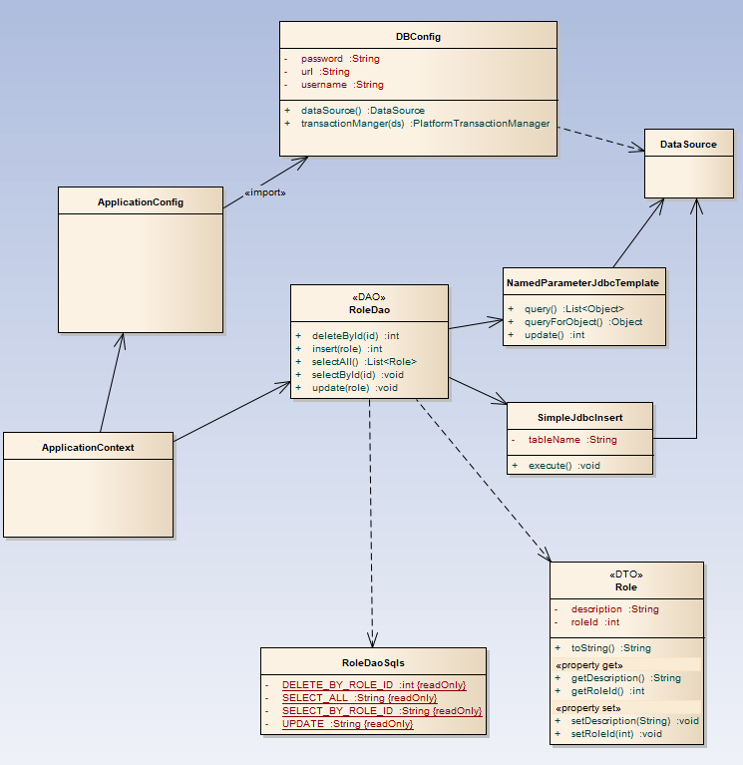](https://www.boostcourse.org/web326/lecture/258527/?isDesc=false#)


### 4) Spring MVC

### 5) 레이어드 아키텍처

### 6) WEB API

### 7) Controller

### 8) Swagger

### 9) 상태유지기술 (Cookie & Session)

### 10) Spring에서의 Session 사용법

### 11) Spring Security

### 12) 인터셉터

### 13) 아큐먼트 리졸버

### 14) 로깅

### 15) 파일 업로드 & 다운로드