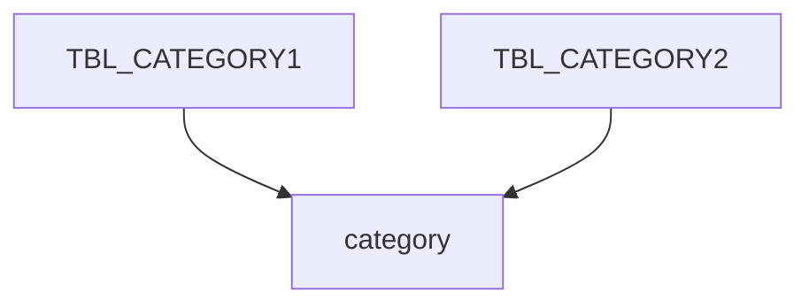

---

title: 2021년 8월 TIL
author: Hyejin
date: 2021-08-01
category: TIL
layout: post
---

# 🗓 8월 1일
## 유니티 안드로이드 빌드 에러 해결 Unity Android Build Error Solved
[AAPT: error: unexpected element found in 에러 해결](https://ajh322.tistory.com/294)
역시 사람은 에러메세지를 꼼꼼히 봐야 해....

---

# 🗓 8월 2일
## SocketIO 라이브러리
며칠째 채팅방 구현을 하고 있는데 사실 공식문서를 읽다보면 너무 오래걸릴 거 같아서 열심히 안보고 다른 블로그글만 보고 따라 하고 있었다.
진행하는데 한계가 느껴지고 이제 더이상 여유롭게 할 수가 없어서 이제 공식문서를 독파하려고 한다...
[SocketIO 공식문서](https://socket.io/)
[SocketIO를 이용한 실시간채팅 서비스 예시1](https://github.com/aamirjaved844/ReactSocketChat)
[SocketIO를 이용한 실시간채팅 서비스 예시2](https://github.com/safak/youtube/tree/chat-app)
[SocketIO를 이용한 실시간채팅 서비스 예시3](https://www.fullstacklabs.co/blog/chat-application-react-express-socket-io)
[SocketIO를 이용한 실시간채팅 서비스 예시4](https://github.com/WebDevSimplified/Realtime-Chat-App-With-Rooms)
[SocketIO를 이용한 실시간채팅 서비스 예시5](https://github.com/WebDevSimplified/Realtime-Simple-Chat-App)

---

# 🗓 8월 3일
## @socket.io-ui
```npm i @socket.io-ui```로 설치하고 https://admin.socket.io 에 접속하면 현재 존재하는 소켓과 룸, 클라이언트, 서버의 현황을 확인할 수 있다.

## JS로 로컬 스토리지 이용
[관련 블로그](https://www.daleseo.com/js-web-storage/)

---

# 🗓 8월 5일
## 레일즈 partial 관련 내용
[관련 블로그](https://flearning-blog.tistory.com/39?category=646783)

## 레일즈 js관련
[관련 블로그](https://brandonhilkert.com/blog/page-specific-javascript-in-rails/)

---

# 🗓 8월 6일
## 레일즈
- 레일즈 버전 : 6
### 레일즈 헤더, 푸터 분리
레일즈 뷰는 views/layouts/application.html.erb를 베이스로 다른 뷰의 코드를 추가해서 렌더링하는 형식을 띄는 듯하다.
(2019년 정도의 설명을 보면 application.html.erb파일이 views바로 아래에 있는 경우도 있다.)

다른 뷰들의 코드가 들어가는 곳은 application.html.erb의 <%= yield %> 부분이다.
그래서 application.html.erb에 <%= yield %> 앞뒤로 헤더와 푸더를 넣으면 다른 뷰에 반복해서 입력하지 않아도, 모든 뷰에 기본적으로 헤더와 푸더가 같이 렌더링된다.

<%= yield %>는 함수에서 미지수같은 표시라면, 헤더와 푸터는 정확히 정해져있는 지수이다.
그래서 <%= yield %>가 아닌 <%= render 'erb파일path' %>를 사용해야한다.
그래서 layouts 디렉토리 밑에 _header.html.erb, _footer.html.erb를 생성하고(앞에 _를 넣어줘야 인식한다) application.html.erb에 필요한 위치에 <%= render 'layouts/header' %>와 <%= render 'layouts/footer' %>를 입력한다(_header가 아닌 header라고 입력해야 인식한다).

### 레일즈 외부자바스크립트 연결
Webpack이라는 Gem으로 되는 거 같다.
프로젝트 생성시에 자동으로 설치된 gem이라서 따로 설치하지는 않았다.

app/javascript/packs밑에 사용할 js파일(custom.js라고 생성함)을 생성하고, app/javascript/packs/application.js 에 해당 파일이름을 입력한다.

```js
import Rails from "@rails/ujs"
import Turbolinks from "turbolinks"
import * as ActiveStorage from "@rails/activestorage"
import channels from "channels"
import custom from "packs/custom" # 사용할 js파일

Rails.start()
Turbolinks.start()
ActiveStorage.start()
```
다른 것들은 무슨 용도인지 잘 모르겠다.. 공부가 필요하다

그리고 js를 사용할 erb파일에 <%= javascript_pack_tag 'js파일명' %> 을 입력하면 자동으로 js파일명에 숫자를(아마도 버전을 표시하는 것 같다) 추가해서 erb파일에 렌더링한다.

---

# 🗓 8월 6일
## 로컬스토리지에 채팅메세지 저장하기
[로컬스토리지 공식문서](https://ko.javascript.info/localstorage)
로컬스토리지는 key-value 형태라서 데이터를 문자로 저장해야한다.
나는 저장할 데이터 형식이 json이라서, 해당 데이터를 텍스트로 바꿔서 저장하고 필요할 때 json으로 변환해서 사용해야한다.

나중에 읽어볼 [관련 블로그 글](https://studyingych.tistory.com/28)

## 리액트 : 채팅방 탭 형식으로 구현

[참조한 블로그](https://ejko0911.medium.com/react-tab-menu-%EA%B5%AC%ED%98%84%ED%95%98%EA%B8%B0-1d1dfe2219d2)가 아주 좋은 방법을 알려줬다.

각 컴포넌트를 리스트로 저장하고, 탭을 클릭하면 변수에 특정 인덱스를 setStatus해서 계속 변하게 하는거다.

이분도 멋쟁이사자 출신이신거 같은데 멋지다....👍

---

# 🗓 8월 9일
## 레일즈 DB select 

### 1. 모든 레코드

```ruby
@user = User.all # Users테이블에 모든 레코드 가져오기 (User는 모델명)
```
### 2. 해당 데이터가 PK 값인 레코드

```ruby
@user = User.find(params[:userId]) # Users테이블에 userId에 해당하는 레코드 조회 
```
params는 http://localhost:3000/?userId=1 url의 userId의 값을 가져온다.

### 3. 특정 컬럼의 해당 데이터를 가지는 레코드

```ruby
@user = User.where("nickname = ?", @nickname) #User테이블에 nickname 컬럼에서 @nickname 값을 가지는 레코드 조회
```

---

# 🗓 8월 10일
## 루비 ==, eql?, equal? 예시
```ryby
# 데이터 설정 - 문자열
a = "hello"
b = "hello"
c = "world"
d = a

# 데이터 설정 - 숫자
n1 = 1
n2 = 1
n3 = 2
n4 = n1
```


### ```==```

```ruby
a == b # => true
a == c # => false
a == d # => true
```

```ruby
n1 == n2 # => true
n1 == n3 # => false
```


### ```eql?```

```ruby
a.eql? b # => true
a.eql? c # => false
a.eql? d # => true
```

```ruby
n1.eql? n2 # => ture
n1.eql? n3 # => false
n1.eql? n4 # => ture
```


### ```equal?```

```ruby
a.equal? b # => false
a.equal? c # => false
a.equal? d # => true
```

문자열은 객체가 같은지 따지고

```ruby
n1.equal? n2 # => true
n1.equal? n3 # => false
n1.equal? n4 # => true
```

숫자는 값을 따진다


## 레일즈 부트스트랩-sass 설치 -> 이후에 삭제하고 그냥 부트스트랩을 설치했다(0811)

레일즈6.1.4 

부트스트랩sass3.4.1 

루비2.7.4


[부트스트랩 Gem문서](https://rubygems.org/search?query=bootstrap) 를 통해서 부트스트랩-sass를 설치한다.

Gemfile에 ```gem 'bootstrap-sass', '~> 3.4', '>= 3.4.1'``` 를 입력하고 ```bundle install``` 명령어를 실행해 설치한다.


app/assets/stylesheets/application.css 를 .scss 확장자로 변경한다 (app/assets/stylesheets/application.scss).


app/assets/stylesheets/application.scss 파일 안에 


 ```scss
 *= require_tree . 
 
 *= require_self
 ```

를 삭제하고

```text
 @import "bootstrap-sprockets"; 
 @import "bootstrap";
```

를 입력한다.

그럼 부트스트랩 사용 가능~!


#### [부트스트랩 알림](https://www.w3schools.com/bootstrap/bootstrap_alerts.asp)

## 레일즈 DB select 결과가 없는지 확인 : ```.empty?```

```ruby
@accounts = Account.where("nickname = ?", nickname)

if @accounts.empty? # 조회 결과가 존재하지 않는 경우
  # ...
end
```


## 레일즈 조인 : ```.left_joins(: )```

```ruby
@articles = Article.where("account_id = ?", session[:current_account_id]).left_joins(:account).left_joins(:book) # account_id로 내가 쓴 글 조회
```

```모델명.left__joins(:조인할 모델명)```

```erb
<% @articles.each do |article| %>
<p><%= article.account_id %></p>
<p>제목 : <%= article.title %></p>
# ...
<p>작성자 : <%= article.account.nickname %></p>
<p>관련 도서 : <%= article.book.title %></p>
<% end %>
```

조인한 모델의 컬럼 데이터를 사용하는 방법

```<%= 모델명.조인한모델명.조인한모델의컬럼 %>```


## 레일즈 링크 연결 ```<%= link_to '출력텍스트', '이동할 URL' %>```

```erb
<%= link_to '내가 쓴 글', '/profile/myArticle' %>
```

#### 하지만, 출력텍스트에 <%=  %>를 넣을 수 없다

그래서 html에 <a href> 태그를 사용했다

```erb
<a href='/article/view?no=<%= article.id %>'><%= article.title %></a>
```


## 레일즈 DB 스키마 수정

현재 디비 스키마를 보여주는 db/schema.rb 파일이나, db테이블 생성할 때 만든db/migrate/20210727041666_create_수정할테이블명.rb 파일을 수정한다고 db에 적용되지 않는다.

새 파일에다가 작성해서 기존 DB에 추가적으로 적용해야한다.

``` rails g migration change_수정할컬럼명_to_수정할테이블명    ``` 명령어를 실행하면 db/migrate 아래에 새 파일을 생성한다

[참고한 블로그](https://kbs4674.tistory.com/160)에서는 파일명을 위 형식으로 알려주었다.

꼭 지켜야하는 절대적인 규칙이 아니고, 파일을 구분하기 위한 규칙이 필요한거 같다.

생성된 파일은 ```버전_change_수정할컬럼명_to_수정할테이블명.rb```이라는 이름을 가지고 있다.

```ruby
# db/migrate/버전_change_수정할컬럼명_to_수정할테이블명.rb

class ChangeQnaCommentIdToQnaComments < ActiveRecord::Migration[6.1] #change_수정할컬럼명_to_수정할테이블명이 camelCase로 변환되어 클래스명이 되었다.
  def change
    change_column(:qna_comments, :qna_comment_id, :integer, :null => true) 
    # change_column(:변경할테이블명, :변경할컬럼명, :변경할컬럼의데이터타입, :null => 널여부(true or false))
  end
end
```

수정할 내용을 change 메소드에 넣는다.


``` bin/rails db:migrate VERSION=버전 ``` 명령을 터미널에 실행하면 새로 추가한 db/migrate/버전_change_수정할컬럼명_to_수정할테이블명.rb 파일이 DB에 적용된다.


#### 😱 이런, db/migrate/버전_change_수정할컬럼명_to_수정할테이블명.rb를 저장하지 않고 bin/rails db:migrate VERSION=버전을 했다... 

아마도 한번이라도 특정 버전 마이그레이션을 하면 그 버전은 더이상 업데이트를 못하는 것 같다.

그래서 db/migrate/버전_change_수정할컬럼명_to_수정할테이블명.rb의 파일명에 버전을 버전+1값으로 변경하고 마이그레이션 버전도 버전+1로 실행했다. (버전 맘대로 수정)

```shell
== 20210810131446 ChangeQnaCommentIdToQnaComments: migrating ==================
-- change_column(:qna_comments, :qna_comment_id, :integer, {:null=>true})
   -> 0.0371s
== 20210810131446 ChangeQnaCommentIdToQnaComments: migrated (0.0372s) =========
```

마이그레이션이 완료하면 위 문구가 출력된다.

위 문구를 확인해서 마이그레이션의 성공을 더블체킹하길 바란다.


---

## 🗓 8월 10일

### 깃허브 오류 remote: Internal Server Error

깃허브 푸시가 안되고 있다...

```text
Enumerating objects: 7, done.
Counting objects: 100% (7/7), done.
Delta compression using up to 8 threads
Compressing objects: 100% (4/4), done.
Writing objects: 100% (4/4), 4.54 KiB | 4.54 MiB/s, done.
Total 4 (delta 2), reused 0 (delta 0), pack-reused 0
remote: Resolving deltas: 100% (2/2), completed with 2 local objects.        
remote: Internal Server Error
Everything up-to-date
```

remote: Internal Server Error 하는걸 보니 깃허브사이트 자체 문제인거 같다.

[여기](https://www.githubstatus.com/)에서 사이트 degrade상태를 확인할 수 있다.

너무 신기하다... 수많은 코드를 저장하는 것도 신기했었는데 영원히 잘돌아갈거 같은 사이트도 다운될 수 있다니...

당연한건데 너무 신기하다... 너무 신기하네...?

기념으로 캡쳐해야지


## Typora 짱 좋아...

맨날 vscode에 TIL쓰고 있었는데 vscode열때 마다 같이 열리고 실수로 닫으면 다같이 닫겨버려서 그냥 TIL만 다른 앱으로 쓰려고 찾은 프로그램이다.

근데 진짜 좋아...

1. 무엇보다 가독성이 좋고 

2. 바로바로 확인할 수 있어서 md파일 렌더링 안기다려도 되고 
3. 사진드래그하면 바로 파일에 저장되는 기능도 너무 획기적이고
4. 와 심지어 아웃라인도 볼 수 있어
5. 와ㅏㅏ 글자수도 알려줘~!!

너무 좋다...

와.....최고야.......


---

## 🗓 8월 11일

## 레일즈6 + 부트스트랩5 

이전에 언급한 부트스트랩-sass가 잘 안되는 거 같아서 그냥 부트스트랩을 설치했다.

이 [포스트](https://medium.com/nerd-for-tech/rails-6-bootstrap-5-3492b7c0a626) 가 아주 간결하고 확실한 방법을 알려준다.

나는 [Gem으로 Bootstrap5](https://rubygems.org/gems/bootstrap/versions/5.0.1) 을 설치했다.

+0812 부트스트랩 드롭다운이 안되서 [추가적으로](https://used-newcomer.tistory.com/139) 더 해서 했더니 된다...

## Bootstrap

1학년때 html+css+js를 한꺼번에 배운 이후로 css는 한번도 다뤄본적이 없다.

사실 그때 별로 안좋아했다.

하나하나 일일이 설정해주는 것도 힘들고 기본 지식이니만큼 결과물도 재미도 없었기 때문이다.

항상 부트스트랩을 말만 들었는데 이번에 처음으로 문법이나 사용방법을 인식하고 사용하고 있다~~(사용하다보니 전에 사용한 기억이 떠올랐다. 뭔지도 모르고 썼을 정도로 작동방식이 쉬움..)~~

싫어하는 거였는데 흥미를 느끼고 있어서 의아하면서도 뿌듯한 순간이다.


---

## 🗓 8월 11일

## flexbox로 레이아웃만들기

[flexbox](https://d2.naver.com/helloworld/8540176) 최고!!

나같이 귀찮은거 딱 싫은 사람에게 최적이다.


## 목록 특정 기준으로 정렬하기

[js사용](https://junspapa-itdev.tistory.com/24)

+0812 : [테이블데이터](https://datatables.net/)라는 플러그인 발견


---

## 🗓 8월 13일

## 레일즈 ActionController::InvalidAuthenticityToken 에러 해결

이 [블로그](https://haereeroo.tistory.com/2) 에 아주 자세한 설명이 들어가 있다.


## 레일즈 kernel_require.rb:23:in `require': cannot load such file -- nokogiri (loaderror) 에러 해결

```rails s```를 하면계속 nokogiri 로딩에러가 떴다.

nokogiri 플랫폼이 여러가지였고 프로젝트 개발 환경이 WSL, MAC  두 개 라서 혹시 그 문제가 인가 싶어서 여기저기 찾아봤는데, 똑같이 WSL랑 MAC에서 프로젝트를 진행하는 블로그 글을 봤다.

그 문제가 아니고 gem 설치 문제 였던듯 싶다.

Gemfile에 ```gem 'nokogiri'``` 를 입력하고 ```bundle install``` 하면 해결된다


---

## 🗓 8월 14일

노션에 있던거 정리

## Homebrew 설치 및 이용

[블로그](https://www.notion.so/Homebrew-9b57f1959cb64b0ca6c7129311ed64f9#2bf7176b92214301b87896e6cc0dc385)


## 유니티 TextMeshPro를 사용하기 위해 필요한 상용한글 2350자

```text
가각간갇갈갉갊감갑값갓갔강갖갗같갚갛개객갠갤갬갭갯갰갱갸갹갼걀걋걍걔걘걜거걱건걷걸걺검겁것겄겅겆겉겊겋게겐겔겜겝겟겠겡겨격겪견겯결겸겹겻겼경곁계곈곌곕곗고곡곤곧골곪곬곯곰곱곳공곶과곽관괄괆괌괍괏광괘괜괠괩괬괭괴괵괸괼굄굅굇굉교굔굘굡굣구국군굳굴굵굶굻굼굽굿궁궂궈궉권궐궜궝궤궷귀귁귄귈귐귑귓규균귤그극근귿글긁금급긋긍긔기긱긴긷길긺김깁깃깅깆깊까깍깎깐깔깖깜깝깟깠깡깥깨깩깬깰깸깹깻깼깽꺄꺅꺌꺼꺽꺾껀껄껌껍껏껐껑께껙껜껨껫껭껴껸껼꼇꼈꼍꼐꼬꼭꼰꼲꼴꼼꼽꼿꽁꽂꽃꽈꽉꽐꽜꽝꽤꽥꽹꾀꾄꾈꾐꾑꾕꾜꾸꾹꾼꿀꿇꿈꿉꿋꿍꿎꿔꿜꿨꿩꿰꿱꿴꿸뀀뀁뀄뀌뀐뀔뀜뀝뀨끄끅끈끊끌끎끓끔끕끗끙끝끼끽낀낄낌낍낏낑나낙낚난낟날낡낢남납낫났낭낮낯낱낳내낵낸낼냄냅냇냈냉냐냑냔냘냠냥너넉넋넌널넒넓넘넙넛넜넝넣네넥넨넬넴넵넷넸넹녀녁년녈념녑녔녕녘녜녠노녹논놀놂놈놉놋농높놓놔놘놜놨뇌뇐뇔뇜뇝뇟뇨뇩뇬뇰뇹뇻뇽누눅눈눋눌눔눕눗눙눠눴눼뉘뉜뉠뉨뉩뉴뉵뉼늄늅늉느늑는늘늙늚늠늡늣능늦늪늬늰늴니닉닌닐닒님닙닛닝닢다닥닦단닫달닭닮닯닳담답닷닸당닺닻닿대댁댄댈댐댑댓댔댕댜더덕덖던덛덜덞덟덤덥덧덩덫덮데덱덴델뎀뎁뎃뎄뎅뎌뎐뎔뎠뎡뎨뎬도독돈돋돌돎돐돔돕돗동돛돝돠돤돨돼됐되된될됨됩됫됴두둑둔둘둠둡둣둥둬뒀뒈뒝뒤뒨뒬뒵뒷뒹듀듄듈듐듕드득든듣들듦듬듭듯등듸디딕딘딛딜딤딥딧딨딩딪따딱딴딸땀땁땃땄땅땋때땍땐땔땜땝땟땠땡떠떡떤떨떪떫떰떱떳떴떵떻떼떽뗀뗄뗌뗍뗏뗐뗑뗘뗬또똑똔똘똥똬똴뙈뙤뙨뚜뚝뚠뚤뚫뚬뚱뛔뛰뛴뛸뜀뜁뜅뜨뜩뜬뜯뜰뜸뜹뜻띄띈띌띔띕띠띤띨띰띱띳띵라락란랄람랍랏랐랑랒랖랗래랙랜랠램랩랫랬랭랴략랸럇량러럭런럴럼럽럿렀렁렇레렉렌렐렘렙렛렝려력련렬렴렵렷렸령례롄롑롓로록론롤롬롭롯롱롸롼뢍뢨뢰뢴뢸룀룁룃룅료룐룔룝룟룡루룩룬룰룸룹룻룽뤄뤘뤠뤼뤽륀륄륌륏륑류륙륜률륨륩륫륭르륵른를름릅릇릉릊릍릎리릭린릴림립릿링마막만많맏말맑맒맘맙맛망맞맡맣매맥맨맬맴맵맷맸맹맺먀먁먈먕머먹먼멀멂멈멉멋멍멎멓메멕멘멜멤멥멧멨멩며멱면멸몃몄명몇몌모목몫몬몰몲몸몹못몽뫄뫈뫘뫙뫼묀묄묍묏묑묘묜묠묩묫무묵묶문묻물묽묾뭄뭅뭇뭉뭍뭏뭐뭔뭘뭡뭣뭬뮈뮌뮐뮤뮨뮬뮴뮷므믄믈믐믓미믹민믿밀밂밈밉밋밌밍및밑바박밖밗반받발밝밞밟밤밥밧방밭배백밴밸뱀뱁뱃뱄뱅뱉뱌뱍뱐뱝버벅번벋벌벎범법벗벙벚베벡벤벧벨벰벱벳벴벵벼벽변별볍볏볐병볕볘볜보복볶본볼봄봅봇봉봐봔봤봬뵀뵈뵉뵌뵐뵘뵙뵤뵨부북분붇불붉붊붐붑붓붕붙붚붜붤붰붸뷔뷕뷘뷜뷩뷰뷴뷸븀븃븅브븍븐블븜븝븟비빅빈빌빎빔빕빗빙빚빛빠빡빤빨빪빰빱빳빴빵빻빼빽뺀뺄뺌뺍뺏뺐뺑뺘뺙뺨뻐뻑뻔뻗뻘뻠뻣뻤뻥뻬뼁뼈뼉뼘뼙뼛뼜뼝뽀뽁뽄뽈뽐뽑뽕뾔뾰뿅뿌뿍뿐뿔뿜뿟뿡쀼쁑쁘쁜쁠쁨쁩삐삑삔삘삠삡삣삥사삭삯산삳살삵삶삼삽삿샀상샅새색샌샐샘샙샛샜생샤샥샨샬샴샵샷샹섀섄섈섐섕서석섞섟선섣설섦섧섬섭섯섰성섶세섹센셀셈셉셋셌셍셔셕션셜셤셥셧셨셩셰셴셸솅소속솎손솔솖솜솝솟송솥솨솩솬솰솽쇄쇈쇌쇔쇗쇘쇠쇤쇨쇰쇱쇳쇼쇽숀숄숌숍숏숑수숙순숟술숨숩숫숭숯숱숲숴쉈쉐쉑쉔쉘쉠쉥쉬쉭쉰쉴쉼쉽쉿슁슈슉슐슘슛슝스슥슨슬슭슴습슷승시식신싣실싫심십싯싱싶싸싹싻싼쌀쌈쌉쌌쌍쌓쌔쌕쌘쌜쌤쌥쌨쌩썅써썩썬썰썲썸썹썼썽쎄쎈쎌쏀쏘쏙쏜쏟쏠쏢쏨쏩쏭쏴쏵쏸쐈쐐쐤쐬쐰쐴쐼쐽쑈쑤쑥쑨쑬쑴쑵쑹쒀쒔쒜쒸쒼쓩쓰쓱쓴쓸쓺쓿씀씁씌씐씔씜씨씩씬씰씸씹씻씽아악안앉않알앍앎앓암압앗았앙앝앞애액앤앨앰앱앳앴앵야약얀얄얇얌얍얏양얕얗얘얜얠얩어억언얹얻얼얽얾엄업없엇었엉엊엌엎에엑엔엘엠엡엣엥여역엮연열엶엷염엽엾엿였영옅옆옇예옌옐옘옙옛옜오옥온올옭옮옰옳옴옵옷옹옻와왁완왈왐왑왓왔왕왜왝왠왬왯왱외왹왼욀욈욉욋욍요욕욘욜욤욥욧용우욱운울욹욺움웁웃웅워웍원월웜웝웠웡웨웩웬웰웸웹웽위윅윈윌윔윕윗윙유육윤율윰윱윳융윷으윽은을읊음읍읏응읒읓읔읕읖읗의읜읠읨읫이익인일읽읾잃임입잇있잉잊잎자작잔잖잗잘잚잠잡잣잤장잦재잭잰잴잼잽잿쟀쟁쟈쟉쟌쟎쟐쟘쟝쟤쟨쟬저적전절젊점접젓정젖제젝젠젤젬젭젯젱져젼졀졈졉졌졍졔조족존졸졺좀좁좃종좆좇좋좌좍좔좝좟좡좨좼좽죄죈죌죔죕죗죙죠죡죤죵주죽준줄줅줆줌줍줏중줘줬줴쥐쥑쥔쥘쥠쥡쥣쥬쥰쥴쥼즈즉즌즐즘즙즛증지직진짇질짊짐집짓징짖짙짚짜짝짠짢짤짧짬짭짯짰짱째짹짼쨀쨈쨉쨋쨌쨍쨔쨘쨩쩌쩍쩐쩔쩜쩝쩟쩠쩡쩨쩽쪄쪘쪼쪽쫀쫄쫌쫍쫏쫑쫓쫘쫙쫠쫬쫴쬈쬐쬔쬘쬠쬡쭁쭈쭉쭌쭐쭘쭙쭝쭤쭸쭹쮜쮸쯔쯤쯧쯩찌찍찐찔찜찝찡찢찧차착찬찮찰참찹찻찼창찾채책챈챌챔챕챗챘챙챠챤챦챨챰챵처척천철첨첩첫첬청체첵첸첼쳄쳅쳇쳉쳐쳔쳤쳬쳰촁초촉촌촐촘촙촛총촤촨촬촹최쵠쵤쵬쵭쵯쵱쵸춈추축춘출춤춥춧충춰췄췌췐취췬췰췸췹췻췽츄츈츌츔츙츠측츤츨츰츱츳층치칙친칟칠칡침칩칫칭카칵칸칼캄캅캇캉캐캑캔캘캠캡캣캤캥캬캭컁커컥컨컫컬컴컵컷컸컹케켁켄켈켐켑켓켕켜켠켤켬켭켯켰켱켸코콕콘콜콤콥콧콩콰콱콴콸쾀쾅쾌쾡쾨쾰쿄쿠쿡쿤쿨쿰쿱쿳쿵쿼퀀퀄퀑퀘퀭퀴퀵퀸퀼큄큅큇큉큐큔큘큠크큭큰클큼큽킁키킥킨킬킴킵킷킹타탁탄탈탉탐탑탓탔탕태택탠탤탬탭탯탰탱탸턍터턱턴털턺텀텁텃텄텅테텍텐텔템텝텟텡텨텬텼톄톈토톡톤톨톰톱톳통톺톼퇀퇘퇴퇸툇툉툐투툭툰툴툼툽툿퉁퉈퉜퉤튀튁튄튈튐튑튕튜튠튤튬튱트특튼튿틀틂틈틉틋틔틘틜틤틥티틱틴틸팀팁팃팅파팍팎판팔팖팜팝팟팠팡팥패팩팬팰팸팹팻팼팽퍄퍅퍼퍽펀펄펌펍펏펐펑페펙펜펠펨펩펫펭펴편펼폄폅폈평폐폘폡폣포폭폰폴폼폽폿퐁퐈퐝푀푄표푠푤푭푯푸푹푼푿풀풂품풉풋풍풔풩퓌퓐퓔퓜퓟퓨퓬퓰퓸퓻퓽프픈플픔픕픗피픽핀필핌핍핏핑하학한할핥함합핫항해핵핸핼햄햅햇했행햐향허헉헌헐헒험헙헛헝헤헥헨헬헴헵헷헹혀혁현혈혐협혓혔형혜혠혤혭호혹혼홀홅홈홉홋홍홑화확환활홧황홰홱홴횃횅회획횐횔횝횟횡효횬횰횹횻후훅훈훌훑훔훗훙훠훤훨훰훵훼훽휀휄휑휘휙휜휠휨휩휫휭휴휵휸휼흄흇흉흐흑흔흖흗흘흙흠흡흣흥흩희흰흴흼흽힁히힉힌힐힘힙힛힝
!"#$%&'()*+,-./0123456789:;<=>?@ABCDEFGHIJKLMNOPQRSTUVWXYZ[\]^_`abcdefghijklmnopqrstuvwxyz{|}~ …□
```


---

## 🗓 8월 15일

## 여러 레포지토리 커밋 히스토리를 유지하면서 합치기 : ```git subtree add --prefix=(새 레포지토리안에 path) (구 레포지토리 주소) (구 레포지토리 브랜치)```

[블로그](https://computer-science-student.tistory.com/311) 를 참조해서 진행했다.

```shell
//내가 진행한 프로젝트 구조

├── Algorithm-Summary
│   ├── ...
│   └── README.md
├── TIL
│   ├── ...
│   └── README.md
└── README.md
```

#### 🧐 만약 새 레포지토리에 top level이 아닌 폴더에서 위 명령어를 실행하면 어떻게 될까?

```shell
➜  Algorithm-Summary git:(main) git subtree add --prefix=TIL https://github.com/yazbyz/TIL.git master

You need to run this command from the toplevel of the working tree.
```

명령어가 실행되지 않고, 위 처럼 top level에서 실행하라고 안내한다.

#### 🚨이 방법은 잔디를 깎아 먹는다...

혹시나 해서 구 레포지토리들을 브랜치로 받아서 메인으로 머지했는데 아~무 효과가 없다.

서브트리는 그냥 서브트리일뿐 브랜치처럼 커밋 정보를 갖고 있지 않다...

~~진짜 거지같다 겨우겨우 키운 내 잔디들..돌려내!!!!!~~


## ```fatal: Not a valid object name: 'main'.``` 오류 해결

최소 한번 이상의 commit이 필요하다


## Github Token-authentication

#### 🌊 문제 상황 

Github Desktop은 정상작동하는데, 터미널에서 깃을 접근할 수 없었다.

```shell
$ git pull origin master
...
remote: Support for password authentication was removed on August 13, 2021. Please use a personal access token instead.
remote: Please see https://github.blog/2020-12-15-token-authentication-requirements-for-git-operations/ for more information.
fatal: unable to access '(깃허브 레포지토리 주소)': The requested URL returned error: 403
```


#### 👩🏻‍💻 원인 

GitHub의 보안 조치.

 [2021년 8월 13일부터 패스워드 인증방식이 더 이상 사용되지 않는다](https://github.blog/2020-12-15-token-authentication-requirements-for-git-operations)고 한다.

- 터미널로 git 접근
- git을 사용하는 데스크톱 애플리케이션
- 비밀번호를 사용하여 GitHub에 git 저장소를 접근하는 아무 앱과 서비스

위에 3가지 경우가 이번 조치로 영향이 있을 것이라고 한다.


#### 🏄 해결방법 (순서 없이 방법이라 어떤 이유로 작동하는지 정확하지 않다)

1. GitHub Profile > Settings > Developer settings > Personal access tokens 에서 Generate new token

2. 토큰 이름과 권한 설정 후 토큰 생성

   1, 2번 출처 : [creating-a-personal-access-token](https://docs.github.com/en/github/authenticating-to-github/keeping-your-account-and-data-secure/creating-a-personal-access-token)

3. ```shell 
   git credential-osxkeychain erase
   ```

   출처 : [updating-credentials-from-the-macos-keychain](https://docs.github.com/en/get-started/getting-started-with-git/updating-credentials-from-the-macos-keychain)

4. brew로 git-credential-manager-core 설치

   출처 : [caching-your-github-credentials-in-git](https://docs.github.com/en/get-started/getting-started-with-git/caching-your-github-credentials-in-git)

5. 원격 저장소를 접근하는 명령어를 실행하니 GitHub 로그인을 할 수있는 GUI가 나왔다.. 토큰 입력하고 나니 해결!


## HttpMediaTypeNotSupportedException 미해결

#### 🌊 문제 상황

```shell
Resolved [org.springframework.web.HttpMediaTypeNotSupportedException: Content type 'application/x-www-form-urlencoded;charset=UTF-8' not supported]
```


#### 👩🏻‍💻 원인

#### 🏄 해결방법


## java.sql.SQLException: No database selected 해결

#### 🌊 문제 상황

데이터베이스 인식불가로 JPA find메소드 실행 불가

#### 👩🏻‍💻 원인

MySQL에는 sys데이터베이스가 기본적으로 있습니다. 

그래서 sys, 제가 생성한 디비. 데이터베이스가 총 두 개였고, datasource를 입력해놓은 application.properties에 사용할 데이터베이스 이름을 입력하지 않았기 때문에 생긴 오류였습니다.

#### 🏄 해결방법

application.properties에 데이터베이스 이름 입력하기

```properties
# mysql
spring.datasource.url=jdbc:mysql://(EC2 퍼블릭 IPv4주소):3306/(데이터베이스이름)?characterEncoding=UTF-8&serverTimezone=UTC
...
```

[참조 문서](https://spring.io/guides/gs/accessing-data-mysql/)


[React function vs. class](https://velog.io/@sdc337dc/0.%ED%81%B4%EB%9E%98%EC%8A%A4%ED%98%95-%EC%BB%B4%ED%8F%AC%EB%84%8C%ED%8A%B8)


---

## 🗓 8월 16일

## 레일즈 테이블 교체

#### 🌊 문제 상황

테이블 이름을 변경해야합니다(cart -> scrap).

#### 👩🏻‍💻 원인

수익 구조가 변경되었습니다.

#### 🏄 해결방법

1. scrap 테이블을 새로 만들고 

   ```rails generate model Scrap reg_at:timestamp account:references book:references```

   ```bundle exec rake db:migrate```

   

2. cart 테이블 및 모델 삭제


---

## 🗓 8월 17일

## 레일즈 버튼으로 GET 요청

#### 🌊 문제 상황

form_tag으로 하려고 했는데 

```erb
# +0817 아래 코드는 오류가 있습니다
<% @변수.each do |사용할 변수명| %>
	<% form_tag(경로, :method => "get") do %>
		...
	<% end %>
<% end %>
```

~~위 구조 처럼 <% %>가 겹쳐서 <% end %>를 일대일로 맞추지 못한다. 속하는 구조인데도 못한다....~~

#### 👩🏻‍💻 원인

~~<% %> 태그는 속하는 구조여도 사용할 수 없다.~~

+0817

충격 그 자체...  다른거 수정하다가 본 코드인데(심지어 내가 했는데..) 많을걸 생략하기는 했지만 포함하는 구조로 실행가능했다...

```erb
<%= form_tag "/updateInfo", method: :post do %>
	<% if(@account.is_admin >= 0) %>
		<input type="text" name="nickname" placeholder="<%= @account.nickname %>" />
    <button type="submit" class="btn btn-primary">저장하기</button>
<% end %>
```


문제는 

```<%= form_tag ... %>``` 라고 해야하는데 ```<% form_tag```라고 해서 안된거였음....

**form_tag는 출력하는거였기 때문이다....**🥲

=를 못보고 참.... 하마터면 이상한 고집 부릴뻔 했네.....

#### 🏄 해결 방법

1. 안에 form_tag말고 <form>태그를 사용한다.

   ```erb
   <% @변수.each do |사용할 변수명| %>
   	...
   	<form action='GET 요청할 URL' method="GET"> 
   		<input type="hidden" name="파라미터명" value='<%= 사용할변수명.사용할컬럼 %>'>
   		<button type="submit" class="btn">
       </button>
   	</form>              
   <% end %>
   ```

   

2. (+0817) form_tag를 정확하게 사용한다

   ```erb
   <% @변수.each do |사용할 변수명| %>
   	<%= form_tag(경로, :method => "get") do %>
   		...
   	<% end %>
   <% end %>
   ```

   

#### 📃 참조 문서

1. [erb에 form_tag 생성](https://guides.rubyonrails.org/v2.3.8/form_helpers.html)
2. [ form 작성](https://wantknow.tistory.com/59)
3. [레일즈 모델 쿼리메서드](https://jinbroing.tistory.com/37)


## 레일즈 기존 프로젝트에 Google Oauth 적용

#### 🌊 문제 상황

참조문서대로 진행하면 에러가 생긴다.

#### 🏊 원인

로그인 관련 Gem이 있는지 몰라서, 현재 프로젝트에 계정 관련 모델과 DB를 이미 구현한 상태라서 컬럼이름이 충돌한다.

#### 🏄 구현 방법

##### Google Developer Console 관련 작업

1. [Google Developer Console](https://console.developers.google.com/)에서 프로젝트 생성
2. API 및 서비스 > 사용자 인증 정보 > OAuth 동의화면 에서 이름과 도메인 저장
3. API 및 서비스 > 사용자 인증 정보 > 사용자 인증 정보 > OAuth 클라이언ID 만들기 에서 유형, 이름, 승인된 리다이렉션 URI 저장하고, 주어진 OAuth클라이언트 ID 및 보안키 따로 저장

##### 레일즈 관련 작업

1. Gemfile파일에 ```gem 'devise'```추가

2. ```rails g devise:install```

   ```shell
   Running via Spring preloader in process 35663
         create  config/initializers/devise.rb
         create  config/locales/devise.en.yml
   ===============================================================================
   
   Depending on your application's configuration some manual setup may be required:
   
     1. Ensure you have defined default url options in your environments files. Here
        is an example of default_url_options appropriate for a development environment
        in config/environments/development.rb:
   
          config.action_mailer.default_url_options = { host: 'localhost', port: 3000 }
   
        In production, :host should be set to the actual host of your application.
   
        * Required for all applications. *
   
     2. Ensure you have defined root_url to *something* in your config/routes.rb.
        For example:
   
          root to: "home#index"
        
        * Not required for API-only Applications *
   
     3. Ensure you have flash messages in app/views/layouts/application.html.erb.
        For example:
   
          <p class="notice"><%= notice %></p>
          <p class="alert"><%= alert %></p>
   
        * Not required for API-only Applications *
   
     4. You can copy Devise views (for customization) to your app by running:
   
          rails g devise:views
          
        * Not required *
   
   ===============================================================================
   ```

3. ```rails generate devise:views```  

4. 기존 테이블을 수정 🔆

   4-1. ```rails generate migration change_변경할컬럼명_to_변경할테이블명```

   ➡️ db/migrate/버전_change_변경할컬럼명_to_변경할테이블명.rb 파일 생성

   4-2. ```버전_change_변경할컬럼명_to_변경할테이블명.rb``` 파일 수정

   ```ruby
   # 버전_change_변경할컬럼명_to_변경할테이블명.rb
   
   class Change변경할컬럼명To변경할테이블명 < ActiveRecord::Migration[6.1]
     def change
       change_table :변경할테이블명 do |t|
         t.추가할컬럼데이터타입 :추가할컬럼명			# 컬럼 추가
     		t.index :색인추가할컬럼명			# 색인 추가
     		t.rename :기존컬럼명, :새컬럼명		# 컬럼명 변경
         t.remove :삭제할컬럼명1 :삭제할컬럼명, ... # 컬럼 삭제
       end
     end
   end
   ```

   4-3. ```bin/rails db:migrate VERSION=버전``` OR ```rake db:migrate VERSION=버전```

   ➡️ ```버전_change_변경할컬럼명_to_변경할테이블명.rb```적용

   

5. 모델 생성 ```rails generate devise 모델명``` 하고 ```bin/rails db:migrate``` OR ```rake db:migrate```으로 적용

6. config / application.yml 파일 생성해서 

   ```yaml
   GOOGLE_CLIENT_ID: "클라이언트 아이디"
   GOOGLE_CLIENT_SECRET: "클라이언트 비밀번호"
   ```

   Google에서 제공한 API 아이디와 비밀번호 저장

7. config/initializers/devise.rb 에 ```config.omniauth :google_oauth2, ENV["GOOGLE_CLIENT_ID"], ENV["GOOGLE_CLIENT_SECRET"]```  저장


1. 컨트롤러 생성 ``rails g devise:controllers 컨트롤러명``

2. 특정 컨트롤러에서 로그인 유무 체크하는 코드 삽입

   ```erb
   class 특정컨트롤러명 < ApplicationController
     before_action :authenticate_user!
     
     ...
   end
   ```

3. 

#### 📃 참조 문서

1. [devise Gem 설치](https://kbs4674.tistory.com/52)


## 레일즈 rails generate 작동 안 함

#### 🌊 문제 상황

```rails generate``` 작동 안 함

#### 🏊 원인

spring 이미 돌아가고 있어서

#### 🏄 해결 방법

```spring stop``` 으로 spring 멈추기

#### 📃 참조 문서

1. [stackoverflow : rails-generate-not-working](https://stackoverflow.com/questions/23157426/rails-generate-not-working)

#### 


---

## 🗓 8월 18일

오늘은 인턴일을 구하려고 로켓펀치랑 원티드 프로필을 정비했다..

어제 하고 있던 devise가 너무 결과물이 안나와서 머리를 식혀야 했다.

내일은 더 열심히 많이 결과물을 낼 것이다.


---

## 🗓 8월 19일

## Spring Boot 여러 테이블 한 엔티티에 저장



```java
import javax.persistence.Column;
import javax.persistence.Entity;
import javax.persistence.Id;
import javax.persistence.PrimaryKeyJoinColumn;
import javax.persistence.SecondaryTable;
import javax.persistence.Table;

import lombok.Getter;
import lombok.Setter;

@Entity
@Table(name="TBL_CATEGORY1")
@SecondaryTable(name="TBL_CATEGORY2", 
	pkJoinColumns = @PrimaryKeyJoinColumn(name = "CATEGORY1_ID"))
@Getter
@Setter
public class Category {

	@Id
	@Column(name = "CATEGORY1_ID")
	private String id;
	@Column(table = "TBL_CATEGORY1", name = "NAME")
	private String cat1_name;
	@Column(table = "TBL_CATEGORY2", name = "NAME")
	private String cat2_name;
}
```


## JPA 오류 : Unknown column 'category0_1_.CATEGORY1_ID' in 'on clause'

#### 🌊 문제 상황

이클립스로 엔티티 테스트를 하는데 Error가 ```Unknown column 'category0_1_.CATEGORY1_ID' in 'on clause'```라고 발생함.

```java
import static org.junit.Assert.assertEquals;

import org.junit.Before;
import org.junit.Test;
import org.junit.runner.RunWith;
import org.springframework.beans.factory.annotation.Autowired;
import org.springframework.boot.test.autoconfigure.jdbc.AutoConfigureTestDatabase;
import org.springframework.boot.test.autoconfigure.orm.jpa.DataJpaTest;
import org.springframework.test.context.junit4.SpringRunner;

import com.hologachi.backend.model.Category;
import com.hologachi.backend.repository.CategoryRepository;

@RunWith(SpringRunner.class)
@DataJpaTest
@AutoConfigureTestDatabase(replace=AutoConfigureTestDatabase.Replace.NONE)
public class CategoryEntityTest {
	
	@Autowired
	private CategoryRepository categoryRepository;
	
	@Before
	public void init() 
	{
		Category category = categoryRepository.save(new Category(2, "가전제품", "노트북"));
	}
	
	@Test
	public void 엔티티_제대로_됐나_테스트() 
	{
		Category category = categoryRepository.findById(2);
		assertEquals(category.getCat1(), "가전제품");
		assertEquals(category.getCat2(), "노트북");
	}
}
```


#### 🏊 원인

컬럼명 CATEGORY를 CATEGOTY라고 오타

#### 🏄 해결 방법

테이블 컬럼명에 오타가 없는지 확인


## React + JPA + Spring Boot : Object 로 map 함수 실행

#### 🌊 문제 상황

```json
// 서버에서 전달하는 데이터 구조
[
    {
        "post_id": 1,
        "user": {
            "userId": 1,
            "nickname": "홀로",
            "email": "aaa@email.com",
            "image": "이미지",
            "accesstoken": 1,
            "expire": "1",
            "tokentype": "1",
            "id_token": "1",
            "sgst_rate": "5.0",
            "rqst_rate": "4.8",
            "is_admin": 0
        },
        "rgst_at": "2021-07-20T15:00:00.000+00:00",
        "update_at": "2021-07-20T15:00:00.000+00:00",
        "title": "비엔나 소세지 1+1",
        "content": "비엔나 소세지 한 봉지씩 나눠 사실 분 구해요",
        "matching": 3,
        "deadline": "2021-07-22T15:00:00.000+00:00",
        "deleted_by": -1,
        "category2": {},
        "step": "proceed",
        "price": 2500,
        "url": null
    },
  
  ...
  
 ]
```

#### 🏊 원인

하나의 배열이 아니라 객체가 전달됨.

#### 🏄 해결 방법

Object.values() 이용해서 

```js
<tbody>
{
	this.props.gbPosts && Object.values(this.props.gbPosts).map(
		(gbPost, i) => (
		<tr key = {i}>
    	<td>{gbPost.post_id}</td>
      <td>{gbPost.user.nickname}</td>
      ...                                
		</tr>
	))
}
</tbody>
```


#### 📃 참조 문서

1. [Object.values()](https://developer.mozilla.org/en-US/docs/Web/JavaScript/Reference/Global_Objects/Object/values)
2. [관련 스택오버플로우 글)](https://stackoverflow.com/questions/63886296/mapping-through-object-data-into-react-components)


---

## 🗓 8월 20일

## HTML 태그

### Semantic Tags (Semantic Markup)

- div 태그만 남발하는 것이 아니라 적절한 semantic tags를 사용하는 것이 좋다
- 이유
  - SEO (Search Engine Optimization : 검색최적화)
  - Accessibility (접근성)
  - Maintainability (유지보수성)
- html 구조

```html
<header>
  웹사이트 브랜드로고
  사용자를 위한 메뉴 아이템
  <nav>
    메뉴 아이템이 너무 많다면 이용
	</nav>
</header>

<main>
	
  웹사이트 중요 컨텐츠
 
  <aside>
  	웹사이트와 직접적인 연관이 없는 부가적인 콘텐츠(ex. 광고, 관련 링크)
  </aside>
  
  <article>
    신문에서 기사 하나 수준의 태그
    단독으로 보여줘도 어색하지 않는 콘텐츠
    main과 상관없이 독립적인 콘텐츠
    
  	<section>
    	article, main에 상관없이, 연관있는 콘텐츠를 묶어줄때 사용
    </section>
  </article>
  
  <section>
  	article, main에 상관없이, 연관있는 콘텐츠를 묶어줄때 사용
	</section>
  
</main>

<footer>
	웹사이트 부가 정보
</footer>
```

- <i> VS <em>

```html
<p>
  <i>시각적으로 변환되는 이텔릭체</i>
  <em>의미적으로 강조하는 이텔릭체</em>
</p>
```

- <b> VS <strong>

```html
<p>
  <b>시각적으로 변환되는 볼드체</b>
  <strong>의미적으로 강조하는 볼드체</strong>
</p>
```

- <ul> VS <ol> VS <dl>

```html
<!-- 목록 -->
<ul> <!-- 순서가 없는 목록-->
  <li></li>
  <li></li>
  <ul>
    <li></li>
    <li></li>
  </ul>
</ul>

<ol> <!-- 순서가 있는 목록 -->
  <li></li>
  <li></li>
  <ol>
    <li></li>
    <li></li>
  </ol>
</ol>

<dl> <!-- 단어에 대한 설명을 하는 목록 -->
  <dt></dt> <!-- description term 단어 -->
  <dd></dd> <!-- description detail 해당 설명 -->
  
  <dt></dt> 
  <dd></dd>
  
  <dt></dt> 
  <dd></dd>
</dl>
```

-  VS CSS background-image

```html
 <!-- 이미지가 웹페이지에서 중요한 요소가 될 때 사용 --> 
```

VS

```css
background-image // 이미지가 문서의 일부분이 아니고 없어도 문서를 이해할 수 있는 경우
```

- <button> VS <a>

```html
<button>
  <!-- 특정 액션을 위한 경우 -->
</button>

<a>
	<!-- 어디론가 이동하는 링크를 위한 경우 -->
</a>
```

- <table> VS CSS  Flex, Grid

```html
<table>
	<!-- 데이터 표현을 할 경우 -->
</table>
```

VS

```css
// 행열 구조를 위해서 사용하면 Flex, Grid를 이용
```

#### 📃 출처 영상

1. [드림코딩 by 엘리](https://www.youtube.com/watch?v=T7h8O7dpJIg&t=59s)


---

## 🗓 8월 21일

## React : react-autocomplete-hint 자동완성 기능 

#### 🏔 문제 상황

카테고리 추가 시에 이미 존재하는 항목인지 자동완성으로 확인하게 하고 싶다.

#### 🏂 구현 방법

1. react-autocomplete-hint 설치

   ```yarn add react-autocomplete-hint```

2. 구현

   ```js
   import React, { Component } from 'react';
   import { Table, Button, Modal } from 'react-bootstrap';
   import { Hint } from 'react-autocomplete-hint';
   
   class ListGBCategory extends Component {
       constructor(props) {
           super(props);
           this.state = {
               value: '',
               show: false, //모달 상태
               cat1: '', // 추가할 카테고리 대분류
               cat2: '', // 추가할 카테고리 소분류
               hintData1: [], // 대분류 자동완성 데이터
               hintData2: [], // 소분류 자동완성 데이터
           };
           this.handleSubmit = this.handleSubmit.bind(this);
       }
   
       handleSubmit(event) { // 카테고리 수정 및 삭제 
           alert('카테고리 관련 수정이 요청되었습니다');
           event.preventDefault();
       }
   
       handleAddCat = () => { // 카테고리 추가
   
           alert('카테고리 추가가 요청되었습니다');
       }
   
       handleClose = () => { // 모달 닫기
           this.setState(
               {show: false}
           );
       }
   
       handleShow = () => { // 모달 보이기
           this.setState(
               {show: true}
           );
       }
   
       render() {
           this.props.categories && this.props.categories.map(
               (category) => 
                   this.state.hintData1.push(category.cat1)
           )
           this.props.categories && this.props.categories.map(
               (category) => 
                   this.state.hintData2.push(category.cat2)
           )
   
           return (
               <div className="manageCategory_body">
                   <div className="cateogoryList">
                       <h4>카테고리 목록</h4>
                       <form onSubmit={this.handleSubmit}>
                       <Table striped bordered hover>
                           <thead>
                               <tr>
                                   <th>대분류</th>
                                   <th>중분류</th>
                                   <th></th>
                                   <th>삭제할 항목 선택</th>
                               </tr>
                           </thead>
   
                           <tbody>
                           {
                               this.props.categories && this.props.categories.map(
                                   (category) => 
                                   <tr key = {category.id}>
                                       <td>{category.cat1}</td>
                                       <td>{category.cat2}</td>
                                       <td><Button onClick={() => alert('click')}>카테고리 수정</Button></td>
                                       <td><input type="checkbox" label={category.cat2} id={category.cat2}></input></td>
                                   </tr>
                               )
                           }
                           <tr>
                               <td colSpan="3">
                                   <Button onClick={this.handleShow}>카테고리 추가</Button>
                               </td>
                               <td>
                                   <Button onClick={() => alert('click')}>카테고리 삭제</Button>
                               </td>
                           </tr>
                           </tbody>
                       </Table>
                       </form>
   
                       <Modal show={this.state.show} onHide={this.handleClose}>
                           <form onSubmit={this.handleAddCat}>
                           <Modal.Header closeButton>
                           <Modal.Title>카테고리를 추가하세요</Modal.Title>
                           </Modal.Header>
                           <Modal.Body>
                                   <ul>
                                       <li>
                                           대분류 : 
                                           <Hint options={this.state.hintData1} allowTabFill>
                                               <input id="cat1" value={this.state.cat1} onChange={e => this.setState({cat1: e.target.value})} ></input>
                                           </Hint>
                                       </li>
                                       <li>
                                           소분류 : 
                                           <Hint options={this.state.hintData2} allowTabFill>
                                               <input id="cat2" value={this.state.cat2} onChange={e => this.setState({cat2: e.target.value})} ></input>
                                           </Hint>
                                       </li>
                                   </ul>
                           </Modal.Body>
                           <Modal.Footer>
                           <Button variant="secondary" onClick={this.handleClose}>닫기</Button>
                           <Button type="submit" value="Submit">추가</Button>
                           </Modal.Footer>
                           </form>
                       </Modal>
                   </div>
              </div>
           );
       }
   }
   
   
   export default ListGBCategory;
   ```

   힌트 데이터를 만드는 것이 챌린지 포인트

#### 📃 참조 문서

1. [react-autocomplete-hint 블로그 글](https://medium.com/how-to-react/create-an-autocomplete-input-box-in-react-js-46724fe6e417)
2. [react-autocomplete-hint](https://github.com/ejmudi/react-autocomplete-hint#readme)


## React : checkbox 사용

#### 🏔 문제 상황

리액트에서 checkbox를 사용하는 방법이 다르다.

#### 🏂 구현 방법


#### 📃 참조 문서

1. [React에서 제시하는 checkbox 사용방법](https://ko.reactjs.org/docs/forms.html#handling-multiple-inputs)
2. [React Hook을 이용한 checkbox 사용방법 by LINE Engineering](https://engineering.linecorp.com/ko/blog/line-securities-frontend-3/)


---

## 🗓 8월 22일

오늘 토익을 봤다... 그리고 아무것도 하기 싫었다..

대신에 자소서를 정리했다


---

## 🗓 8월 23일

## JS : 조건에 따른 배열 추가 및 삭제

#### 🏔 문제 상황

배열에 없다면 추가, 배열에 존재한다면 삭제

#### 🏂 구현 방법

##### findIndex()

##### array.splice(start*, deleteCount, item1, item2, ... ) : 배열의 인덱스로 원소를 삭제하거나 추가할 수 있다

- start : 시작 인덱스 (필수)
  - -n 표시도 가능 (맨끝 인덱스가 -1)
  - 만약 주어진 배열의 길이보다 큰 값이면, 시작 인덱스를 배열의 길이로 설정

- deleteCount : 삭제할 개수
- item1, item2 :  추가할 요소

```js
const array = [...]; 
              
let result = array.findIndex((element, index, array) => element == choose);

if(result == -1) {
	array.push(choose)
} else {
	array.splice(result, 1)
}
```


#### 📃 참조 문서

1. [JS findIndex()](https://developer.mozilla.org/en-US/docs/Web/JavaScript/Reference/Global_Objects/Array/findIndex)
2. [JS splice()](https://developer.mozilla.org/en-US/docs/Web/JavaScript/Reference/Global_Objects/Array/splice)


## JS : 문자열 배열 ↔️ 숫자 배열

#### 🏔 문제 상황

#### 🏂 구현 방법

1. 문자열 배열 ➡️ 숫자 배열 

   ```js
   var ids = ["1", "2", "3"];
   
   ids.map(function(item) {
   	return item.toString());
   })
   ```

2. 숫자 배열 ➡️ 문자열 배열

   ```js
   var ids = [1, 2, 3];
   
   ids.map(function(item) {
   	return item.toString();
   })
   ```

   

#### 📃 참조 문서

1. [숫자.toString()](https://developer.mozilla.org/en-US/docs/Web/JavaScript/Reference/Global_Objects/Number/toString)
2. [parseInt(문자열, 진수2-36](https://developer.mozilla.org/en-US/docs/Web/JavaScript/Reference/Global_Objects/parseInt)


## Spring Error : [org.springframework.dao.DataIntegrityViolationException](https://docs.spring.io/spring-framework/docs/current/javadoc-api/org/springframework/dao/DataIntegrityViolationException.html)


## Spring Error : [org.springframework.dao.IncorrectResultSizeDataAccessException](https://docs.spring.io/spring-framework/docs/current/javadoc-api/org/springframework/dao/IncorrectResultSizeDataAccessException.html)


## Mac Eclipse에 lombok 설치

Help > Install New Software > Add > Location에  **https://projectlombok.org/p2** 입력 > Archive > Add > Lombok 체크 > Next > 동의 > Finish > 다시 껏다 키고 빨간줄 수정하기


---

## 🗓 8월 25일

## React + Spring Boot + MySQL: 날짜 포맷

#### 🏔 문제 상황

날짜 데이터를 다듬어서 보여주고 싶다.

#### 🏂 구현 방법

1. 백엔드에서 해결 : [@JsonFormat(pattern="yyyy-MM-dd")](https://www.javadoc.io/doc/com.fasterxml.jackson.core/jackson-annotations/2.9.8/com/fasterxml/jackson/annotation/JsonFormat.html) 사용

   ```java
   @Entity
   public class Post {
     @Id @Column(name="POST_ID")
     private Long id
     ...
     @Column(name="REGIST_AT")
     @JsonFormat(pattern="yyyy-MM-dd")
     private Date registAt;
   }
   ```

   @JsonFormat(pattern="yyyy-MM-dd")을 사용해서 원하는 포맷으로 저장하고 조회할 수 있다.

   

2. 프론트엔드에서 해결 : [react-moment](https://www.npmjs.com/package/react-moment) 이용

   - ```npm i moment```로 설치

   - ```js
     import moment from 'moment';
     ...
     ```

     js 파일에 명시

   - ```js
     const now = moment("2021-02-27T10:00:00").format('YYYY-MM-DD');
     ```

     로 이용

#### 📃 참조 문서

1. [@JsonFormat](https://www.javadoc.io/doc/com.fasterxml.jackson.core/jackson-annotations/2.9.8/com/fasterxml/jackson/annotation/JsonFormat.html)
2.  [react-moment](https://www.npmjs.com/package/react-moment)


---

# 🗓 8월 27일

## Spring Boot Error : references an unknown entity

#### 🌊 문제 상황

코드 에러가 없는데 서버가 실행되지 않고 위 에러를 보임

#### 🏊 원인

엔티티에서 참조하는 엔티티가 엔티티가 아님.

```java
@Entity
@Table(name="TBL_A")
public class A {
  @Id @Column(name="A_ID")
  int id;
  
  ...
    
  @JoinColumn(name="B_ID")
  B b;
}

@Table(name="TBL_B")
public class B {
  @Id @Column(name="B_ID")
  int id;
  
  ...
}
```

위 처럼 A 엔티티가 B를 참조하는데 B를 엔티티라고 명시하지 않으면 ```references an unknown entity```에러가 생긴다

#### 🏄 해결 방법

참조되는 클래스에 @Entity를 명시한다

#### 📃 참조 문서

1. [스택오버플로우](https://stackoverflow.com/questions/3983135/hibernate-manytoone-references-an-unknown-entity/22706340)


## NPM 라이브러리 추가하기 : npm i --save 라이브러리명


## Spring Boot Error : 엔티티에 @Id를 여러개 명시한 경우

#### 🌊 문제 상황

```shell
2021-08-27 19:20:18.678 ERROR 6910 --- [  restartedMain] o.s.boot.SpringApplication               : Application run failed

org.springframework.beans.factory.BeanCreationException: Error creating bean with name 'entityManagerFactory' defined in class path resource [org/springframework/boot/autoconfigure/orm/jpa/HibernateJpaConfiguration.class]: 
Invocation of init method failed; nested exception is org.hibernate.AnnotationException: A Foreign key refering com.hologachi.backend.model.Category2 from com.hologachi.backend.model.Post has the wrong number of column. should be 2
```

#### 🏊 원인

엔티티에 @Id를 여러개 명시했다.

#### 🏄 해결 방법

@Id를 하나만 명시한다.


---

# 🗓 8월 28일

## Spring Boot(Maven) : Oauth

#### 🏔 문제 상황

스프링부트 구글 Oauth 적용

- Maven 프로젝트 입니다.

#### 🏂 구현 방법

1. pom.xml에 ```spring-boot-stater-security``` 디펜던시 추가

   ```xml
   <dependencies>
   	...
   <dependency>
     <groupId>org.springframework.boot</groupId>
     <artifactId>spring-boot-starter-security</artifactId>
   </dependency>
   <dependency>
     <groupId>org.springframework.security</groupId>
     <artifactId>spring-security-test</artifactId>
     <scope>test</scope>
   </dependency>
   ...
   </dependencies>
   ```

    

2. WevSecurityConfig.java 파일 생성

   ```java
   package com.example.config;
   
   import org.springframework.context.annotation.Configuration;
   import org.springframework.security.config.annotation.web.builders.HttpSecurity;
   import org.springframework.security.config.annotation.web.configuration.EnableWebSecurity;
   import org.springframework.security.config.annotation.web.configuration.WebSecurityConfigurerAdapter;
   
   @Configuration
   @EnableWebSecurity
   public class WebSecurityConfig extends WebSecurityConfigurerAdapter {
   	@Override
   	protected void configure(HttpSecurity http) throws Exception {
   		http
   			.authorizeRequests()
   				.antMatchers("/", "/home").permitAll()
   				.anyRequest().authenticated()
   				.and()
   			.formLogin()
   				.loginPage("/login")
   				.permitAll()
   				.and()
   			.logout()
   				.permitAll();
   	}
   	// In-Memory가 아닌 DB를 사용할 것임
   }
   ```

   

3. [Spring Security OAuth2 AutoConfigure](https://mvnrepository.com/artifact/org.springframework.security.oauth.boot/spring-security-oauth2-autoconfigure) 라이브러리 

#### 📃 참조 문서

1. [spring guide: securing-web](https://spring.io/guides/gs/securing-web/)
2. [JDBC Authentication](https://www.baeldung.com/spring-security-jdbc-authentication)
3. [google oauth2](https://developers.google.com/identity/protocols/oauth2/web-server#httprest)


## React : Oauth

#### 🏔 문제 상황

#### 🏂 구현 방법

1. ```npm i react-google-login --save``` 로 모듈 설치
2. 

#### 📃 참조 문서

1. [npm: react-google-login](https://www.npmjs.com/package/react-google-login)


## Spring Boot : Pageable


#### 🌊 문제 상황

#### 🏊 원인

#### 🏄 해결 방법

#### 📃 참조 문서


---

[ 문제해결 레이아웃]

#### 🌊 문제 상황

#### 🏊 원인

#### 🏄 해결 방법

#### 📃 참조 문서

[ 기능 구현 레이아웃 ]

#### 🏔 문제 상황

#### 🏂 구현 방법

#### 📃 참조 문서

