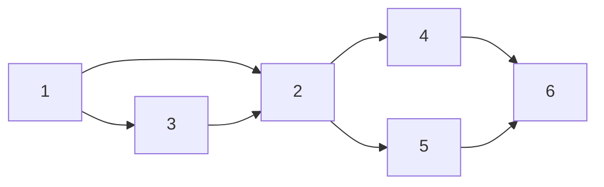

# 2021-02-02

### 이클립스 재설치

https://www.eclipse.org/downloads/packages/release/2020-06/r/eclipse-ide-enterprise-java-developers

---
# 2021-02-04

### 반응형 웹

css로 가능
프로젝트에 추가해야지!

+ELS도 추가하고 싶고

---
# 2021-02-05

### Git


믿기 힘들겠지만 위 그림이 내가 원하는 깃 그래프 모양이다.
마크다운 머메이드가 깃 그래프를 개발 중인거 같았는데 아직도 하고 있다.. (이마 빡-)

여튼 1-2-4-6(이하 B브랜치로 칭함)이 같은 브랜치고, 3-5(이하 A브랜치로 칭함)가 같은 브랜치고 2번때 업데이트하기 위해서 잠깐 머지했다가 다시 진행하는 거다.

일단 성공은 했다.

깃허브 그림판 같은 레포에다가 여러가지 실험을 하다가 성공했다! (뿌-듯)

그 방법은 
A브랜치를 2번으로 B브랜치에 머지 시키고 
싹다 지운다음에 B브랜치를 새롭게 클론해서 (지울 때, gitignore에 등록한 파일 잘 챙겨두고 진행해야함.)
같은 이름의 브랜치, origin/A브랜치로 checkout 해서 진행시키고
거기에다가 5번 커밋.

### 유니티

##### 다른 게임오브젝트 스크립트 함수 사용하기
``` c#
GameObject.Find("게임오브젝트 명").GetComponent("스크립트 명").함수명();
GameObject.Find("게임오브젝트 명").GetComponent("스크립트 명").변수;
```


 ### Mysql(MariaDB) VS Sqlite (1)
 ```sql
 INSERT INTO users ( A, B)
 VALUES ('a', 'b') 
 ON DUPLICATE KEY UPDATE A='a', B='c';
 ```
 A, B 컬럼에 데이터 a, b삽입하는데
 이미 데이터가 있으면 A는 a로 B는 c로 업데이트 해라

##### 근데 sqlite는 다름 REPLACE라는 명령어가 있다!

---

# 2021-02-08

### Mybatis resultType이 리스트 일 때

그냥 Dto를 해줘도 된다.
Mybatis가 자동으로 리스트에 담아서 준다고 함.

테스트 때 꼭 확인해보겠음.

---

# 2021-02-25

### 알고리즘 스터디 준비
최근에 에타로 알고리즘 스터디를 들어갔다.
이김에 알고리즘 공부도 하고 인텔리제이도 이숙해져야겠다는 생각이 들어서
스터디 하기전에 프로젝트를 만들었다.
자바 프로젝트를 만드는 좋은 블로그 글이 있어서 남긴다.

https://ifuwanna.tistory.com/243

---

