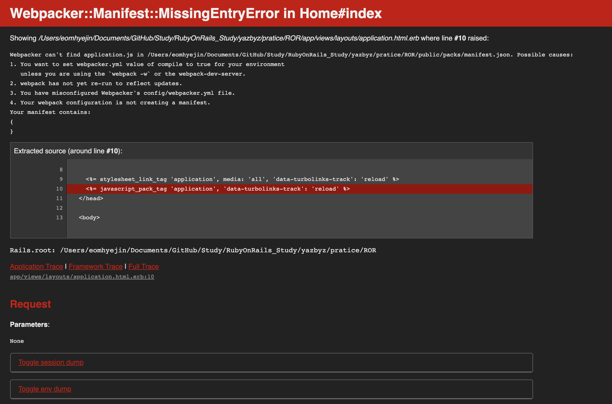

# 5월 4일
## 자바 랜덤 숫자 생성
### Math.random()
Math.random() 수행 시 0.0 ~ 1.0 미만 사이의 무작위 숫자 한 개가 반환됨
가공하여 사용하면 됨
``` java
(int)(Math.random() * 100) // 0~100 사이의 난수 생성
// int형으로 정수형을 나타낼 수 있다
```
### Random 클래스 사용
| 메서드 | 설명 |
| --- | --- |
| setSeed(long n) | 매개값으로 주어진 종자값이 설정됩니다. |
| boolean nextBoolean() | boolean타입의 난수를 리턴합니다. |
| double nextDouble() | doouble 타입의 난수를 리턴합니다. |
| int nextInt() | int 타입의 난수를 리턴합니다. |
| int nextInt(int n) | int 타입의 0 ~ 매개값까지의 난수를 리턴합니다. |
| double nextGaussian() | 평균이 0.0이고 표준편차가 1.0인 정규분포 난수를 리턴합니다. |

## 자바 사용자 입력
### 1. java.util.Scanner
``` java
import java.util.Scanner;

public class InputSomthing {
	public static void main(String[] args) {

		Scanner sc = new Scanner(System.in);
		
        String temp_string = sc.next(); 
        //스페이스 기준 한 단어
        
        int temp_int = sc.nextInt();
        double temp_int = sc.nextDouble();
        // next[자료형]()
        // nextByte(), nextLong(), nextFloat()

        String temp_line = nextLine();
        // 개행문자까지 한 줄 통째로 받아 올 수 있음. 
        // 이전에 입력 안되서 남아있는 개행문자를 처리하지 않으면 남아있던 개행문자만 받아 올 수 있음.
    }
}
```
### 2. java.io.InputStreamReader + java.io.BufferedReader
``` java
import java.io.BufferedReader;
import java.io.IOException;
import java.io.InputStreamReader;

public class InputSomthing2 {
	public static void main(String[] args) throws IOException {

        InputStreamReader isr = new InputStreamReader(System.in);
        BufferedReader br = new BufferedReader(isr);

        try {
            String temp = br.readLine();
        } catch (IOException e) {
            e.printStackTrace();
        }

        br.close();
    }
}
```

# 5월 6일
## Mac에 RubyOnRails 프로젝트 생성
### 설치
```brew install rbenv ruby-build```

```sudo gem install rails```
### 프로젝트 생성
```rails new [프로젝트이름]```

프로젝트 생성으로 만들어진 파일들
``` text
total 56
-rw-r--r--   1 eomhyejin  staff   2.2K May  6 23:35 Gemfile
-rw-r--r--   1 eomhyejin  staff   5.5K May  6 23:35 Gemfile.lock
-rw-r--r--   1 eomhyejin  staff   374B May  6 23:35 README.md
-rw-r--r--   1 eomhyejin  staff   227B May  6 23:35 Rakefile
drwxr-xr-x  11 eomhyejin  staff   352B May  6 23:35 app
drwxr-xr-x   8 eomhyejin  staff   256B May  6 23:35 bin
drwxr-xr-x  16 eomhyejin  staff   512B May  6 23:35 config
-rw-r--r--   1 eomhyejin  staff   160B May  6 23:35 config.ru
drwxr-xr-x   3 eomhyejin  staff    96B May  6 23:35 db
drwxr-xr-x   4 eomhyejin  staff   128B May  6 23:35 lib
drwxr-xr-x   3 eomhyejin  staff    96B May  6 23:35 log
-rw-r--r--   1 eomhyejin  staff   223B May  6 23:35 package.json
drwxr-xr-x   9 eomhyejin  staff   288B May  6 23:35 public
drwxr-xr-x   3 eomhyejin  staff    96B May  6 23:35 storage
drwxr-xr-x  12 eomhyejin  staff   384B May  6 23:35 test
drwxr-xr-x   6 eomhyejin  staff   192B May  6 23:35 tmp
drwxr-xr-x   3 eomhyejin  staff    96B May  6 23:35 vendor
```
### 컨트롤러 생성
```$rails g(generate) controller [컨트롤러이름]```
### 프로젝트 서버 실행
```rails s(server)```

### 오류1
``` text
Webpacker configuration file not found 루비온레일즈프로젝트절대적주소/config/webpacker.yml. Please run rails webpacker:install Error: No such file or directory @ rb_sysopen - 루비온레일즈프로젝트절대적주소/config/webpacker.yml (RuntimeError)
```
#### 해결1
```
curl https://raw.githubusercontent.com/rails/webpacker/master/lib/install/config/webpacker.yml > config/webpacker.yml
bundle exec rake webpacker:install
```

### 오류2
Webpacker::Manifest::MissingEntryError in Home#index

#### 해결2
```bundle exec rails webpacker:install```
⚠️프로젝트 위치에서 진행해야 함!!

# 5월 7일
## RubyOnRails 프로젝트 에러
### undefined method `back_url' for #<HomeController:0x007fdf8e36f798>


#### 해결
[구글링한 사이트](https://stackoverflow.com/questions/44098584/rails-redirect-to-back-not-working)
##### 설명
Rails5에는 redirect_to :back 비추천하고 대신에 redirect_back 이 있다.
그래서 ```redirect_back fallback_location: '/돌아갈주소' ``` 사용

Rails5.1에는 위에 것 대신에 ```redirect_back(fallback_location: root_path)```을 추천한다.

## 인자 관련 단어 정리
```
//설명을 위한 코드
main {
    ...
    methodA(a, b);
    ...
}

methodA(int A, int B) {
    ...
}
```
### argument 인자
호출하는 메소드가 전달하는 것
위 코드에서 a, b를 말함
### parameter 매개변수
호출된 메소드가 전달된 데이터를 받는 것
위 코드에서 A, B를 말함
### 실행인자
명령어 실행에 사용되는 인자


# 5월 8일
이런것도 모른다는게(알긴 아는데 외우지 않은 상태.. 확인이 한번 필요한 거지같은 암기상태) 창피하긴하지만
정리할 필요가 있다고 생각한다..
그리고 일주일에 한번 다시 읽으려고 한다.

[Java Collection 정리요망](https://gangnam-americano.tistory.com/41)
[Java ArrayList](https://coding-factory.tistory.com/552)
[Java HashMap](https://coding-factory.tistory.com/556)
[Java 2차원 배열 생성](https://keichee.tistory.com/423)
```int[][] array = {{1, 2, 3}, {4, 5, 6}};```

[Java switch 구문 형식](https://wikidocs.net/263)
``` java
int a;
...
switch(a) {
    case 1 :
        ...
        break;
    case 2 :
        ...
        break;
    ...
    default : 
        ...
        break;
}
```
[Java String->int](https://zetawiki.com/wiki/String%EC%9D%84_int%EB%A1%9C_%EB%B3%80%ED%99%98)
``` java
String str = "123";
int a = Integer.parseInt(str);
```

[Java Stack 클래스](https://coding-factory.tistory.com/601)

[Java String 배열 초기화](https://kookyungmin.github.io/language/2018/05/22/java_06/)
``` java
String[] temp = new String[2];
temp[0] = "hello";
temp[1] = "world";

String[] temp2 = new String[]{"hello", "world"};

String[] temp3 = {"hello", "world"};
```

[Java 객체배열 선언](https://sleep365.tistory.com/249)
클래스를 구조체처럼 사용할 때 각 배열의 요소마다 객체를 생성해줘야한다


[Mac Eclipse 디버깅](https://wewave.tistory.com/10)

[Java 문자열 포함 확인빙법](https://jobc.tistory.com/85)
[Java 문자열 포함 확인빙법2](https://mine-it-record.tistory.com/124)
```
contains

indexOf
lastIndexOf

matches
```

```
replace
```

[Java 정렬](https://codechacha.com/ko/java-sorting-array/)
[Java 정렬2](https://ramees.tistory.com/53)

[Java 거듭제곱구하기](https://coding-factory.tistory.com/531)
``` java
Math.pow(int 어떤숫자를, int 몇번제곱);
```


# 5월 10일
## Marp for VSCode
[Marp for VSCode](https://actually-i-am.tistory.com/m/34)
마크다운 최고!!!
PPT도 만들 수 있다니!!!!

```markdown
---
marp: true
---

# 제목

## 부제목

- 리스트

1. 숫자 리스트 **강조**
2. _기울이기_
3. ~~취소선~~

---

## 두 번재 페이지

| 이런식으로 | 표도 | 쓸 수가 있다. |
| ---------- | ---- | ------------- |
| 값1        | 값2  | 값3           |
| 값4        | 값5  | 값6           |

---
```