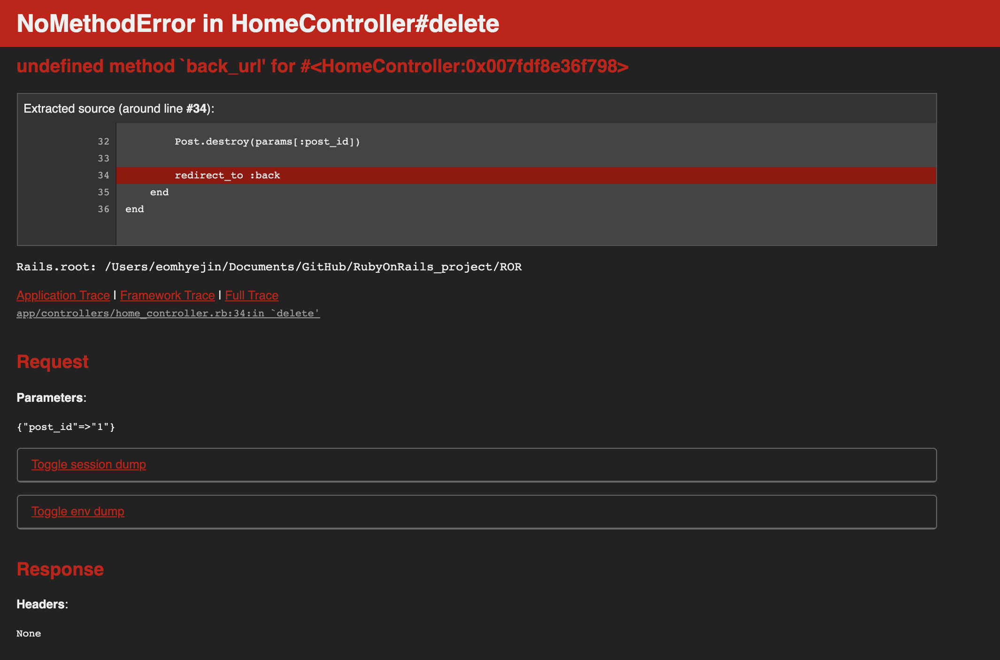

# 5월 7일
## RubyOnRails 프로젝트 에러
### undefined method `back_url' for #<HomeController:0x007fdf8e36f798>


#### 해결
[구글링한 사이트](https://stackoverflow.com/questions/44098584/rails-redirect-to-back-not-working)
##### 설명
Rails5에는 redirect_to :back 비추천하고 대신에 redirect_back 이 있다.
그래서 ```redirect_back fallback_location: '/돌아갈주소' ``` 사용

Rails5.1에는 위에 것 대신에 ```redirect_back(fallback_location: root_path)```을 추천한다.

## 인자 관련 단어 정리
```
//설명을 위한 코드
main {
    ...
    methodA(a, b);
    ...
}

methodA(int A, int B) {
    ...
}
```
### argument 인자
호출하는 메소드가 전달하는 것
위 코드에서 a, b를 말함
### parameter 매개변수
호출된 메소드가 전달된 데이터를 받는 것
위 코드에서 A, B를 말함
### 실행인자
명령어 실행에 사용되는 인자
