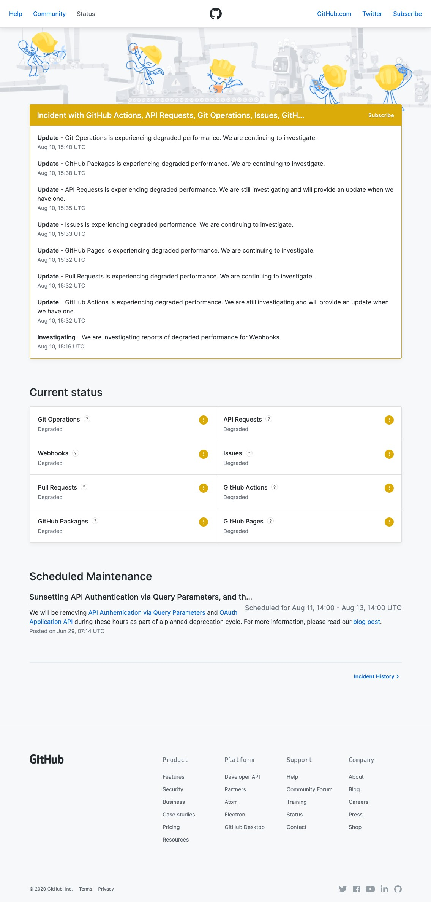

# 🗓 8월 1일
## 유니티 안드로이드 빌드 에러 해결 Unity Android Build Error Solved
[AAPT: error: unexpected element found in 에러 해결](https://ajh322.tistory.com/294)
역시 사람은 에러메세지를 꼼꼼히 봐야 해....

---

# 🗓 8월 2일
## SocketIO 라이브러리
며칠째 채팅방 구현을 하고 있는데 사실 공식문서를 읽다보면 너무 오래걸릴 거 같아서 열심히 안보고 다른 블로그글만 보고 따라 하고 있었다.
진행하는데 한계가 느껴지고 이제 더이상 여유롭게 할 수가 없어서 이제 공식문서를 독파하려고 한다...
[SocketIO 공식문서](https://socket.io/)
[SocketIO를 이용한 실시간채팅 서비스 예시1](https://github.com/aamirjaved844/ReactSocketChat)
[SocketIO를 이용한 실시간채팅 서비스 예시2](https://github.com/safak/youtube/tree/chat-app)
[SocketIO를 이용한 실시간채팅 서비스 예시3](https://www.fullstacklabs.co/blog/chat-application-react-express-socket-io)
[SocketIO를 이용한 실시간채팅 서비스 예시4](https://github.com/WebDevSimplified/Realtime-Chat-App-With-Rooms)
[SocketIO를 이용한 실시간채팅 서비스 예시5](https://github.com/WebDevSimplified/Realtime-Simple-Chat-App)

---

# 🗓 8월 3일
## @socket.io-ui
```npm i @socket.io-ui```로 설치하고 https://admin.socket.io 에 접속하면 현재 존재하는 소켓과 룸, 클라이언트, 서버의 현황을 확인할 수 있다.

## JS로 로컬 스토리지 이용
[관련 블로그](https://www.daleseo.com/js-web-storage/)

---

# 🗓 8월 5일
## 레일즈 partial 관련 내용
[관련 블로그](https://flearning-blog.tistory.com/39?category=646783)

## 레일즈 js관련
[관련 블로그](https://brandonhilkert.com/blog/page-specific-javascript-in-rails/)

---

# 🗓 8월 6일
## 레일즈
- 레일즈 버전 : 6
### 레일즈 헤더, 푸터 분리
레일즈 뷰는 views/layouts/application.html.erb를 베이스로 다른 뷰의 코드를 추가해서 렌더링하는 형식을 띄는 듯하다.
(2019년 정도의 설명을 보면 application.html.erb파일이 views바로 아래에 있는 경우도 있다.)

다른 뷰들의 코드가 들어가는 곳은 application.html.erb의 <%= yield %> 부분이다.
그래서 application.html.erb에 <%= yield %> 앞뒤로 헤더와 푸더를 넣으면 다른 뷰에 반복해서 입력하지 않아도, 모든 뷰에 기본적으로 헤더와 푸더가 같이 렌더링된다.

<%= yield %>는 함수에서 미지수같은 표시라면, 헤더와 푸터는 정확히 정해져있는 지수이다.
그래서 <%= yield %>가 아닌 <%= render 'erb파일path' %>를 사용해야한다.
그래서 layouts 디렉토리 밑에 _header.html.erb, _footer.html.erb를 생성하고(앞에 _를 넣어줘야 인식한다) application.html.erb에 필요한 위치에 <%= render 'layouts/header' %>와 <%= render 'layouts/footer' %>를 입력한다(_header가 아닌 header라고 입력해야 인식한다).

### 레일즈 외부자바스크립트 연결
Webpack이라는 Gem으로 되는 거 같다.
프로젝트 생성시에 자동으로 설치된 gem이라서 따로 설치하지는 않았다.

app/javascript/packs밑에 사용할 js파일(custom.js라고 생성함)을 생성하고, app/javascript/packs/application.js 에 해당 파일이름을 입력한다.

```js
import Rails from "@rails/ujs"
import Turbolinks from "turbolinks"
import * as ActiveStorage from "@rails/activestorage"
import channels from "channels"
import custom from "packs/custom" # 사용할 js파일

Rails.start()
Turbolinks.start()
ActiveStorage.start()
```
다른 것들은 무슨 용도인지 잘 모르겠다.. 공부가 필요하다

그리고 js를 사용할 erb파일에 <%= javascript_pack_tag 'js파일명' %> 을 입력하면 자동으로 js파일명에 숫자를(아마도 버전을 표시하는 것 같다) 추가해서 erb파일에 렌더링한다.

---

# 🗓 8월 6일
## 로컬스토리지에 채팅메세지 저장하기
[로컬스토리지 공식문서](https://ko.javascript.info/localstorage)
로컬스토리지는 key-value 형태라서 데이터를 문자로 저장해야한다.
나는 저장할 데이터 형식이 json이라서, 해당 데이터를 텍스트로 바꿔서 저장하고 필요할 때 json으로 변환해서 사용해야한다.

나중에 읽어볼 [관련 블로그 글](https://studyingych.tistory.com/28)

## 리액트 : 채팅방 탭 형식으로 구현

[참조한 블로그](https://ejko0911.medium.com/react-tab-menu-%EA%B5%AC%ED%98%84%ED%95%98%EA%B8%B0-1d1dfe2219d2)가 아주 좋은 방법을 알려줬다.

각 컴포넌트를 리스트로 저장하고, 탭을 클릭하면 변수에 특정 인덱스를 setStatus해서 계속 변하게 하는거다.

이분도 멋쟁이사자 출신이신거 같은데 멋지다....👍

---

# 🗓 8월 9일
## 레일즈 DB select 

### 1. 모든 레코드

```ruby
@user = User.all # Users테이블에 모든 레코드 가져오기 (User는 모델명)
```
### 2. 해당 데이터가 PK 값인 레코드

```ruby
@user = User.find(params[:userId]) # Users테이블에 userId에 해당하는 레코드 조회 
```
params는 http://localhost:3000/?userId=1 url의 userId의 값을 가져온다.

### 3. 특정 컬럼의 해당 데이터를 가지는 레코드

```ruby
@user = User.where("nickname = ?", @nickname) #User테이블에 nickname 컬럼에서 @nickname 값을 가지는 레코드 조회
```

---

# 🗓 8월 10일
## 루비 ==, eql?, equal? 예시
```ryby
# 데이터 설정 - 문자열
a = "hello"
b = "hello"
c = "world"
d = a

# 데이터 설정 - 숫자
n1 = 1
n2 = 1
n3 = 2
n4 = n1
```


### ```==```

```ruby
a == b # => true
a == c # => false
a == d # => true
```

```ruby
n1 == n2 # => true
n1 == n3 # => false
```


### ```eql?```

```ruby
a.eql? b # => true
a.eql? c # => false
a.eql? d # => true
```

```ruby
n1.eql? n2 # => ture
n1.eql? n3 # => false
n1.eql? n4 # => ture
```


### ```equal?```

```ruby
a.equal? b # => false
a.equal? c # => false
a.equal? d # => true
```

문자열은 객체가 같은지 따지고

```ruby
n1.equal? n2 # => true
n1.equal? n3 # => false
n1.equal? n4 # => true
```

숫자는 값을 따진다


## 레일즈 부트스트랩-sass 설치 -> 이후에 삭제하고 그냥 부트스트랩을 설치했다(0811)

레일즈6.1.4 

부트스트랩sass3.4.1 

루비2.7.4


[부트스트랩 Gem문서](https://rubygems.org/search?query=bootstrap) 를 통해서 부트스트랩-sass를 설치한다.

Gemfile에 ```gem 'bootstrap-sass', '~> 3.4', '>= 3.4.1'``` 를 입력하고 ```bundle install``` 명령어를 실행해 설치한다.


app/assets/stylesheets/application.css 를 .scss 확장자로 변경한다 (app/assets/stylesheets/application.scss).


app/assets/stylesheets/application.scss 파일 안에 


 ```scss
 *= require_tree . 
 
 *= require_self
 ```

를 삭제하고

```text
 @import "bootstrap-sprockets"; 
 @import "bootstrap";
```

를 입력한다.

그럼 부트스트랩 사용 가능~!


#### [부트스트랩 알림](https://www.w3schools.com/bootstrap/bootstrap_alerts.asp)

## 레일즈 DB select 결과가 없는지 확인 : ```.empty?```

```ruby
@accounts = Account.where("nickname = ?", nickname)

if @accounts.empty? # 조회 결과가 존재하지 않는 경우
  # ...
end
```


## 레일즈 조인 : ```.left_joins(: )```

```ruby
@articles = Article.where("account_id = ?", session[:current_account_id]).left_joins(:account).left_joins(:book) # account_id로 내가 쓴 글 조회
```

```모델명.left__joins(:조인할 모델명)```

```erb
<% @articles.each do |article| %>
<p><%= article.account_id %></p>
<p>제목 : <%= article.title %></p>
# ...
<p>작성자 : <%= article.account.nickname %></p>
<p>관련 도서 : <%= article.book.title %></p>
<% end %>
```

조인한 모델의 컬럼 데이터를 사용하는 방법

```<%= 모델명.조인한모델명.조인한모델의컬럼 %>```


## 레일즈 링크 연결 ```<%= link_to '출력텍스트', '이동할 URL' %>```

```erb
<%= link_to '내가 쓴 글', '/profile/myArticle' %>
```

#### 하지만, 출력텍스트에 <%=  %>를 넣을 수 없다

그래서 html에 <a href> 태그를 사용했다

```erb
<a href='/article/view?no=<%= article.id %>'><%= article.title %></a>
```


## 레일즈 DB 스키마 수정

현재 디비 스키마를 보여주는 db/schema.rb 파일이나, db테이블 생성할 때 만든db/migrate/20210727041666_create_수정할테이블명.rb 파일을 수정한다고 db에 적용되지 않는다.

새 파일에다가 작성해서 기존 DB에 추가적으로 적용해야한다.

``` rails g migration change_수정할컬럼명_to_수정할테이블명    ``` 명령어를 실행하면 db/migrate 아래에 새 파일을 생성한다

[참고한 블로그](https://kbs4674.tistory.com/160)에서는 파일명을 위 형식으로 알려주었다.

꼭 지켜야하는 절대적인 규칙이 아니고, 파일을 구분하기 위한 규칙이 필요한거 같다.

생성된 파일은 ```버전_change_수정할컬럼명_to_수정할테이블명.rb```이라는 이름을 가지고 있다.

```ruby
# db/migrate/버전_change_수정할컬럼명_to_수정할테이블명.rb

class ChangeQnaCommentIdToQnaComments < ActiveRecord::Migration[6.1] #change_수정할컬럼명_to_수정할테이블명이 camelCase로 변환되어 클래스명이 되었다.
  def change
    change_column(:qna_comments, :qna_comment_id, :integer, :null => true) 
    # change_column(:변경할테이블명, :변경할컬럼명, :변경할컬럼의데이터타입, :null => 널여부(true or false))
  end
end
```

수정할 내용을 change 메소드에 넣는다.


``` bin/rails db:migrate VERSION=버전 ``` 명령을 터미널에 실행하면 새로 추가한 db/migrate/버전_change_수정할컬럼명_to_수정할테이블명.rb 파일이 DB에 적용된다.


#### 😱 이런, db/migrate/버전_change_수정할컬럼명_to_수정할테이블명.rb를 저장하지 않고 bin/rails db:migrate VERSION=버전을 했다... 

아마도 한번이라도 특정 버전 마이그레이션을 하면 그 버전은 더이상 업데이트를 못하는 것 같다.

그래서 db/migrate/버전_change_수정할컬럼명_to_수정할테이블명.rb의 파일명에 버전을 버전+1값으로 변경하고 마이그레이션 버전도 버전+1로 실행했다. (버전 맘대로 수정)

```shell
== 20210810131446 ChangeQnaCommentIdToQnaComments: migrating ==================
-- change_column(:qna_comments, :qna_comment_id, :integer, {:null=>true})
   -> 0.0371s
== 20210810131446 ChangeQnaCommentIdToQnaComments: migrated (0.0372s) =========
```

마이그레이션이 완료하면 위 문구가 출력된다.

위 문구를 확인해서 마이그레이션의 성공을 더블체킹하길 바란다.


---

## 🗓 8월 10일

### 깃허브 오류 remote: Internal Server Error

깃허브 푸시가 안되고 있다...

```text
Enumerating objects: 7, done.
Counting objects: 100% (7/7), done.
Delta compression using up to 8 threads
Compressing objects: 100% (4/4), done.
Writing objects: 100% (4/4), 4.54 KiB | 4.54 MiB/s, done.
Total 4 (delta 2), reused 0 (delta 0), pack-reused 0
remote: Resolving deltas: 100% (2/2), completed with 2 local objects.        
remote: Internal Server Error
Everything up-to-date
```

remote: Internal Server Error 하는걸 보니 깃허브사이트 자체 문제인거 같다.

[여기](https://www.githubstatus.com/)에서 사이트 degrade상태를 확인할 수 있다.

너무 신기하다... 수많은 코드를 저장하는 것도 신기했었는데 영원히 잘돌아갈거 같은 사이트도 다운될 수 있다니...

당연한건데 너무 신기하다... 너무 신기하네...?

기념으로 캡쳐해야지




## Typora 짱 좋아...

맨날 vscode에 TIL쓰고 있었는데 vscode열때 마다 같이 열리고 실수로 닫으면 다같이 닫겨버려서 그냥 TIL만 다른 앱으로 쓰려고 찾은 프로그램이다.

근데 진짜 좋아...

1. 무엇보다 가독성이 좋고 

2. 바로바로 확인할 수 있어서 md파일 렌더링 안기다려도 되고 
3. 사진드래그하면 바로 파일에 저장되는 기능도 너무 획기적이고
4. 와 심지어 아웃라인도 볼 수 있어
5. 와ㅏㅏ 글자수도 알려줘~!!

너무 좋다...

와.....최고야.......


---

## 🗓 8월 11일

## 레일즈6 + 부트스트랩5 

이전에 언급한 부트스트랩-sass가 잘 안되는 거 같아서 그냥 부트스트랩을 설치했다.

이 [포스트](https://medium.com/nerd-for-tech/rails-6-bootstrap-5-3492b7c0a626) 가 아주 간결하고 확실한 방법을 알려준다.

나는 [Gem으로 Bootstrap5](https://rubygems.org/gems/bootstrap/versions/5.0.1) 을 설치했다.

+0812 부트스트랩 드롭다운이 안되서 [추가적으로](https://used-newcomer.tistory.com/139) 더 해서 했더니 된다...

## Bootstrap

1학년때 html+css+js를 한꺼번에 배운 이후로 css는 한번도 다뤄본적이 없다.

사실 그때 별로 안좋아했다.

하나하나 일일이 설정해주는 것도 힘들고 기본 지식이니만큼 결과물도 재미도 없었기 때문이다.

항상 부트스트랩을 말만 들었는데 이번에 처음으로 문법이나 사용방법을 인식하고 사용하고 있다~~(사용하다보니 전에 사용한 기억이 떠올랐다. 뭔지도 모르고 썼을 정도로 작동방식이 쉬움..)~~

싫어하는 거였는데 흥미를 느끼고 있어서 의아하면서도 뿌듯한 순간이다.


---

## 🗓 8월 11일

## flexbox로 레이아웃만들기

[flexbox](https://d2.naver.com/helloworld/8540176) 최고!!

나같이 귀찮은거 딱 싫은 사람에게 최적이다.


## 목록 특정 기준으로 정렬하기

[js사용](https://junspapa-itdev.tistory.com/24)

+0812 : [테이블데이터](https://datatables.net/)라는 플러그인 발견


---

## 🗓 8월 13일

## 레일즈 ActionController::InvalidAuthenticityToken 에러 해결

이 [블로그](https://haereeroo.tistory.com/2) 에 아주 자세한 설명이 들어가 있다.


## 레일즈 kernel_require.rb:23:in `require': cannot load such file -- nokogiri (loaderror) 에러 해결

```rails s```를 하면계속 nokogiri 로딩에러가 떴다.

nokogiri 플랫폼이 여러가지였고 프로젝트 개발 환경이 WSL, MAC  두 개 라서 혹시 그 문제가 인가 싶어서 여기저기 찾아봤는데, 똑같이 WSL랑 MAC에서 프로젝트를 진행하는 블로그 글을 봤다.

그 문제가 아니고 gem 설치 문제 였던듯 싶다.

Gemfile에 ```gem 'nokogiri'``` 를 입력하고 ```bundle install``` 하면 해결된다
